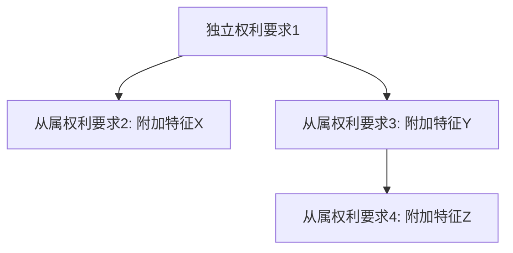

# Analyze-Claims 工作流 —— 权利要求深度解析

将竞品专利的权利要求拆解为可操作的结构化分析，产出**要素分解表、保护范围解读、等同范围预判、审查历史限制分析**等关键成果。

---

## 一、概述

**触发条件**：用户要求解析某件竞品专利的权利要求、要素分解、保护范围

**前置条件**：用户已提供目标专利的全文文件（专利公开文本、授权文本、审查文件等），或指定了包含专利全文的文件/文件夹路径。支持 PDF/DOCX/DOC/MD 等格式。对于 PDF/DOCX/DOC 格式的文件，系统将自动调用 `patent-pdf-to-md` 技能将其转换为结构化 Markdown 后再进行分析。如未提供任何文件，先提示用户上传或指定专利文件。

**技能依赖检查**：在执行分析前，需确保 `patent-pdf-to-md` 技能已安装。请先检查是否已安装 SkillHub 商店，若未安装，请调用SUBAgent根据 `https://skillhub.cn/install/skillhub.md` 安装 SkillHub 商店，但是只安装 CLI，然后安装 patent-pdf-to-md 技能。若已安装 SkillHub，则直接安装 patent-pdf-to-md 技能。

---

## 二、数据降级策略

根据用户提供的输入数据完整度，自动选择可达的最高分析层级。在分析开始时检测输入数据，选择对应层级，并在报告中明确说明降级情况。

### 第一层（完整分析）：专利全文 + 审查历史

- 输入：权利要求书 + 说明书 + 附图 + 审查历史文件
- 分析能力：完整执行所有 14 步，包括审查历史限制分析和等同范围预判
- 置信度：LEGAL-OPINION

### 第二层（降级）：仅有专利全文，无审查历史

- 输入：权利要求书 + 说明书 + 附图（无审查历史）
- 分析能力：执行除 Step 9 外的所有步骤；Step 9 标注"⚠️ 审查历史缺失，无法评估禁止反悔适用性"
- 降级影响：等同范围预判（Step 7）置信度从 LEGAL-OPINION 降为 INFERRED；保护范围弹性标注（Step 8）中"可限缩"方向无法评估
- 置信度：INFERRED（等同预判部分）

### 第三层（显著降级）：仅有权利要求书，无说明书

- 输入：仅权利要求书（无说明书、无审查历史）
- 分析能力：仅执行 Step 3（要素分解）、Step 4（层次结构）、Step 5（限定词识别）；Step 6 保护范围解读仅基于字面含义，标注"⚠️ 说明书缺失，保护范围解读仅基于字面含义，可能偏窄"
- 降级影响：无法展开功能性限定；无法确定"大约"等程度限定词的具体范围；等同预判无法执行
- 置信度：UNVERIFIED（保护范围解读部分）

### 第四层（最低限度）：仅有权利要求摘要或部分信息

- 输入：权利要求摘要或部分权利要求文本
- 分析能力：仅提供初步要素识别和限定词标注，标注"⚠️ 证据严重不足，以下仅为初步识别，需补充完整专利全文后重新分析"
- 降级影响：不生成完整报告，仅输出要素识别草稿
- 置信度：UNVERIFIED

### 降级规则

- 不得将低层级结果伪装成与高层级相同的分析深度
- 使用第三层或第四层时，增加明确的差距说明，降低结论中的置信度表述
- 证据基础薄弱时不得强行得出强结论——明确的不确定性优于虚假的自信

---

## 三、执行步骤（严格按序执行）

### Step 0：冻结范围与模式选择

在任何分析前，确认或推断以下内容：

- **patent_number**：目标专利号
- **mode**：分析模式（默认 `full`）
- **data_level**：输入数据完整度（第一层/第二层/第三层/第四层）

**模式选择**：

| 模式 | 适用场景 | 典型输出 |
|------|----------|----------|
| `screen`（快速筛查） | 初步评估、快速筛选、优先级排序 | 要素分解 + 保护范围宽窄评级（6-8 页） |
| `full`（标准解析） | 标准权利要求解析 | 完整 14 步流程（12-18 页） |
| `deep`（深度解析） | 关键专利的深度分析、诉讼准备 | 增加逐要素等同范围详析 + 多解释方案对比 + 反向证据检验详表（18-25 页） |

默认模式选择：
- 若请求为快速筛选、优先级排序或"这件专利是否值得关注" → 默认 `screen`
- 若请求为深度分析、诉讼准备或委员会级材料 → 默认 `deep`
- 其他情况 → 默认 `full`

**数据层级检测**：
- 检测用户提供的文件，判断数据完整度层级
- 根据数据层级自动调整可执行的步骤范围
- 在 `method_decisions.md` 中记录数据层级和模式选择

### Step 0.5：专利文件自动转换（SUB Agent 调用 patent-pdf-to-md）

当用户提供的输入文件为 PDF/DOCX/DOC 格式时，主 Agent 自动启动 SUB Agent 调用 `patent-pdf-to-md` 技能，将原始专利文件转换为结构化 Markdown 文件。转换完成后，后续步骤（Step 1 起）基于生成的 Markdown 文件进行分析。

**触发条件**：输入文件扩展名为 `.pdf`、`.docx` 或 `.doc`（不区分大小写）。若输入已是 `.md` 格式，跳过此步骤。

**SUB Agent 调用流程**：

1. **识别待转换文件**：检查用户提供的所有输入文件，筛选出 PDF/DOCX/DOC 格式的文件
2. **分类文件**：
   - **专利公开/公告文件**（公开文本、授权文本等）：转换后提供权利要求书、说明书、附图等完整内容
   - **审查文件**（审查意见通知书、驳回决定等）：转换后提供审查历史内容
3. **启动 SUB Agent**：为每个待转换文件启动一个 SUB Agent，多个文件时并行启动

**SUB Agent 提示词模板**：

```
你是一个专利文档转换专家。请调用 patent-pdf-to-md 技能，将以下专利文件转换为结构化 Markdown：

1. 读取并执行 patent-pdf-to-md 技能：读取 "<patent_pdf_to_md_skill_root>/SKILL.md" 的完整内容，按照其中的工作流程执行文档转换
2. 输入文件：<input_file>
3. 路径变量：skill_root=<patent_pdf_to_md_skill_root>, input_file=<input_file>
4. 转换完成后，报告以下信息：
   - 输出目录路径
   - 生成的 Markdown 文件路径
   - 生成的 JSON 文件路径
   - 文档类型（专利公开/公告文件 或 审查文件）
   - 提取摘要（专利名称、申请号、权利要求条数等）
5. ⛔⛔⛔ 禁止向用户提问、禁止要求用户提供任何信息、禁止因任何原因暂停处理流程
```

**路径变量定义**：

| 变量 | 含义 | 值 |
|:---|:---|:---|
| `<patent_pdf_to_md_skill_root>` | patent-pdf-to-md 技能根目录 | `<skill_root>/../patent-pdf-to-md` |

**转换结果收集**：

所有 SUB Agent 完成后，主 Agent 收集并记录以下信息：

| 文件 | 转换状态 | 输出 Markdown 路径 | 输出 JSON 路径 | 文档类型 |
|------|---------|-------------------|---------------|---------|
| xxx.pdf | 成功/失败 | `<final_dir>/<base_name>.md` | `<final_dir>/<base_name>.json` | 专利公开/公告/审查文件 |

**转换失败处理**：
- 若所有文件转换均失败，停止执行，向用户报告失败原因并建议检查文件完整性
- 若部分文件转换失败，继续使用成功转换的文件进行分析，在报告中标注"⚠️ 部分输入文件转换失败，分析可能不完整"
- 若审查历史文件转换失败，按"审查历史缺失"降级处理（参见数据降级策略第二层）

**转换成功后的数据映射**：

| 转换输出 | 对应分析步骤 | 用途 |
|---------|------------|------|
| Markdown 文件中的权利要求书章节 | Step 1、Step 3-6 | 权利要求原文提取、要素分解、保护范围解读 |
| Markdown 文件中的说明书章节 | Step 1、Step 5-7 | 说明书支撑段落查找、功能性限定展开、等同范围预判 |
| Markdown 文件中的附图说明章节 | Step 1 | 附图及附图说明 |
| JSON 文件中的著录项目 | Step 0、Step 1.5、Step 13 | 专利号、申请人、申请日等基本信息，法律状态自动判定 |
| 审查文件的 Markdown | Step 2、Step 9 | 审查历史读取、禁止反悔分析 |

### Step 1：读取专利全文

从用户提供的专利全文文件中获取目标竞品专利的以下内容：

**数据来源优先级**：
1. 若 Step 0.5 已执行转换，优先从转换生成的 Markdown 文件中读取
2. 若用户直接提供了 Markdown 格式文件，从该文件读取
3. 若用户提供了纯文本或其他格式，直接读取原始文件

**读取内容**：
- 权利要求书（独立权利要求 + 从属权利要求的完整原文）
- 说明书（特别是具体实施方式、发明目的、技术效果段落）
- 附图及附图说明

**操作规范**：
- 必须逐字引用权利要求原文，不得意译或概括
- 说明书中的关键段落需记录段落号，作为后续解释的依据
- 如专利为外文，保留原文并在首次出现时附中文注释
- 若从 patent-pdf-to-md 转换的 Markdown 读取，注意 Markdown 中的章节标记和格式，确保提取内容完整准确

### Step 1.5：专利法律状态自动判定

> **必要环节**：本步骤为技能处理流程的必要环节，在所有专利分析场景中必须自动执行，无论用户是否提供了专利失效状态信息。

当用户未提供明确的专利失效状态文件时，Agent 必须执行以下判定步骤，自动确定专利的法律状态（是否已届满失效）。

**判定步骤**：

1. **获取当前系统日期**：获取执行分析时的当前日期
2. **提取专利关键信息**：从 Step 1 读取的专利全文或 Step 0.5 转换生成的 JSON 文件中提取以下信息：
   - **申请日**（必要）
   - **授权公告日**（如有）
   - **专利类型**（发明专利 / 实用新型 / 外观设计）
3. **计算保护期届满日期**：根据《中国专利法》规定的保护期限计算：

   | 专利类型 | 保护期限 | 起算日 | 届满日计算 |
   |---------|---------|-------|-----------|
   | 发明专利 | 20年 | 申请日 | 申请日 + 20年 |
   | 实用新型 | 10年 | 申请日 | 申请日 + 10年 |
   | 外观设计 | 15年 | 申请日 | 申请日 + 15年 |
   | 外观设计（2021.06.01前申请） | 10年 | 申请日 | 申请日 + 10年 |

   > **注意**：2021年6月1日起施行的新《专利法》将外观设计保护期从10年延长至15年。对于2021.06.01之前提交的外观设计申请，仍适用10年保护期。

4. **比较判定**：将当前日期与届满日期进行比较：
   - 当前日期 > 届满日期 → **已届满失效**
   - 当前日期 ≤ 届满日期 → **仍在保护期内**
   - 无法确定届满日期 → **法律状态待确认**

5. **输出判定结果**：在报告的"专利基本信息"表格的"法律状态"字段中明确标注判定结果及计算依据，格式如下：

   **已届满失效**：
   ```
   ⚠️ **保护期已届满**：申请日YYYY.MM.DD，[专利类型]保护期[N]年，**已于YYYY.MM.DD届满失效**；本分析仅作历史参考和专利技术理解使用
   ```

   **仍在保护期内**：
   ```
   🟢 **保护期内**：申请日YYYY.MM.DD，[专利类型]保护期[N]年，届满日YYYY.MM.DD，剩余约[N]年[N]个月
   ```

   **法律状态待确认**：
   ```
   ⚠️ **法律状态待确认**：无法自动判定保护期届满状态（原因：[缺少申请日/无法确定专利类型等]），建议人工核实
   ```

6. **附加提示**：若判定为"已届满失效"，在报告的"专利基本信息"表格下方增加时效提示框：

   ```markdown
   > 📌 **重要时效提示**：
   > - 申请日：YYYY.MM.DD
   > - [专利类型]专利保护期：[N]年（自申请日起算）
   > - **保护期届满日：YYYY.MM.DD**
   > - **当前日期：YYYY.MM.DD**
   > - **结论：本专利已于YYYY.MM.DD届满失效，不再具有专利权效力**
   > - 本分析仅作历史参考和技术理解使用，**不构成当前的侵权风险评估依据**
   > - 第三方可自由使用本专利公开的技术方案，不再需要规避
   ```

**操作规范**：
- 本步骤必须在 Step 1 读取专利全文后、Step 2 读取审查历史前执行
- 判定结果必须在报告的"专利基本信息"部分明确体现
- 若用户已提供了明确的专利失效状态信息（如审查决定书、专利登记簿副本等），以用户提供的信息为准，但仍需在报告中注明信息来源
- 保护期计算仅基于法定保护期限，不考虑专利权提前终止（未缴年费等）的情况；如需确认专利权是否因未缴年费而提前终止，建议用户查询专利登记簿

### Step 2：读取审查历史

从用户提供的审查历史文件中获取以下内容：

**数据来源优先级**（与 Step 1 一致）：
1. 若 Step 0.5 已将审查文件转换为 Markdown，优先从转换生成的 Markdown 文件中读取
2. 若用户直接提供了 Markdown 格式的审查历史，从该文件读取
3. 若用户提供了其他格式的审查历史文件，直接读取原始文件

**读取内容**：
- 审查意见通知书（Office Action）
- 申请人答复意见
- 权利要求修改记录（修改前/后对照）
- 授权文本与申请文本的差异

**操作规范**：
- 审查历史对权利要求解释的影响往往比说明书更大，必须作为核心输入
- 如审查历史缺失，在输出中标注"⚠️ 审查历史缺失，以下分析可能不完整，建议补充"
- 重点关注：申请人因审查意见所做的限缩性修改、放弃的权利要求范围

### Step 3：权利要求要素分解

将每个独立权利要求拆解为**前序部分** + **特征部分**，逐要素标注：

**权利要求原文对照**：在要素分解表上方，必须放置对应权利要求的完整原文，采用引用块格式（`>`）与水平线（`---`）分隔，确保读者可便捷地进行原文与分析内容的对照阅读。格式如下：

```markdown
### 权利要求N原文

> [权利要求N的完整原文，逐字引用，不得意译或概括]

---

### 前序部分

| 序号 | 要素描述（原文摘录） | 前序/特征 | 必要技术特征 | 关键限定词 | 说明书支撑段落 |
|------|---------------------|----------|------------|-----------|--------------|
```

**从属权利要求原文对照**：每个从属权利要求的附加特征分析上方，同样放置该从属权利要求的完整原文，格式同上。

| 序号 | 要素描述（原文摘录） | 前序/特征 | 必要技术特征 | 关键限定词 | 说明书支撑段落 |
|------|---------------------|----------|------------|-----------|--------------|
| 1 | | 前序 | 是/否 | | 第X段 |

**操作规范**：
- "必要技术特征"判断标准：该要素缺失时，技术方案是否无法实现发明目的
- 中国专利权利要求通常以"其特征在于"分隔前序部分和特征部分；如无明确分隔，需自行判断并标注理由
- 每个要素必须可追溯到权利要求原文的具体位置
- 从属权利要求也需分解，标注其引用关系和附加技术特征
- 权利要求原文必须逐字引用，不得意译、概括或省略

### Step 4：构建权利要求层次结构

用 Mermaid 图表示独立权利要求与从属权利要求的引用关系树：



**操作规范**：
- 每个从属权利要求节点必须标注其附加技术特征的简要描述
- 如有多个独立权利要求，分别绘制子树

**步骤 4.1：权利要求层次结构自检（SUB Agent 调用）**

输出前必须通过 SUB Agent 执行自检。主 Agent 在完成 Step 4 后，自动启动 SUB Agent 对权利要求层次结构进行质量检查。

**SUB Agent 调用流程**：

1. **准备检查输入**：主 Agent 将以下内容作为 SUB Agent 的输入：
   - Step 3 的要素分解表（权利要求要素清单）
   - Step 4 的 Mermaid 层次结构图
   - 原始权利要求原文
2. **启动 SUB Agent**：使用下方提示词模板启动 SUB Agent 执行自检
3. **收集检查结果**：SUB Agent 返回结构化检查结果
4. **处理未通过项**：根据 SUB Agent 返回的未通过项，主 Agent 执行修正后重新提交检查（最多重试 2 次）

**SUB Agent 提示词模板**：

```
你是一个具有多年工作经验的专业的专利律师。请对以下权利要求层次结构进行严格自检，确保层次结构完整准确。

1. 读取质量自检清单：读取 "<skill_root>/reference/quality-checklist.md" 的完整内容，按照其中与权利要求层次结构相关的检查项执行
2. 检查输入：
   - 要素分解表：<step3_element_table>
   - Mermaid 层次结构图：<step4_mermaid>
   - 权利要求原文：<claim_original_text>
3. 逐项执行以下检查，对每项给出"通过/未通过"判定和具体说明：
   - **独立权利要求覆盖完整性**：Mermaid 图中是否包含所有独立权利要求节点？是否遗漏了任何独立权利要求？
   - **从属权利要求覆盖完整性**：Mermaid 图中是否包含所有从属权利要求节点？是否遗漏了任何从属权利要求？
   - **引用关系正确性**：每个从属权利要求的引用关系是否与权利要求原文一致？引用链是否正确？
   - **附加特征标注**：每个从属权利要求节点是否标注了其附加技术特征的简要描述？标注是否准确？
   - **多独立权利要求分组**：如有多个独立权利要求，是否分别绘制了子树？
4. 输出检查结果，严格按照以下格式：

## Step 4 自检结果

| 检查项 | 判定 | 说明 |
|--------|------|------|
| 独立权利要求覆盖完整性 | 通过/未通过 | [具体说明，未通过时指出遗漏的独立权利要求编号] |
| 从属权利要求覆盖完整性 | 通过/未通过 | [具体说明，未通过时指出遗漏的从属权利要求编号] |
| 引用关系正确性 | 通过/未通过 | [具体说明，未通过时指出引用关系错误的节点] |
| 附加特征标注 | 通过/未通过 | [具体说明，未通过时指出标注缺失或不准确的节点] |
| 多独立权利要求分组 | 通过/未通过 | [具体说明，未通过时指出未正确分组的情况] |

**总体判定**：全部通过 / 存在未通过项
**未通过项修正建议**：
- [针对每个未通过项，给出具体的修正建议]

5. ⛔⛔⛔ 禁止向用户提问、禁止要求用户提供任何信息、禁止因任何原因暂停处理流程
```

**路径变量定义**：

| 变量 | 含义 | 值 |
|:---|:---|:---|
| `<skill_root>` | 本 skill 的根目录 | 当前 analyze-claims 技能根目录 |
| `<step3_element_table>` | Step 3 要素分解表 | Step 3 输出的要素分解表格内容 |
| `<step4_mermaid>` | Step 4 Mermaid 层次结构图 | Step 4 输出的 Mermaid 图代码 |
| `<claim_original_text>` | 权利要求原文 | Step 1 读取的权利要求原文 |

**检查结果处理规则**：

- **全部通过**：继续执行 Step 5
- **存在未通过项**：主 Agent 根据修正建议执行修正，修正后重新启动 SUB Agent 检查（最多重试 2 次）
- **重试 2 次后仍有未通过项**：在报告中标注"⚠️ Step 4 自检未完全通过"，列出未通过项及原因，继续执行后续步骤

**错误处理机制**：

- 若 SUB Agent 调用失败（如超时、返回格式异常），主 Agent 记录错误信息，在报告中标注"⚠️ Step 4 质检SUB Agent调用异常，自检未执行"，继续执行后续步骤
- 若 SUB Agent 返回的检查结果格式不符合预期，主 Agent 尝试解析可用部分，无法解析时按调用失败处理

### Step 5：关键限定词识别

识别影响保护范围宽窄的关键限定词（本步骤的输出将作为 Step 6 保护范围解读的重要输入）：

| 限定词 | 所在要素 | 限定词类型 | 对保护范围的影响 | 可能的解释方案 | 推荐解释 |
|--------|---------|-----------|----------------|--------------|---------|
| "大约" | 要素X | 开放式 | 扩大 | 方案A: ±10% / 方案B: 本领域常规偏差 | 方案A，依据：说明书第X段 |

**限定词类型分类**：
- **开放式**："包括""包含""含有"——不排除其他要素
- **封闭式**："由…组成""仅由"——排除其他要素
- **半开放式**："基本上由…组成"——排除改变本质的要素
- **程度限定**："大约""约""基本上""实质上"——需结合说明书确定范围
- **功能限定**："用于""适于""配置为"——功能性限定，需结合说明书具体实施方式

### Step 6：保护范围解读

用**技术语言**（非法律术语）描述权利要求实际保护的技术方案范围。

**操作规范**：
- 禁止使用"保护范围较宽""涵盖面广"等模糊表述
- 必须具体描述：该权利要求覆盖了"采用[方法A]实现[功能B]的[装置/系统/方法]"
- 区分"必须包含的技术特征"和"可选包含的技术特征"
- 标注 `confidence: LEGAL-OPINION`，并附注"初步法律分析，需专利律师确认"

**保护范围解读详细执行规范**：

**核心原则**：技术语言 ≠ 通俗语言。技术语言是指：本领域研发工程师在技术方案评审会上描述产品功能/结构时使用的语言。它应当：

- 描述**做什么、怎么做的**（功能 + 结构/步骤），而非**法律上保护什么**
- 使用**工程术语**，而非**法律限定语**
- 保持**与权利要求要素的一一对应**，不可遗漏也不可添加

正确与错误的边界：

| 维度 | 法律语言（禁止） | 技术语言（要求） |
|------|----------------|----------------|
| 过渡词 | "包括""由…组成" | "至少包含以下组件""仅由以下组件组成" |
| 引用链 | "所述检测模块的所述输出" | "电压检测模块的输出信号" |
| 功能性限定 | "用于检测的装置" | "温度传感器（热敏电阻/热电偶，参见说明书第X段）" |
| 数值修饰 | "大约100°C" | "100°C ± 工程公差（说明书第X段）" |
| 整体描述 | "保护一种…的系统" | "一种…系统，其技术方案为…" |

**步骤 6.1：识别权利要求中的法律限定语**

从独立权利要求中，逐要素标记出以下类型的法律限定语，这些是必须"翻译"的对象：

| 法律限定语类型 | 示例 | 翻译方向 |
|---|---|---|
| 开放式过渡词 | "包括""包含""含有" | → "至少包含以下组件/步骤，不排除其他" |
| 封闭式过渡词 | "由…组成""仅由…构成" | → "仅由以下组件/步骤组成，不含其他" |
| 数值限定修饰词 | "大约""约""基本上""近似" | → "允许在工程公差范围内波动，具体范围需参照说明书" |
| 功能性限定 | "用于…的装置""配置为…" | → 描述实现该功能的具体结构（基于说明书实施例） |
| "所述"引用链 | "所述A的所述B" | → 还原为完整的技术对象名称 |
| 方法权利要求的功能性步骤 | "检测…""确定…" | → 描述该步骤的具体技术手段（传感器类型、算法类别等） |

输出：为每个要素生成一张法律限定语标记表：

| 要素序号 | 要素原文 | 识别出的法律限定语 | 限定语类型 |
|---------|---------|------------------|-----------|
| 1 | ... | ... | 开放式过渡词/功能性限定/... |

**步骤 6.2：逐要素改写为技术描述**

对权利要求的每个要素，按以下模板进行改写：

```
要素 [序号]：[权利要求原文]
  → 技术描述：[用技术语言描述该要素实际要求的技术特征]
  → 证据分层：
    - 权利要求原文：[逐字摘录该要素原文]
    - 说明书佐证：[支撑该技术描述的说明书段落及关键内容摘要]
    - 审查历史限缩：[审查历史中对该要素的限缩性修改/意见陈述，无则标注"无审查历史限缩"]
    - 解释缺口：[权利要求和说明书均未明确、存在争议的要素含义，无则标注"无解释缺口"]
  → 改写依据：[说明书第X段/附图X/审查历史第X页]
  → 保护范围边界：[该要素允许的技术变化范围]
```

**改写规则**：

1. **"所述"还原**：将"所述X"还原为完整名称。如"所述电机"→"永磁同步电机"（如果前序已限定类型）
2. **功能性限定展开**：权利要求写"用于检测温度的装置"→技术描述写"温度传感器（热敏电阻/热电偶/红外传感器等，参见说明书第X段实施例）"
3. **数值范围具象化**：权利要求写"大约100-200°C"→技术描述写"100-200°C温度范围，允许±5%工程偏差（说明书第X段）"
4. **连接关系明确化**：权利要求写"连接至"→技术描述写"通过[具体连接方式：电连接/机械耦合/数据通信]连接至"

**禁止事项**：
- 禁止引入权利要求和说明书中均未出现的技术特征
- 禁止将功能性限定展开为说明书未公开的具体实现方式
- 禁止省略任何权利要求要素

**步骤 6.3：合成整体技术方案描述**

将所有要素的技术描述合成为一段连贯的技术方案描述，**必须全面覆盖独立权利要求和所有从属权利要求所保护的技术方案**。

**核心原则**：整体技术方案描述不仅要阐述独立权利要求界定的核心技术方案，还必须详细说明每个从属权利要求所保护的进一步限定的技术方案，确保读者能够清晰理解从属权利要求对独立权利要求的层层限定关系以及各技术特征之间的层次结构。

#### 6.3.1 独立权利要求技术方案描述

对每个独立权利要求，按以下格式合成。**每项权利要求的保护范围解读前，必须先完整引用该权利要求原文**，建立法律术语与技术方案的明确对应关系：

```markdown
### 5.X 权利要求X

#### 权利要求X的原文记载

> [权利要求X的完整原文，逐字引用，不得意译或概括]

#### 权利要求X的保护范围

该专利保护的技术方案是：
一种 [产品类型/方法类型]，其至少包含：
  - [要素1的技术描述]
  - [要素2的技术描述]
  - ...
其中，[要素间的协同关系/信号流向/数据流向]为：[描述]

该方案的核心技术特征在于：[特征部分要素的技术描述汇总]

该方案不排除：[开放式过渡词允许的额外技术特征]
该方案排除：[封闭式过渡词排除的技术特征]
```

**原文记载规范**：
- 权利要求原文必须逐字引用，不得意译、概括或省略
- 使用引用块格式（`>`）呈现，与保护范围解读部分形成视觉区分
- 原文记载与保护范围解读的对应要素应可逐一对照

#### 6.3.2 从属权利要求技术方案描述

对每个从属权利要求，按以下格式合成其进一步限定的技术方案。**每项从属权利要求的保护范围解读前，同样必须先完整引用该从属权利要求原文**：

```markdown
### 5.X 权利要求X

#### 权利要求X的原文记载

> [从属权利要求X的完整原文，逐字引用，不得意译或概括]

#### 权利要求X的保护范围

在独立权利要求[M]的技术方案基础上，从属权利要求[X]进一步限定：

**附加技术特征**：
  - [从属权利要求X的附加技术特征1的技术描述]
  - [从属权利要求X的附加技术特征2的技术描述]
  - ...

**附加特征对整体方案的影响**：
  - [附加特征如何进一步限定/细化独立权利要求中的某个要素或要素间关系]
  - [附加特征引入的新技术效果/功能]

**该从属权利要求保护的完整技术方案**：
一种 [产品类型/方法类型]，其至少包含：
  - [独立权利要求的所有要素技术描述]
  - [从属权利要求X的附加技术特征描述]
其中，[要素间的协同关系，含附加特征的影响]为：[描述]
```

**从属权利要求描述规则**：

1. **逐项覆盖**：每个从属权利要求都必须有独立的"原文记载+保护范围"描述段落，不得省略或合并
2. **原文先行**：每个从属权利要求的保护范围解读前，必须先以"#### 权利要求X的原文记载"完整引用该从属权利要求原文
3. **引用链追溯**：对于多级引用的从属权利要求（如权5引用权3，权3引用权1），必须完整追溯引用链，在"完整技术方案"中体现所有层级限定的叠加效果
4. **增量描述**：先说明附加技术特征本身，再说明其对独立权利要求方案的影响，最后合成完整方案
5. **层次分明**：使用标题层级（`### 5.X` + `#### 原文记载/保护范围`）清晰区分各权利要求的原文与解读
6. **避免重复**：从属权利要求的"完整技术方案"描述中，对独立权利要求已描述的要素可简要引用（如"同独立权利要求1所述的…"），重点突出附加特征带来的变化

#### 6.3.3 合成规则

- 前序部分要素和特征部分要素必须分开描述，体现"已有技术 + 创新点"的结构
- 要素间的协同关系必须描述，不能只罗列要素
- 如果存在多个独立权利要求，每个独立权利要求分别合成一段
- 从属权利要求按引用关系排序，先描述直接引用独立权利要求的从属权利要求，再描述间接引用的
- 整体技术方案描述的覆盖范围必须与 Step 3 要素分解表和 Step 4 权利要求层次结构完全一致，不得遗漏任何权利要求项

**步骤 6.4：自检清单（SUB Agent 调用）**

输出前必须通过 SUB Agent 执行自检。主 Agent 在完成 Step 6.3 后，自动启动 SUB Agent 对保护范围解读结果进行质量检查。

**SUB Agent 调用流程**：

1. **准备检查输入**：主 Agent 将以下内容作为 SUB Agent 的输入：
   - Step 3 的要素分解表（权利要求要素清单）
   - Step 6.2 的逐要素技术描述
   - Step 6.3 的整体技术方案描述
   - 原始权利要求原文
   - 说明书关键段落（如已提取）
2. **启动 SUB Agent**：使用下方提示词模板启动 SUB Agent 执行自检
3. **收集检查结果**：SUB Agent 返回结构化检查结果，格式见下方"检查结果格式"
4. **处理未通过项**：根据 SUB Agent 返回的未通过项，主 Agent 执行修正后重新提交检查（最多重试 2 次）

**SUB Agent 提示词模板**：

```
你是一个具有多年工作经验的专业的专利律师。请对以下保护范围解读结果进行严格自检，确保分析质量符合规范。

1. 读取质量自检清单：读取 "<skill_root>/reference/quality-checklist.md" 的完整内容，按照其中的检查项逐项执行
2. 检查输入：
   - 要素分解表：<step3_element_table>
   - 逐要素技术描述：<step6_2_descriptions>
   - 整体技术方案描述：<step6_3_summary>
   - 权利要求原文：<claim_original_text>
   - 说明书关键段落：<specification_excerpts>
3. 逐项执行以下检查，对每项给出"通过/未通过"判定和具体说明：
   - **要素完整性**：每个权利要求要素是否都有对应的技术描述？（无遗漏）
   - **从属权利要求覆盖完整性**：Step 6.3 是否为每个从属权利要求都生成了独立的技术方案描述段落？是否遗漏了任何从属权利要求项？
   - **原文记载完整性**：Step 6.3 中每项权利要求的保护范围解读前，是否都以"#### 权利要求X的原文记载"完整引用了该权利要求原文？原文是否逐字引用、无省略？
   - **从属权利要求引用链追溯**：多级引用的从属权利要求是否完整追溯了引用链？完整技术方案中是否体现了所有层级限定的叠加效果？
   - **引用链消除**：技术描述中是否消除了所有"所述"引用链？（可独立阅读）
   - **功能性限定展开**：是否所有功能性限定都已基于说明书展开？（无未展开的功能性限定）
   - **禁止添加**：技术描述是否添加了权利要求和说明书中均未出现的技术特征？（禁止添加）
   - **过渡词语义**：开放式/封闭式过渡词的语义是否在技术描述中正确体现？
   - **依据溯源**：每条技术描述是否标注了改写依据（说明书/审查历史）？
   - **置信度标注**：整体描述是否标注 `confidence: LEGAL-OPINION`？
4. 输出检查结果，严格按照以下格式：

## 自检结果

| 检查项 | 判定 | 说明 |
|--------|------|------|
| 要素完整性 | 通过/未通过 | [具体说明，未通过时指出遗漏要素] |
| 从属权利要求覆盖完整性 | 通过/未通过 | [具体说明，未通过时指出遗漏的从属权利要求编号] |
| 原文记载完整性 | 通过/未通过 | [具体说明，未通过时指出缺少原文记载的权利要求编号] |
| 从属权利要求引用链追溯 | 通过/未通过 | [具体说明，未通过时指出引用链不完整的从属权利要求] |
| 引用链消除 | 通过/未通过 | [具体说明，未通过时指出未消除的引用链] |
| 功能性限定展开 | 通过/未通过 | [具体说明，未通过时指出未展开的功能性限定] |
| 禁止添加 | 通过/未通过 | [具体说明，未通过时指出添加的未出现技术特征] |
| 过渡词语义 | 通过/未通过 | [具体说明，未通过时指出语义错误的过渡词] |
| 依据溯源 | 通过/未通过 | [具体说明，未通过时指出缺少依据的技术描述] |
| 置信度标注 | 通过/未通过 | [具体说明，未通过时指出缺失的标注] |

**总体判定**：全部通过 / 存在未通过项
**未通过项修正建议**：
- [针对每个未通过项，给出具体的修正建议]

5. ⛔⛔⛔ 禁止向用户提问、禁止要求用户提供任何信息、禁止因任何原因暂停处理流程
```

**路径变量定义**：

| 变量 | 含义 | 值 |
|:---|:---|:---|
| `<skill_root>` | 本 skill 的根目录 | 当前 analyze-claims 技能根目录 |
| `<step3_element_table>` | Step 3 要素分解表 | Step 3 输出的要素分解表格内容 |
| `<step6_2_descriptions>` | Step 6.2 逐要素技术描述 | Step 6.2 输出的逐要素改写结果 |
| `<step6_3_summary>` | Step 6.3 整体技术方案描述 | Step 6.3 输出的合成描述 |
| `<claim_original_text>` | 权利要求原文 | Step 1 读取的独立权利要求原文 |
| `<specification_excerpts>` | 说明书关键段落 | Step 1 读取的说明书相关段落 |

**检查结果处理规则**：

- **全部通过**：继续执行 Step 7
- **存在未通过项**：主 Agent 根据修正建议执行修正，修正后重新启动 SUB Agent 检查（最多重试 2 次）
- **重试 2 次后仍有未通过项**：在报告中标注"⚠️ 自检未完全通过"，列出未通过项及原因，继续执行后续步骤

**自检未通过的修正规则**：
- 要素遗漏 → 补充遗漏要素的技术描述
- 从属权利要求覆盖遗漏 → 为遗漏的从属权利要求补充技术方案描述段落，按 6.3.2 格式生成
- 原文记载遗漏 → 为缺少原文记载的权利要求补充"#### 权利要求X的原文记载"子标题及完整原文引用
- 从属权利要求引用链不完整 → 追溯完整引用链，在完整技术方案中体现所有层级限定的叠加效果
- 引用链未消除 → 将"所述X"还原为完整的技术对象名称（如"所述电机"→"永磁同步电机"）
- 功能性限定未展开 → 回到说明书查找实施例，如说明书也未公开具体实现，标注"功能性限定，说明书未公开具体实施方式，保护范围存在争议"
- 添加了未出现的技术特征 → 删除该技术特征，回归权利要求和说明书的限定
- 过渡词语义错误 → 修正技术描述中的过渡词语义，确保开放式/封闭式/半开放式的语义正确体现
- 依据缺失 → 为缺少依据的技术描述补充改写依据（说明书段落号/审查历史页码），如确实无依据则标注"无直接依据，基于本领域公知常识推断"
- 置信度标注缺失 → 补充 `confidence: LEGAL-OPINION` 标注及"⚠️ 初步法律分析，需专利律师确认"附注

**保护范围解读的三条核心约束**：

1. **一一对应约束**：技术描述的要素数量必须与权利要求要素分解表（Step 3 的输出）完全一致，不得增删
2. **依据溯源约束**：每条技术描述必须标注出处（说明书段落/审查历史页码），禁止无依据的"合理推测"
3. **禁止添加约束**：技术描述不得引入权利要求和说明书中均未出现的技术特征——"展开"功能性限定是还原说明书已公开的内容，不是发明新内容

这三条约束解决 Agent 最常见的两种错误：
- **过度泛化**：把保护范围描述得比实际更宽
- **过度具体化**：把保护范围描述得比实际更窄

### Step 7：等同范围预判

基于说明书和审查历史，预判可能被认定为等同特征的范围：

| 权利要求要素 | 可能的等同特征 | 预判依据 | 方式（同/不同） | 功能（同/不同） | 效果（同/不同） | 等同认定可能性 | 置信度 |
|------------|--------------|---------|---------------|---------------|---------------|--------------|--------|
| | | 说明书第X段 | | | | 高/中/低 | INFERRED |

**操作规范**：
- 采用"方式-功能-效果"三要素测试框架（doctrine of equivalents）
- 等同预判必须结合说明书中描述的技术效果，不能脱离说明书凭空推断
- 审查历史中放弃的范围不得纳入等同范围（禁止反悔原则）
- 标注 `confidence: LEGAL-OPINION`

**步骤 7.1：等同范围预判自检（SUB Agent 调用）**

输出前必须通过 SUB Agent 执行自检。主 Agent 在完成 Step 7 后，自动启动 SUB Agent 对等同范围预判结果进行质量检查。

**SUB Agent 调用流程**：

1. **准备检查输入**：主 Agent 将以下内容作为 SUB Agent 的输入：
   - Step 3 的要素分解表（权利要求要素清单）
   - Step 7 的等同范围预判表
   - 原始权利要求原文
   - 说明书关键段落（如已提取）
   - 审查历史信息（如已读取）
2. **启动 SUB Agent**：使用下方提示词模板启动 SUB Agent 执行自检
3. **收集检查结果**：SUB Agent 返回结构化检查结果
4. **处理未通过项**：根据 SUB Agent 返回的未通过项，主 Agent 执行修正后重新提交检查（最多重试 2 次）

**SUB Agent 提示词模板**：

```
你是一个具有多年工作经验的专业的专利律师。请对以下等同范围预判结果进行严格自检，确保分析质量符合规范。

1. 读取质量自检清单：读取 "<skill_root>/reference/quality-checklist.md" 的完整内容，按照其中与等同范围预判相关的检查项执行
2. 检查输入：
   - 要素分解表：<step3_element_table>
   - 等同范围预判表：<step7_equivalents_table>
   - 权利要求原文：<claim_original_text>
   - 说明书关键段落：<specification_excerpts>
   - 审查历史信息：<prosecution_history>
3. 逐项执行以下检查，对每项给出"通过/未通过"判定和具体说明：
   - **要素覆盖完整性**：等同范围预判表中的"权利要求要素"是否覆盖了要素分解表中的所有要素？是否遗漏了任何要素的等同预判？
   - **三要素测试完整性**：每个等同预判是否都完整填写了"方式-功能-效果"三要素？是否有缺失项？
   - **说明书依据充分性**：每个等同预判的"预判依据"是否指向了具体的说明书段落？依据是否支撑等同认定？
   - **禁止反悔原则检查**：审查历史中放弃的范围是否已排除在等同范围之外？是否存在将审查历史中已放弃的范围重新纳入等同范围的情况？
   - **等同认定可能性合理性**：等同认定可能性的"高/中/低"评级是否与三要素测试结果一致？是否存在三要素中存在"不同"但等同认定可能性仍为"高"的矛盾？
   - **置信度标注**：等同范围预判表是否标注了正确的置信度（`LEGAL-OPINION` 或 `INFERRED`）？
4. 输出检查结果，严格按照以下格式：

## Step 7 自检结果

| 检查项 | 判定 | 说明 |
|--------|------|------|
| 要素覆盖完整性 | 通过/未通过 | [具体说明，未通过时指出遗漏的要素] |
| 三要素测试完整性 | 通过/未通过 | [具体说明，未通过时指出缺失三要素的预判项] |
| 说明书依据充分性 | 通过/未通过 | [具体说明，未通过时指出依据不充分的预判项] |
| 禁止反悔原则检查 | 通过/未通过 | [具体说明，未通过时指出违反禁止反悔原则的预判项] |
| 等同认定可能性合理性 | 通过/未通过 | [具体说明，未通过时指出评级与三要素测试矛盾的预判项] |
| 置信度标注 | 通过/未通过 | [具体说明，未通过时指出标注错误或缺失的项] |

**总体判定**：全部通过 / 存在未通过项
**未通过项修正建议**：
- [针对每个未通过项，给出具体的修正建议]

5. ⛔⛔⛔ 禁止向用户提问、禁止要求用户提供任何信息、禁止因任何原因暂停处理流程
```

**路径变量定义**：

| 变量 | 含义 | 值 |
|:---|:---|:---|
| `<skill_root>` | 本 skill 的根目录 | 当前 analyze-claims 技能根目录 |
| `<step3_element_table>` | Step 3 要素分解表 | Step 3 输出的要素分解表格内容 |
| `<step7_equivalents_table>` | Step 7 等同范围预判表 | Step 7 输出的等同范围预判表格内容 |
| `<claim_original_text>` | 权利要求原文 | Step 1 读取的权利要求原文 |
| `<specification_excerpts>` | 说明书关键段落 | Step 1 读取的说明书相关段落 |
| `<prosecution_history>` | 审查历史信息 | Step 2 读取的审查历史内容（如缺失则标注"审查历史缺失"） |

**检查结果处理规则**：

- **全部通过**：继续执行 Step 8
- **存在未通过项**：主 Agent 根据修正建议执行修正，修正后重新启动 SUB Agent 检查（最多重试 2 次）
- **重试 2 次后仍有未通过项**：在报告中标注"⚠️ Step 7 自检未完全通过"，列出未通过项及原因，继续执行后续步骤

**错误处理机制**：

- 若 SUB Agent 调用失败（如超时、返回格式异常），主 Agent 记录错误信息，在报告中标注"⚠️ Step 7 质检SUB Agent调用异常，自检未执行"，继续执行后续步骤
- 若 SUB Agent 返回的检查结果格式不符合预期，主 Agent 尝试解析可用部分，无法解析时按调用失败处理

### Step 8：保护范围弹性标注

综合 Step 5（关键限定词识别）和 Step 7（等同范围预判）的结果，对每个要素标注其保护范围的弹性区间：

| 要素 | 字面范围 | 弹性方向 | 弹性依据 |
|---|---|---|---|
| 要素1 | [字面技术描述] | 可能扩展至[更宽的技术描述] / 无弹性 | 说明书第X段暗示了替代方案 / 封闭式限定 |
| 要素2 | [字面技术描述] | 可能限缩至[更窄的技术描述] | 审查历史第X页限缩性修改 |

**弹性方向分类**：
- **可扩展**：说明书公开了替代方案，等同原则可能适用（依据 Step 7 等同范围预判）
- **可限缩**：审查历史中存在限缩性修改，禁止反悔原则可能适用
- **无弹性**：封闭式限定或数值精确限定（依据 Step 5 关键限定词识别）

### Step 9：审查历史限制分析

分析申请人因审查意见所做的限缩性修改，评估禁止反悔原则的适用性：

| 审查意见要点 | 申请人答复/修改 | 修改前权利要求 | 修改后权利要求 | 放弃的范围 | 禁止反悔适用性 | 对保护范围的影响 |
|------------|---------------|--------------|--------------|-----------|--------------|----------------|
| 缺乏新颖性 | 将"包括"改为"由…组成" | | | 开放→封闭 | 可能适用 | 显著限缩 |

**操作规范**：
- 每次限缩性修改都必须记录，无论大小
- 区分"为克服审查意见的修改"（可能适用禁止反悔）和"主动修改"（通常不适用）
- 如审查历史显示申请人做了多次修改，需追踪每次修改的累积效果
- 无审查历史时，此节标注"审查历史缺失，无法评估"

### Step 10：权利要求解释争议点

识别可能存在多种合理解释的权利要求要素：

| 争议要素 | 解释方案A（宽解释） | 解释方案A依据 | 解释方案B（窄解释） | 解释方案B依据 | 推荐解释 | 推荐理由 |
|---------|-------------------|-------------|-------------------|-------------|---------|---------|
| | | 说明书第X段 | | 审查历史修改 | 方案B | 审查历史限缩 |

**操作规范**：
- 每个争议点至少列出两种合理解释
- 依据必须标注来源（说明书/审查历史/本领域公知常识）
- 推荐解释必须说明理由
- 如争议要素的解释直接影响侵权判定结论，标注"⚠️ 关键争议点"

### Step 11：同族权利要求差异

如该专利有同族专利，对比同一发明在不同法域的权利要求差异：

| 法域 | 专利号 | 对应权利要求 | 权利要求差异 | 对保护范围的影响 | 参考价值 |
|------|--------|------------|------------|----------------|---------|
| US | | 权利要求1 | 增加了限定词X | 保护范围更窄 | 高 |
| EP | | 权利要求1 | 无对应限定 | 保护范围更宽 | 中 |

**操作规范**：
- 同族审查结果（如美国被驳回、欧洲被限缩）可作为权利要求解释的参考
- 如无同族信息，此节标注"同族信息缺失"

### Step 12：保护范围宽窄评级

综合评估该专利保护范围的宽窄程度：

- **评级**：宽 / 中 / 窄
- **理由**：需从以下维度综合论证
  - 独立权利要求要素数量（要素越少越宽）
  - 开放式/封闭式限定词的使用
  - 功能性限定的比例
  - 审查历史限缩的程度
  - 等同范围预判的宽窄
  - 同族对比的相对宽窄

**评级标准**：
- **宽**：独立权利要求要素少、多开放式限定、审查历史限缩小、等同范围大
- **中**：介于宽窄之间
- **窄**：独立权利要求要素多、多封闭式限定、审查历史限缩大、等同范围小

### Step 12.5：规避方案设计

> **默认包含规则**：除非用户在输入指令中明确包含"不需要规避设计方案"或类似表述，否则所有输出结果必须包含本规避方案设计模块。

基于权利要求要素分解和保护范围解读的结果，针对独立权利要求的每个必要技术特征，设计技术替代方案，评估规避有效性，为产品研发提供可实施的规避路径。

**核心要素**：

1. **技术替代方案分析**：针对每个必要技术特征（F1-FN），识别可实现相同或相似功能但技术手段不同的替代方案
2. **权利要求规避策略**：基于要素分解结果，制定系统性规避策略，明确规避路径
3. **潜在规避方案的有效性评估**：评估每个规避方案落入权利要求字面范围和等同范围的可能性

**输出格式**：

```markdown
## 规避方案设计

### 独立权利要求1规避方案

#### 技术替代方案分析

| 规避要素 | 原权利要求特征 | 替代技术方案 | 替代方案技术描述 | 技术可行性 | 说明书支撑/公知常识依据 |
|---------|-------------|------------|----------------|-----------|---------------------|
| F1 | [原文特征] | [替代方案] | [技术描述] | 高/中/低 | [依据] |
| F2 | [原文特征] | [替代方案] | [技术描述] | 高/中/低 | [依据] |

#### 权利要求规避策略

| 策略编号 | 规避路径 | 涉及要素 | 规避原理 | 实施要点 |
|---------|---------|---------|---------|---------|
| S1 | [路径描述] | [要素编号] | [如何避免落入字面范围] | [具体实施方式] |
| S2 | [路径描述] | [要素编号] | [如何避免落入等同范围] | [具体实施方式] |

#### 规避方案有效性评估

| 策略编号 | 字面侵权风险 | 等同侵权风险 | 综合规避有效性 | 风险说明 | 建议 |
|---------|------------|------------|--------------|---------|------|
| S1 | 无/低/中/高 | 无/低/中/高 | 高/中/低 | [具体风险分析] | [建议] |
| S2 | 无/低/中/高 | 无/低/中/高 | 高/中/低 | [具体风险分析] | [建议] |
```

**操作规范**：

- **技术替代方案分析**：
  - 每个必要技术特征至少提出一个替代方案
  - 替代方案必须与原权利要求特征在技术手段上存在实质差异（非简单替换）
  - 替代方案必须具备技术可行性，不得提出违反物理原理或本领域公知常识的方案
  - 替代方案需标注依据来源（说明书未公开的替代方式/本领域公知常识/现有技术）

- **权利要求规避策略**：
  - 规避路径必须明确指出所规避的具体权利要求要素
  - 规避原理需说明替代方案为何不落入该要素的字面范围
  - 需同时考虑等同原则的适用性，说明替代方案是否可能被认定为等同特征
  - 优先针对核心创新特征（Step 6.3 中识别的核心技术特征）设计规避路径

- **有效性评估**：
  - 字面侵权风险：替代方案是否落入权利要求的字面范围（"无"表示明确不落入）
  - 等同侵权风险：替代方案是否可能被认定为等同特征（结合 Step 7 等同范围预判）
  - 综合规避有效性 = f(字面侵权风险, 等同侵权风险)，评级标准：
    - 高：字面和等同侵权风险均为"无"或"低"
    - 中：字面侵权风险"无"但等同侵权风险"中"，或反之
    - 低：任一风险为"高"
  - 需标注 `confidence: INFERRED`，并附注"⚠️ 规避方案有效性为初步评估，需专利律师确认"

**禁止行为**：
- 不得建议侵犯其他专利权的替代方案
- 不得建议无法实施的纯理论方案
- 不得忽略等同原则对规避方案的影响
- 不得将规避方案的有效性评估标注为 LEGAL-OPINION

### Step 13：生成分析报告

使用 [权利要求解析模板](reference/claim-decomposition-template.md) 生成权利要求解析报告，保存到用户指定的工作目录中。

**产出物文件夹命名规范**：

所有产出物必须集中存放于单一文件夹内，文件夹命名格式为：

```
[专利号]-claim-decomposition-[时间戳]
```

其中时间戳采用 ISO 8601 紧凑格式 `YYYYMMDDHHMMSS`（如 `20260606143025`），以确保唯一性和时间顺序可追溯性。

**示例**：`CN114909579B-claim-decomposition-20260606143025`

**产出物文件夹结构**：

```
[专利号]-claim-decomposition-[时间戳]/
├── [专利号]-claim-decomposition.md    # 权利要求解析报告
├── source_index.csv                    # 来源索引
├── claim_ledger.csv                    # 主张台账
└── method_decisions.md                 # 方法决策记录
```

**操作规范**：
- YAML frontmatter 必须完整填写，`type: claims`，`confidence: LEGAL-OPINION`，`classification: 内部`
- `sources` 必须列出所有引用的输入文件
- 如用户的工作目录中已有 `index.md`，在"权利要求解析"分类下添加条目
- 如用户的工作目录中已有 `log.md`，追加记录，格式：`[日期] ANALYZE-CLAIMS [专利号] | 创建了 [专利号]-claim-decomposition-[时间戳]/[专利号]-claim-decomposition.md`

---

## 四、质量要求

### 必须满足

1. **原文可溯**：每个要素分解必须可追溯到权利要求原文的具体位置，不得凭记忆或概括
2. **解释一致**：本步骤确定的权利要求解释，在报告内各章节之间必须保持一致
3. **法律状态必判**：Step 1.5 专利法律状态自动判定为必要环节，所有专利分析场景中必须执行，不得跳过
4. **置信度标注**：
   - 权利要求原文要素分解 → `EXTRACTED`
   - 保护范围解读 → `LEGAL-OPINION`
   - 等同范围预判 → `LEGAL-OPINION`
   - 审查历史限制分析 → `INFERRED`（有审查历史时）或 `UNVERIFIED`（无审查历史时）
   - 同族差异 → `INFERRED`
4. **法律分析标注**：所有 `LEGAL-OPINION` 内容必须附注"⚠️ 初步法律分析，需专利律师确认"
5. **保密等级**：权利要求解析报告默认 `classification: 内部`
6. **审查历史优先**：当说明书解释与审查历史限制冲突时，以审查历史限制为准
7. **SUB Agent 质检必执行**：以下关键步骤必须通过 SUB Agent 执行质量检查，不得跳过：
   - **Step 4.1（权利要求层次结构自检）**：主 Agent 完成 Step 4 后，必须启动 SUB Agent 对权利要求层次结构的完整性、引用关系正确性进行检查
   - **Step 6.4（保护范围解读自检）**：主 Agent 完成 Step 6.3 后，必须启动 SUB Agent 对保护范围解读结果进行质量检查
   - **Step 7.1（等同范围预判自检）**：主 Agent 完成 Step 7 后，必须启动 SUB Agent 对等同范围预判结果进行质量检查
   - **SUB Agent 调用失败处理**：若 SUB Agent 调用失败（超时、返回格式异常等），主 Agent 必须在报告中标注"⚠️ 质检SUB Agent调用异常，自检未执行"，不得静默跳过
   - **重试限制**：SUB Agent 质检未通过时，主 Agent 最多重试 2 次；重试后仍有未通过项时，在报告中标注"⚠️ 自检未完全通过"并列出未通过项，继续执行后续步骤

### 禁止行为

1. 不得意译或概括权利要求原文，必须逐字引用
2. 不得将 LEGAL-OPINION 内容标注为 EXTRACTED
3. 不得编造不在原始素材中的审查历史信息
4. 不得忽略审查历史中的限缩性修改
5. 不得在保护范围解读中使用模糊的法律术语替代具体技术描述
6. 不得对授权前专利和授权后专利采用相同的解释原则（授权前：最宽合理解释；授权后：结合审查历史限缩解释）
7. 不得跳过任何步骤，即使某些步骤暂无数据（无数据时标注"缺失"并建议补充）
8. 不得在保护范围解读中省略"原文记载"子标题，每项权利要求必须先引用原文再进行解读

---

## 五、异常处理

| 异常场景 | 处理方式 |
|---------|---------|
| 专利全文缺失 | 停止执行，提示用户先提供专利全文文件 |
| 专利文件格式不支持（非 PDF/DOCX/DOC/MD） | 提示用户将文件转换为支持的格式后重新提交 |
| patent-pdf-to-md 转换全部失败 | 停止执行，向用户报告失败原因，建议检查文件完整性或尝试其他格式 |
| patent-pdf-to-md 转换部分失败 | 继续使用成功转换的文件，在报告中标注"⚠️ 部分输入文件转换失败，分析可能不完整" |
| 审查历史文件转换失败 | 按"审查历史缺失"降级处理（参见数据降级策略第二层） |
| 审查历史缺失 | 继续执行，但在 Step 9 和相关分析中标注"⚠️ 审查历史缺失"，建议补充 |
| 权利要求书为外文 | 保留原文，关键术语附中文注释，要素分解基于原文 |
| 专利尚未授权（实审中） | 采用"最宽合理解释"原则，并在报告中标注"⚠️ 本专利尚在实审中，采用最宽合理解释原则，授权后需重新评估" |
| 专利已届满失效 | Step 1.5 自动判定后，在报告中标注届满失效信息及计算依据，并增加时效提示框；规避方案设计（Step 12.5）标注"⚠️ 本专利已届满失效，第三方可自由使用，规避方案仅作技术参考" |
| 无法确定专利类型 | Step 1.5 标注"⚠️ 法律状态待确认：无法确定专利类型，建议人工核实保护期"，按发明专利20年保护期做最保守估计 |
| 从属权利要求数量极多 | 至少完整分解所有独立权利要求，从属权利要求可分组概述，但附加特征必须列出 |
| 同族信息缺失 | Step 11 标注"同族信息缺失，建议补充"，不影响其他步骤 |
| 转换后 Markdown 结构异常（章节缺失） | 检查原始文件完整性，如原始文件完整则手动补充缺失章节，如原始文件不完整则按数据降级策略处理 |

---

## 六、输入输出

### 输入

| 参数 | 类型 | 必需 | 说明 |
|------|------|------|------|
| 专利全文文件 | 文件/文件夹 | 是 | 目标竞品专利的公开文本或授权文本（PDF/DOCX/DOC/MD 等格式），用户需上传或指定路径。PDF/DOCX/DOC 格式将自动调用 patent-pdf-to-md 技能转换为 Markdown |
| 审查历史文件 | 文件/文件夹 | 否 | 审查意见通知书、申请人答复意见等（PDF/DOCX/DOC/MD 格式），如缺失将在分析中标注。PDF/DOCX/DOC 格式将自动转换 |
| 输出目录 | 路径 | 否 | 分析报告的保存位置，默认为当前项目根目录 |

### 输出

| 产物 | 说明 |
|------|------|
| `[专利号]-claim-decomposition-[时间戳]/[专利号]-claim-decomposition.md` | 权利要求解析报告，包含要素分解、权利要求原文对照、保护范围解读、等同范围预判、规避方案设计等完整分析 |
| `[专利号]-claim-decomposition-[时间戳]/source_index.csv` | 来源索引，记录所有引用的来源及其位置 |
| `[专利号]-claim-decomposition-[时间戳]/claim_ledger.csv` | 主张台账，记录所有分析结论及其证据层级和支撑来源 |
| `[专利号]-claim-decomposition-[时间戳]/method_decisions.md` | 方法决策记录，记录数据层级、模式选择、降级决策等关键决策 |

---

## 七、输出格式

最终输出为 Markdown 报告文件，严格遵循 [权利要求解析模板](reference/claim-decomposition-template.md) 的结构。

报告必须包含以下完整章节（无数据时标注"暂无"并说明原因）：
1. 专利基本信息
2. 独立权利要求要素分解（含权利要求原文对照 + 前序部分 + 特征部分表格）
3. 从属权利要求附加特征（含各从属权利要求原文对照）
4. 权利要求层次结构（Mermaid 图）—— **须通过 Step 4.1 SUB Agent 质检后方可输出**
5. 关键限定词识别
6. 保护范围解读（每项权利要求须包含"原文记载"+"保护范围"两个子标题）—— **须通过 Step 6.4 SUB Agent 质检后方可输出**
7. 等同范围预判 —— **须通过 Step 7.1 SUB Agent 质检后方可输出**
8. 保护范围弹性标注
9. 审查历史对保护范围的限制
10. 权利要求解释争议点
11. 同族权利要求差异
12. 保护范围宽窄评级
13. 规避方案设计（默认包含，除非用户明确要求排除）

**SUB Agent 质检章节说明**：

以下章节在输出前必须通过 SUB Agent 质检，质检结果影响报告的最终质量标注：

| 章节 | 对应步骤 | SUB Agent 质检步骤 | 质检内容 | 质检未通过时的报告标注 |
|------|---------|-------------------|---------|---------------------|
| 第4章：权利要求层次结构 | Step 4 | Step 4.1 | 独立/从属权利要求覆盖完整性、引用关系正确性、附加特征标注、多独立权利要求分组 | "⚠️ Step 4 自检未完全通过" + 未通过项列表 |
| 第6章：保护范围解读 | Step 6 | Step 6.4 | 要素完整性、原文记载完整性、引用链消除、功能性限定展开、禁止添加、过渡词语义、依据溯源、置信度标注 | "⚠️ 自检未完全通过" + 未通过项列表 |
| 第7章：等同范围预判 | Step 7 | Step 7.1 | 要素覆盖完整性、三要素测试完整性、说明书依据充分性、禁止反悔原则检查、等同认定可能性合理性、置信度标注 | "⚠️ Step 7 自检未完全通过" + 未通过项列表 |

**SUB Agent 调用失败时的报告标注**：若任一质检步骤的 SUB Agent 调用失败（超时、返回格式异常等），在对应章节标注"⚠️ 质检SUB Agent调用异常，自检未执行"，并在报告末尾汇总所有质检异常信息。

---

## 八、路径变量说明

| 变量 | 含义 | 示例 |
|:---|:---|:---|
| `<skill_root>` | 本 skill 的根目录 | `/path/to/.trae/skills/analyze-claims` |
| `<patent_pdf_to_md_skill_root>` | patent-pdf-to-md 技能根目录 | `/path/to/.trae/skills/patent-pdf-to-md` |
| `<output_dir>` | 用户指定的输出工作目录 | 由用户在触发时指定，默认为当前项目根目录 |
| `<converted_md>` | Step 0.5 转换生成的 Markdown 文件路径 | `<input_dir>/<base_name>/<base_name>.md` |
| `<converted_json>` | Step 0.5 转换生成的 JSON 文件路径 | `<input_dir>/<base_name>/<base_name>.json` |

## 九、领域适配指引（借鉴 company-tech-profile 行业适配框架）

不同技术领域的权利要求撰写习惯和解释规则差异很大。根据专利的 IPC 分类和技术领域，调整分析侧重：

```
技术领域？
├─ 生物医药/医疗器械
│  侧重：马库什结构解释规则、给药方案限定、用途限定、
│  方法权利要求的治疗效果限定、Swiss-type 用途权利要求
│  注意：功能性限定在医药领域解释通常较窄（反向限制）
├─ 通信/软件/AI
│  侧重：功能性限定解释规则、方法+装置双重保护、
│  算法步骤的具象化、计算机实现权利要求的技术效果认定
│  注意：功能性限定在软件领域解释争议最大
├─ 半导体/电子
│  侧重：结构限定与连接关系、工艺步骤顺序限定、
│  参数范围限定（如"大约100nm"）、材料组合的封闭式限定
│  注意：参数限定的等同认定通常较窄
├─ 机械/制造
│  侧重：结构限定、连接关系、位置关系限定、
│  方法权利要求的步骤顺序限定
│  注意：结构限定通常比功能性限定保护范围更确定
└─ 化学/材料
   侧重：组合物限定（开放式 vs 封闭式）、制备方法限定、
   用途限定、参数范围限定
   注意："包括"在化学组合物中的解释争议较大
```

**领域适配操作规范**：
- 在 Step 0 冻结范围时，识别专利的技术领域
- 根据技术领域调整 Step 6 保护范围解读的解释侧重
- 在报告中标注领域适配的考虑因素

---

## 十、参考文件

| 文件 | 用途 | 加载时机 |
|------|------|----------|
| [权利要求解析模板](reference/claim-decomposition-template.md) | 权利要求解析报告模板 | Step 13 生成报告时 |
| [质量自检清单](reference/quality-checklist.md) | 质量自检清单与禁止行为 | 执行过程中随时查阅，特别是 Step 6.4 自检时 |
| [patent-pdf-to-md 技能](../patent-pdf-to-md/SKILL.md) | 专利 PDF/DOCX/DOC 转 Markdown | Step 0.5 自动转换时，由 SUB Agent 读取并执行 |
