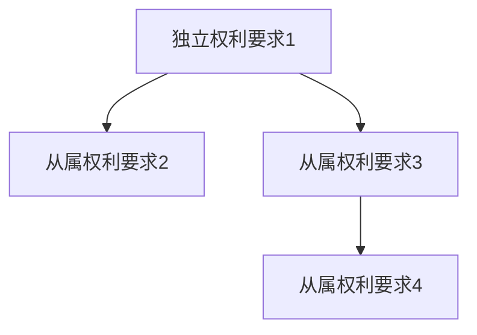

# 权利要求解析模板（`wiki/claims/`）

## 权利要求要素分解 `[专利号]/claim-decomposition.md`

```markdown
---
title: [专利号] 权利要求要素分解
type: claims
sources:
  - raw/patents/[专利号]-全文.pdf
  - raw/prosecution-history/[专利号]-审查历史.pdf
created: YYYY-MM-DD
updated: YYYY-MM-DD
tags: [权利要求, 要素分解, [竞品名]]
confidence: LEGAL-OPINION
classification: 内部
patent_number: [专利号]
competitor: [竞品公司名]
threat_level: 🔴高
status: draft
---

# [专利号] 权利要求要素分解

## 专利基本信息

| 项目 | 内容 |
|------|------|
| 专利号 | |
| 专利名称 | |
| 申请人 | |
| 申请日 | |
| 授权日 | |
| 法律状态 | [Step 1.5 自动判定结果，格式见下方说明] |
| IPC分类 | |

> [若已届满失效，在此处增加时效提示框，格式见 Step 1.5 规范]

**法律状态字段填写规范**（由 Step 1.5 自动判定后填入）：

- 已届满失效：`⚠️ **保护期已届满**：申请日YYYY.MM.DD，[专利类型]保护期[N]年，**已于YYYY.MM.DD届满失效**；本分析仅作历史参考和专利技术理解使用`
- 仍在保护期内：`🟢 **保护期内**：申请日YYYY.MM.DD，[专利类型]保护期[N]年，届满日YYYY.MM.DD，剩余约[N]年[N]个月`
- 法律状态待确认：`⚠️ **法律状态待确认**：无法自动判定保护期届满状态（原因：[缺少申请日/无法确定专利类型等]），建议人工核实`

## 独立权利要求1要素分解

### 权利要求1原文

> [权利要求1的完整原文，逐字引用，不得意译或概括]

---

### 前序部分

| 序号 | 要素描述 | 必要技术特征 | 关键限定词 |
|------|---------|------------|-----------|
| 1 | | 是/否 | |

### 特征部分

| 序号 | 要素描述 | 必要技术特征 | 关键限定词 |
|------|---------|------------|-----------|
| 1 | | 是/否 | |

## 从属权利要求附加特征

### 权利要求2原文

> [权利要求2的完整原文，逐字引用]

---

| 权利要求 | 引用 | 附加技术特征 | 关键限定词 |
|---------|------|------------|-----------|
| 2 | 权1 | | |

### 权利要求3原文

> [权利要求3的完整原文，逐字引用]

---

| 权利要求 | 引用 | 附加技术特征 | 关键限定词 |
|---------|------|------------|-----------|
| 3 | 权2 | | |

[按此格式继续每个从属权利要求]

## 权利要求层次结构



## 保护范围解读

### 5.1 权利要求1

#### 权利要求1的原文记载

> [权利要求1的完整原文，逐字引用，不得意译或概括]

#### 权利要求1的保护范围

该专利保护的技术方案是：
一种 [产品类型/方法类型]，其至少包含：
  - [要素1的技术描述]
  - [要素2的技术描述]
  - ...
其中，[要素间的协同关系/信号流向/数据流向]为：[描述]

该方案的核心技术特征在于：[特征部分要素的技术描述汇总]

该方案不排除：[开放式过渡词允许的额外技术特征]
该方案排除：[封闭式过渡词排除的技术特征]

### 5.2 权利要求2

#### 权利要求2的原文记载

> [权利要求2的完整原文，逐字引用，不得意译或概括]

#### 权利要求2的保护范围

在权利要求1的技术方案基础上，权利要求2进一步限定：

**附加技术特征**：
  - [从属权利要求2的附加技术特征技术描述]

**附加特征对整体方案的影响**：
  - [附加特征如何进一步限定/细化独立权利要求中的要素或要素间关系]

**该从属权利要求保护的完整技术方案**：
[在独立权利要求技术方案基础上，叠加从属权利要求附加特征后的完整技术方案描述]

[按此格式继续每个从属权利要求：5.X 权利要求X → 原文记载 → 保护范围]

## 关键限定词识别

| 限定词 | 所在要素 | 对保护范围的影响 | 可能的解释方案 |
|--------|---------|----------------|--------------|
| "大约" | 要素X | 扩大保护范围 | 方案1/方案2 |

## 等同范围预判

| 权利要求要素 | 可能的等同特征 | 预判依据 | 置信度 |
|------------|--------------|---------|--------|
| | | 说明书第X段 | INFERRED |

> ⚠️ 等同范围预判为初步法律分析，需专利律师确认

## 审查历史对保护范围的限制

| 审查意见 | 申请人答复/修改 | 对保护范围的影响 | 禁止反悔适用性 |
|---------|---------------|----------------|--------------|
| | | 限缩了XX要素 | 可能适用 |

## 权利要求解释争议点

| 争议要素 | 解释方案A | 解释方案B | 各自依据 | 建议 |
|---------|---------|---------|---------|------|
| | | | 审查历史/说明书 | |

## 同族权利要求差异

| 法域 | 专利号 | 权利要求差异 | 对保护范围的影响 |
|------|--------|------------|----------------|
| US | | | |
| EP | | | |

## 保护范围宽窄评级

- **评级**：宽 / 中 / 窄
- **理由**：

## 规避方案设计

### 独立权利要求1规避方案

#### 技术替代方案分析

| 规避要素 | 原权利要求特征 | 替代技术方案 | 替代方案技术描述 | 技术可行性 | 说明书支撑/公知常识依据 |
|---------|-------------|------------|----------------|-----------|---------------------|
| F1 | | | | 高/中/低 | |
| F2 | | | | 高/中/低 | |

#### 权利要求规避策略

| 策略编号 | 规避路径 | 涉及要素 | 规避原理 | 实施要点 |
|---------|---------|---------|---------|---------|
| S1 | | | | |
| S2 | | | | |

#### 规避方案有效性评估

| 策略编号 | 字面侵权风险 | 等同侵权风险 | 综合规避有效性 | 风险说明 | 建议 |
|---------|------------|------------|--------------|---------|------|
| S1 | 无/低/中/高 | 无/低/中/高 | 高/中/低 | | |
| S2 | 无/低/中/高 | 无/低/中/高 | 高/中/低 | | |

> ⚠️ 规避方案有效性为初步评估，需专利律师确认

confidence: INFERRED
```
