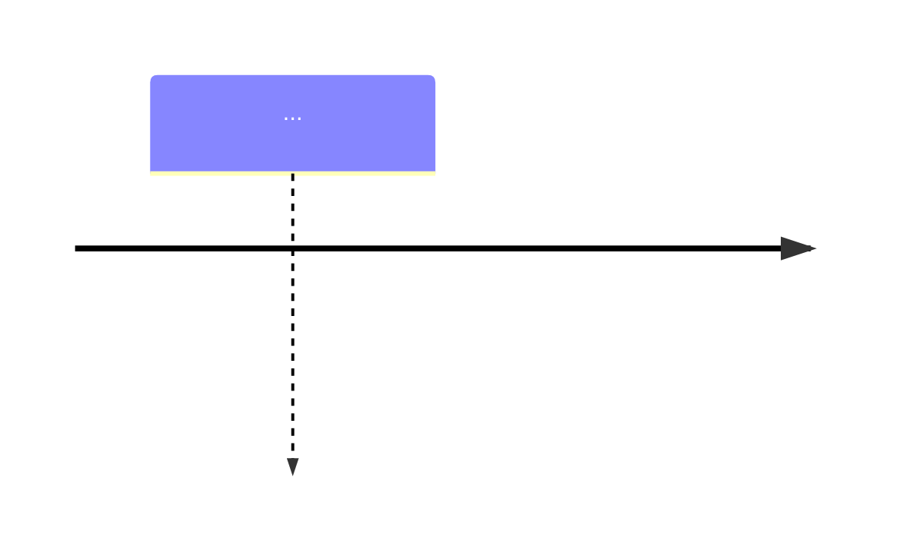

# 阅卷报告格式规范

## 通用要求

1. **文件格式**：Markdown（.md），层级清晰，可直接阅读或导入 Word
2. **文件命名**：`[案号或案件简称]_阅卷报告.md`，如无案号则用 `[当事人名称]_阅卷报告.md`
3. **语言风格**：专业但清晰，结论先行，每个判断都有依据
4. **必含元素**：每条结论必须标注证据来源（证据编号-页码-段落）

## 报告结构

### 模式 A（仅证据）报告结构

```
# [案件名称] 阅卷报告

> 分析日期：YYYY-MM-DD
> 材料数量：N 份
> 分析模式：模式 A — 仅证据材料

---

## 一、材料清单与 OCR 处理

| 序号 | 证据编号 | 文件名 | 类型 | 页数 | OCR 状态 |
|---|---|---|---|---|---|
| 1 | 证1 | ... | PDF | 5页 | ✅ 已完成 |
| ... | ... | ... | ... | ... | ... |

---

## 二、事实与证据梳理

### 证1：[证据名称]

| 编号 | 时间 | 主体 | 行为/事件 | 金额 | 来源 |
|---|---|---|---|---|---|
| F1 | 2024-03-10 | 张三 | 签署借款合同 | 50万 | 证1-第1页-第1段 |
| ... | ... | ... | ... | ... | ... |

### 证2：[证据名称]

...

---

## 三、证据矛盾点清单

### 矛盾点 #1 [🔴 严重]

- **涉及证据**：证1 vs 证2
- **矛盾类型**：金额矛盾
- **矛盾内容**：...
- **来源**：...
- **可能影响**：...
- **建议处理**：...

---

## 四、时间轴




---

## 五、综合分析结论

### 5.1 证据链完整度评估
### 5.2 关键事实确认情况
### 5.3 证据风险提示
### 5.4 后续建议
```

### 模式 B（起诉状+证据）报告结构

在模式 A 结构基础上，在「事实与证据梳理」之后、「证据矛盾点清单」之前，增加：

```
## 三、法律关系分析

### 3.1 起诉状要点提取

**案由**：民间借贷纠纷

**诉讼请求**：
1. 请求判令被告偿还借款本金50万元
2. 请求判令被告支付利息XX元
3. ...

**事实与理由摘要**：...

### 3.2 构成要件对照表

| 序号 | 构成要件 | 对应证据 | 证据充分性 | 说明 |
|---|---|---|---|---|
| 1 | 借贷合意 | 证1（借款合同） | ✅ 充分 | 合同第2条明确借款意思表示 |
| ... | ... | ... | ... | ... |

### 3.3 证据不足要件

| 构成要件 | 缺失说明 | 补证建议 |
|---|---|---|
| 还款事实 | 未提供任何还款记录 | 建议调取双方银行流水 |
```

后续编号顺延。
