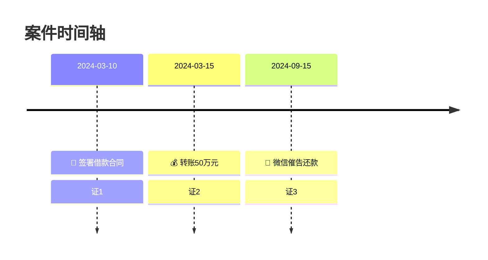

# 时间轴提取与生成规范

## 提取规则

### 1. 时间节点提取

从全部 OCR 后的证据文本中，提取所有包含明确日期的事件：

- 精确日期（如 2024-03-15）
- 模糊日期（如 2024年3月、2024年3月中旬）→ 标注为模糊
- 相对时间（如 "合同签订后3日内""收到通知后7个工作日"）→ 尝试推算绝对日期，标注推算依据

### 2. 去重与排序

- 同一日期的多个事件 → 合并到同一时间点，但不丢失任何事件
- 按时间从早到晚排序
- 标注事件之间的时间间隔

### 3. 事件分类

给每个事件打分类标签：

| 分类 | 标签 | 说明 |
|---|---|---|
| 合同/协议 | 📝 签约 | 合同签订、协议达成 |
| 款项往来 | 💰 资金 | 付款、转账、收款 |
| 货物/服务 | 📦 交付 | 交货、验收、提供服务 |
| 通知/催告 | 📨 通知 | 发函、催告、通知 |
| 违约/争议 | ⚠️ 违约 | 违约行为、争议发生 |
| 诉讼/仲裁 | ⚖️ 程序 | 起诉、立案、开庭、判决 |
| 其他 | 📌 其他 | 其他重要事件 |

## 生成流程

### Step 1：提取时间数据

从 Phase 3 的事实提取结果中，筛选所有含时间标记的事件，整理为结构化数据：

```json
[
  {"date": "2024-03-10", "event": "张三与李四签署《借款合同》", "source": "证1-第1页", "category": "📝 签约"},
  {"date": "2024-03-15", "event": "张三向李四转账50万元", "source": "证2-全页", "category": "💰 资金"},
  {"date": "2024-09-15", "event": "张三微信催告李四还款", "source": "证3-第5页", "category": "📨 通知"}
]
```

### Step 2：生成 HTML 时间轴

使用 `scripts/timeline-template.html` 模板，将时间数据填入生成完整 HTML 页面。

HTML 页面要求：
- 响应式设计，适配不同屏幕
- 左侧时间线 + 右侧事件卡片布局
- 事件按分类使用不同颜色标记
- 每个事件卡片显示：日期、事件描述、来源证据
- 支持鼠标悬停展开详情

### Step 3：截图转 PNG

1. 将生成的 HTML 保存为 `timeline.html`
2. 加载 `agent-browser` skill
3. 使用 agent-browser 打开 `file://` + 绝对路径
4. 执行全页截图，保存为 `timeline.png`
5. PNG 分辨率至少 1200px 宽，确保清晰可读

### Step 4：生成 Mermaid 代码（备选）

同步生成 Mermaid 格式的时间轴代码，嵌入 Markdown 报告：



## HTML 时间轴设计规范

参见 `scripts/timeline-template.html`，核心设计要素：

- **配色方案**：简洁专业的法律文书风格
- **字体**：系统默认中文字体（PingFang SC / Microsoft YaHei）
- **布局**：左侧竖线时间轴 + 右侧事件卡片
- **交互**：卡片悬停高亮、点击展开详情
- **截图友好**：无动画、固定宽度、白色背景

## 质量控制

- [ ] 所有可确定的时间节点均已提取
- [ ] 模糊时间已标注"约""中旬"等限定词
- [ ] 每个事件都有来源标注
- [ ] HTML 页面可正常打开和浏览
- [ ] PNG 截图清晰可读（文字不模糊）
- [ ] Mermaid 代码语法正确
