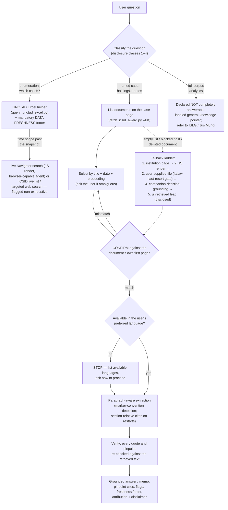

# ISDS 研究技能（ISDS Research skill）

这是一款植根于检索的投资人与国家间争端解决（ISDS）裁决研究辅助工具。它通过按需从 ICSID、PCA 及其他官方来源检索**原始文件**来回答关于投资争端案件与主题的问题，从而将答案植根于裁决的实际文本，并附精确引注（段落/页码）。它遵守其所依赖的公共数据库的条款；绝不抓取或托管语料库，且只引用其实际检索到的文本。

**不构成法律意见。**

## 如何在 Claude 中安装

1. **下载技能。** 在此下载打包的 ZIP 文件：https://github.com/ccrnyc/isds-research/releases/latest/download/isds-research.zip （或从本仓库的 [Releases 页面](../../releases) 下载）。
2. **确保已启用"云端代码执行与文件创建"以使技能能够运行**。Free/Pro/Max 套餐：前往"设置 > 功能"，确保"云端代码执行与文件创建"已开启。Team/Enterprise 套餐：由您的组织所有者（Owner）在"组织设置 > 技能"下启用 Skills。
3. **上传技能。** 前往"自定义 > 技能"，点击"+"或"添加"→"上传技能"，然后选择该 ZIP。选择该技能并将其打开。

要使用本技能，只需提出一个 ISDS 问题——例如*"Tecmed v. Mexico 案的仲裁庭如何阐述公平公正待遇标准？"*——您的助手会自动调用本技能。

完整功能请参阅下文**网络要求**。根据您的助手和平台，您可能还需要调整网络设置和文件夹权限，以便助手能够访问来源网站并将文件保存到本地文件夹——先运行 `--check-env` 可以报告依赖项、网络访问和可写研究文件夹是否就绪，并指出需要修复的内容。

## 如何在 ChatGPT 中安装

ChatGPT 中的 Skills 遵循相同的开放 Agent Skills 标准，因此使用同一个 ZIP。截至 2026 年 7 月，OpenAI 将 Skills 列为 ChatGPT Business、Enterprise、Edu 和 Healthcare 套餐（外加 Codex 和 API）可用；如果您的 ChatGPT 个人资料菜单中没有出现 **Skills** 部分，则您的套餐可能尚不包含该功能。

1. **下载技能** — 与上面相同的 ZIP。
2. **上传技能。** 如果您的套餐显示 **Skills** 部分，请打开个人资料菜单 → **Skills** → **Create** → **Upload from your computer**，然后选择该 ZIP；上传的技能会由 OpenAI 扫描，可能被标记为"Needs Review"（需要审查）或"Blocked"（被阻止）后才能使用。**如果没有出现 Skills 部分**（例如免费账户），请改通过 Codex CLI 安装：将同一压缩包解压到您的 Codex 技能目录中 — `unzip isds-research-*.zip -d ~/.codex/skills` — 这会生成 `~/.codex/skills/isds-research/SKILL.md`。安装路径因套餐而异；技能内容完全相同。
3. **在新对话中运行环境检查** — 请 ChatGPT 运行该技能的 `--check-env`（参见 `SKILL.md` → 平台说明）。如果代码沙箱无法访问来源主机，技能仍可在其中所述的降级模式下工作（内置浏览抓取并披露截断，或由您上传 PDF 并使用 `--pdf-file` 处理）。

## 目录内容

- `SKILL.md` — 代理技能：工作流、合规护栏、署名/免责声明，以及黄金法则（植根于检索，而非凭记忆作答）。
- `WRITEUP.md` — 设计笔记：为何如此构建、如何评估（10 项经裁决的评估；1.0 版总体评分 A−），以及 *Saluka*→*Methanex* 幻影引文发现。
- `scripts/fetch_icsid_award.py` — 列出 ICSID 案件页面上的文件，下载您选择的文件，显示其首页以便您确认这是正确的文件，然后提取段落感知文本（完整 PDF，不截断），并支持可选查询匹配。可处理两种段落标记约定（`154. ` 和方括号式 `[324] `，自动检测）以及按部分/章节重新编号的情况（如 Methanex）：经标题确认的重新编号产生章节相对引注（"PART IV - CHAPTER D, para 7"）；无法识别的编号约定会触发明确警告，回退到基于页面的引注。
- `scripts/query_unctad_excel.py` — 筛选本地 UNCTAD 全量数据 Excel 快照（`data/`）以回答"哪些案件"类问题：被申请国、条约、结果、违约、行业、规则、年份、仲裁员、自由文本的任意组合；提取 ICSID 案件编号（它们位于案件名称/链接文本内部，而非专用列）；标记快照数据推定已过时的行（`LIVE_CHECK`：快照时待决、后续待决或近期活动）；并附加强制性的数据新鲜度页脚（快照日期、UNCTAD 非穷尽性说明，以及对 Navigator"Updated as of"日期的限速 ≤1 次/天实时检查，离线时降级为"最后已知"）。
- `data/` — **您自己**的 UNCTAD 官方全量数据 Excel 的存放位置（31/12/2023 版发布包含 1,332 个案件；实时 Navigator 大约领先其两年）。**该文件不包含在本仓库中** — UNCTAD 的条款禁止再分发；请参阅下文下载部分。仅限本地非商业性筛选使用，绝不重新发布。

## 获取 UNCTAD 数据（必需，一次性下载）

该技能"哪些案件……"（枚举）功能基于 UNCTAD 官方全量数据 Excel 运行，该文件**不包含在本仓库中**：UNCTAD 的[使用条款](https://investmentpolicy.unctad.org/pages/1048/terms-and-conditions-of-use)允许个人、非商业性使用，但禁止再分发，因此每位用户直接从 UNCTAD 下载自己的副本（免费，无需注册）：

1. 查看 UNCTAD 的[发布页面](https://investmentpolicy.unctad.org/publications/1303/investment-dispute-settlement-navigator-full-isds-data-release-as-of-31-12-2023-in-excel-format-)获取全量数据发布；截至撰写本文时最新版本为 **31/12/2023 快照**：[直接下载](https://investmentpolicy.unctad.org/uploaded-files/document/UNCTAD-ISDS-Navigator-data-set-31December2023.xlsx)。
2. 将 `.xlsx` 放入本技能的 `data/` 文件夹。在聊天中（Claude Cowork / claude.ai、ChatGPT 等），您可以直接**上传文件并请您的助手将其保存到技能的 `data/` 文件夹中** — 在平台跨会话持久化技能文件的情况下，无需重新上传即可复用（参见 `SKILL.md` → 平台说明）。

如果未提供该文件即运行技能，`query_unctad_excel.py` 会打印上述相同说明（`DATA_MISSING`），而不是以晦涩的方式报错。裁决检索（`fetch_icsid_award.py`）无需该 Excel 即可工作；只有枚举功能需要它。

## 安装与运行

```
pip install requests pdfplumber openpyxl

# （任何平台上首次使用）检查依赖项、网络出口和配置可写性
python scripts/fetch_icsid_award.py --check-env

# （首次运行，询问一次）记录您偏好的语言以及研究
# 文件夹（每个主题的备忘录 + 检索到的 PDF）的保存位置
python scripts/fetch_icsid_award.py --set-prefer-lang "English" --set-research-root "<your research folder>"

# 1) 列出案件页面上的每份文件（程序、标题、日期、语言）
python scripts/fetch_icsid_award.py --case "ARB(AF)/00/2" --list

# 2) 选择一份，从首页确认，并检索它
python scripts/fetch_icsid_award.py --case "ARB(AF)/00/2" --select 1 --query "fair and equitable treatment"
```

步骤 2 会打印一个 CONFIRM 块（案件页面标签、检测到的案件编号、首页文本），以便您在依赖该文件前进行验证，然后打印匹配段落及其 `para N (p.M)` 引注，外加必需的 ICSID 署名和不构成法律意见的免责声明。

**语言**被视为一种属性，而非过滤器：仅以西班牙语/法语等发布的裁决同样是有效结果。工具会在存在您偏好的语言时检索之；不存在时，它不会静默替换——它会列出该文件*实际*可用的语言并询问您希望如何继续（阅读已有的 ICSID 版本，或获取一份带标记的、非权威的原文译本），因为页面并不总能确定哪种语言是权威版本。使用 `--select N --lang "<language>"` 提供您的选择。

**偏好设置与只读安装。** 偏好设置（语言、研究文件夹根目录）默认存放在脚本旁的 `scripts/user-config.json` 中。已安装的技能文件夹通常以只读方式挂载：`--show-config` 会预先报告此情况（`CONFIG_DIR_WRITABLE=no`），保存失败时会打印清晰的 `CONFIG NOT SAVED` 块（退出码 3），而不是回溯信息。在这种情况下，请将配置保存在您选择的任何可写位置——惯例是在研究文件夹根目录的 `isds-research-config.json`——并在每次调用时传入 `--config "<research folder>/isds-research-config.json"`；在 Claude 中，技能会询问您一次偏好设置应存放于何处，并在后续会话中复用该位置。

## 网络要求

脚本直接抓取文件和元数据，因此运行脚本的环境需要对这些官方主机具有出站访问权限：

- `icsid.worldbank.org` — 案件详情页
- `icsidfiles.worldbank.org` — 文件 PDF
- `investmentpolicy.unctad.org` — 您自行下载的 UNCTAD Excel，以及辅助工具的新鲜度检查
- `pca-cpa.org` / `docs.pca-cpa.org` — PCA 案件页面和文件

**italaw 刻意不在此列表中。** italaw 文件的默认获取方式是由您在浏览器中手动下载（参见合规说明）— 除非您明确批准受限的、逐文件的回退，否则工具不需要对 italaw 的网络访问。

**请将这些网站加入您的允许列表，以使用工具的完整功能。**

- **claude.ai / Cowork（Team 或 Enterprise 套餐）：** 网络访问由您的组织所有者控制。如果脚本报告主机被阻止，请与所有者讨论是否可以将这些域名加入允许列表（或启用网络访问）。
- **Claude Code：** 在首次使用时批准按域名的网络提示，或在您的 `settings.json` 的 `sandbox.network.allowedDomains` 下预先允许这些主机。
- **ChatGPT：** Skills 代码沙箱的网络策略未公开文档化；安装后运行 `--check-env`。如果主机不可达，请使用 `SKILL.md` → 平台说明中的降级模式。

任何设置更改都应由您自行完成 — 技能绝不修改您的设置。这些域名管辖的是该技能的*脚本*；您助手的内置网页抓取/浏览（以及在 Claude 中可选的 Claude in Chrome）由平台自身的设置另行管辖。

## 发现与数据新鲜度（优雅降级）

"哪些案件……"类问题遵循一个**发现阶梯**——每一级都优雅地降级到下一级，且答案始终披露其立于哪一级：

1. **本地 UNCTAD Excel**（`scripts/query_unctad_excel.py`）— 截至快照日期（目前为 31/12/2023）的、完整的、可筛选的 UNCTAD 标记案件集合。对于以快照为边界的问题是主要且充分的。
2. **实时 Navigator 检索** — 用于快照之后的近期窗口。Navigator 的检索/列表视图为 JS 渲染，因此该级需要具备 JS 能力的浏览器渲染——在 Claude 上，是可选的 Claude in Chrome 扩展（安装：https://code.claude.com/docs/en/chrome）；在其他平台上，是助手的浏览/代理模式。仅限定向检索；绝不批量爬取。
3. **无 Chrome 时** — 技能*不会*失败或假装完整：它用 ICSID 自身的实时案件数据库（服务器渲染）对 ICSID 子集进行补充，和/或进行定向网络搜索，并明确标记为非穷尽性的指引而非完整集合。

指名案件查询永远不需要浏览器：Navigator 的单个案件页面为服务器渲染，可通过数字 id 解析（`/investment-dispute-settlement/cases/{id}/{any-slug}`）。请注意新鲜度层级：Excel 快照（31/12/2023）< 实时 Navigator（本身是约半年一次的快照；目前为 31/12/2025）< 机构自身的实时页面（ICSID/PCA）— 真正当前的状态只能来自最后一层。辅助工具的 `LIVE_CHECK` 标记用于标记快照数据推定已过时的行；其新鲜度检查需要出站网络（在普通机器/Claude Code 上可工作；某些沙箱会阻止它，此时它会报告"NOT verified now"（现在未验证）并继续运行）。

## 设计（RAG 流水线）



1. **发现** — 上述阶梯：本地 UNCTAD Excel → JS 渲染的 Navigator 检索（具备浏览器能力的代理，如 Claude in Chrome）→ ICSID 实时列表/带披露限制的定向网络搜索。ICSID 案件使用 ICSID 自身的案件数据库（robots 许可宽松）；绝不批量采集。
2. **识别** — 抓取 ICSID 案件详情页，将*所有*已发布文件解析为结构化表格（程序、标题、日期以及每种可用语言 + URL），而不是抓取"第一个英文 PDF"。
3. **确认** — 下载所选文件并阅读其首页，核验标题、当事人、案件编号和日期与预期文件一致后再依赖之。
4. **提取** — 使用 pdfplumber 逐页提取，检测段落编号，使答案携带精确引注（完整 PDF，不截断）。
5. **植根** — 仅根据检索到的文本作答；如果某个要点不在其中，就明确说明。
6. **核验** — 在发送之前，确认每处引文/段落确实出现在检索到的文本中。

## 本工具的擅长与不擅长

**擅长：** 可核验的研究。单文件问题（"*Tecmed* 案如何处理比例原则？"）可获得植根于已确认原始文本的精确引注答案。有界比较（"就主题 A 比较 X、Y、Z"）获得同样的待遇，外加一项强制性的完整性检查，将全面处理该主题所需的其他案件或权威线索标记为——明确标注为未经审查的线索。类别枚举（"哪些条约案件源于委内瑞拉国有化？"）基于 UNCTAD 官方数据集运行，并披露其范围与快照日期。

**刻意不擅长：** 语料分析。这里没有抓取的裁决语料库（出于设计——参见合规说明），也无法访问订阅数据库（Investor-State LawGuide、Jus Mundi、italaw 全文）。因此，"主题 Z 被引用最多的案件"或"仲裁员 N 异议的频率"之类的问题无法完整回答；工具会如实说明，提供清晰标注的一般知识指引，并将用户引向为此类工作而建的数据库。本工具的设计宗旨是对其局限保持诚实：每个答案都说明实际审查了什么、未审查什么。

## 合规说明

- **ICSID** 条款允许出于个人、非商业性目的查看/下载；禁止再分发或制作衍生数据库。必须注明出处（脚本会自动附上）。
- **UNCTAD** 仅用于发现/元数据；其 robots 阻止批量/训练爬虫，其条款禁止编译/再分发其数据集 — 因此它在人工指挥下使用，或通过定向的、用户发起的代理抓取（`Claude-User` / `ChatGPT-User`）使用，绝不批量采集。
- **italaw** 仅是**最后手段、逐案确认的回退**：先使用官方来源（ICSID/PCA）；默认路径是用户手动下载文件（italaw 条款明确允许人工浏览）；自动化抓取仅在逐文件人工确认后发生，使用平台自身的用户发起代理令牌，每份文件一次批准，参考而不复制，并记录在案。italaw 内容绝不进入任何构建/测试语料库。完整条件请参阅 SKILL.md 中的 italaw 条目。
- 礼貌访问：描述性 User-Agent、请求之间设置礼貌延迟、仅按需单文件获取。
- 上述每个主机的 Robots.txt 已于 2026-07-18 针对 `Claude-User` 和 `ChatGPT-User` 重新核验 — 参见 `SKILL.md` → 平台说明及其中各来源条目。Robots 文件会变化；请定期重新核验。

## 许可证

版权所有（C）2026 Cameron Russell (ccrnyc)。依据 **GNU Affero General Public License v3.0**（`AGPL-3.0-only`）授权 — 参见 [LICENSE](LICENSE)。本程序不附带任何担保（ABSOLUTELY NO WARRANTY）。许可证仅覆盖技能的代码和文档；检索到的文件和 UNCTAD 数据集仍受其各自来源条款的约束（参见合规说明）。

## 已知限制

- `web_fetch`（无代码回退）会将超长 PDF 截断在约 120k 字符处，这会静默丢弃长裁决的后段段落——深藏于文件后部的裁判要旨会从视野中消失。脚本通过下载文件并用 pdfplumber 提取来避免此问题——请在主机（`icsidfiles.worldbank.org`）可达的环境中运行。请注意，`icsidfiles.worldbank.org` 对裸域名请求返回 403，但能正常提供真实 PDF 路径；某些沙箱在网络代理层阻止该主机，此时请在本地或具备网络能力的环境中运行。
- ICSID 案件详情页的渲染因案件而异：大多数案件的文件链接位于初始 HTML 中（普通 `requests` 即可看到），但有些案件由客户端注入列表。当文件列表返回为空时，技能不会猜测——它会诊断原因并回退到具备 JS 能力的渲染，或请求提供文件 URL（参见 SKILL.md 中的检索回退阶梯）。
