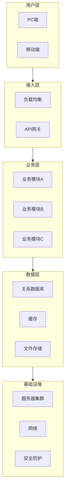
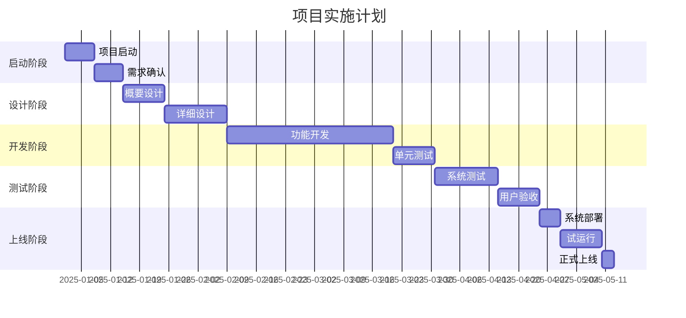

# 投标文件模板

> 以下为投标文件的标准结构模板。使用时将所有 `[方括号]` 中的内容替换为实际信息。
> 删除所有注释行（以 `>` 开头的行）。

---

# [项目名称] 投标文件

**招标编号：** [招标编号]

**投标人：** [公司全称]（公章）

**法定代表人或授权代表：** [签字]

**投标日期：** [YYYY年MM月DD日]

---

## 目录

> 正式提交前请根据实际页码更新

---

## 第一章 投标函及投标函附录

### 1.1 投标函

致：[招标人名称]

我方 [公司全称] 在充分研究 [项目名称]（招标编号：[招标编号]）招标文件的全部内容后，郑重承诺：

1. 我方愿以人民币（大写）[报价大写金额]（¥[报价小写金额]）的投标总价，按招标文件要求承包上述项目。

2. 一旦我方中标，我方保证在 [工期天数] 个自然日内完成项目交付。

3. 我方承诺在投标有效期内（自投标截止日起 [天数] 天内）不撤销投标文件。

4. 如我方中标，我方承诺：
   - 在收到中标通知书后 [天数] 天内签订合同
   - 按招标文件要求提交履约保证金
   - 按合同约定履行全部责任和义务

5. 我方在此声明，所递交的投标文件及有关资料内容完整、真实、准确。

**投标人（公章）：** [公司全称]

**法定代表人或授权代表（签字）：** [姓名]

**地址：** [公司地址]

**电话：** [联系电话]

**日期：** [YYYY年MM月DD日]

### 1.2 投标函附录

| 序号 | 项目 | 约定内容 |
|-----|------|---------|
| 1 | 投标有效期 | 自投标截止日起 [天数] 天内 |
| 2 | 工期 | [天数] 个自然日 |
| 3 | 质保期 | [年限] 年 |
| 4 | 履约保证金 | 合同金额的 [百分比]% |
| 5 | 质量目标 | [质量标准] |
| 6 | 项目经理 | [项目经理姓名] |

---

## 第二章 法定代表人授权书

致：[招标人名称]

我，[法定代表人姓名]，作为 [公司全称] 的法定代表人，在此授权 [被授权人姓名]（身份证号码：[身份证号]）为我公司的合法代理人，以我公司名义全权处理 [项目名称]（招标编号：[招标编号]）的投标活动。

代理人在投标、开标、评标、合同谈判及合同执行过程中所签署的一切文件和处理与之有关的一切事务，我均予以承认。

授权有效期：自本授权书签署之日起至投标有效期结束。

**投标人（公章）：** [公司全称]

**法定代表人（签字）：** [姓名]

**被授权人（签字）：** [姓名]

**日期：** [YYYY年MM月DD日]

---

## 第三章 资格证明文件

### 3.1 营业执照

> 附：营业执照副本复印件（加盖公章）

### 3.2 资质证书

> 附：与招标要求相关的资质证书复印件（逐份加盖公章）
>
> 常见资质：
> - ISO 9001 质量管理体系认证证书
> - 行业特定许可/资质证书
> - 高新技术企业证书
> - 软件企业认定证书
> - 安全生产许可证

### 3.3 财务状况证明

> 附：近 [X] 年财务审计报告（第三方审计机构出具，含审计机构营业执照副本）

| 财务指标 | [年份]年 | [年份]年 | [年份]年 |
|---------|---------|---------|---------|
| 营业收入（万元） | | | |
| 净资产（万元） | | | |
| 资产负债率 | | | |
| 净利润（万元） | | | |

### 3.4 纳税与社保证明

> 附：近 [X] 个月纳税证明 + 近 [X] 个月社保缴纳记录

### 3.5 无重大违法记录声明

本公司郑重声明，在参加本次采购活动前三年内，在经营活动中无重大违法记录，未被列入失信被执行人、重大税收违法案件当事人名单和政府采购严重违法失信行为记录名单。

> 附：信用中国网站截图 + 中国政府采购网截图

### 3.6 项目团队

#### 3.6.1 项目经理简历

> 附：项目经理以下材料（按顺序）：
> 1. 个人简历表
> 2. 身份证复印件
> 3. 学历证书复印件
> 4. 职业资格证书复印件
> 5. 荣誉证书复印件
> 6. 劳动合同复印件
> 7. 社保缴纳证明
> 8. 纳税证明
> 9. 项目负责人任命文件
> 10. 个人业绩清单

#### 3.6.2 项目团队概况

| 姓名 | 职务 | 学历 | 专业 | 从业年限 | 相关项目经验 |
|-----|------|------|------|---------|------------|
| | | | | | |
| | | | | | |

### 3.7 中小企业声明函（如适用）

> 如公司属于中小企业，填写《中小企业声明函》；否则声明"本公司不属于中小企业"。

---

## 第四章 技术方案

### 4.1 项目概述

#### 4.1.1 项目背景

[描述项目背景]

#### 4.1.2 建设目标

[列出建设目标]

#### 4.1.3 建设范围

[明确建设范围和边界]

### 4.2 需求分析

#### 4.2.1 招标文件核心需求摘录

| 序号 | 需求类别 | 具体内容 | 来源（招标条款） |
|-----|---------|---------|---------------|
| 1 | | | |
| 2 | | | |

#### 4.2.2 核心需求分析

1. [核心需求一]：[详细分析]
2. [核心需求二]：[详细分析]
3. [核心需求三]：[详细分析]

#### 4.2.3 关键技术难点

| 序号 | 技术难点 | 解决方案 | 创新性 |
|-----|---------|---------|-------|
| 1 | | | |
| 2 | | | |

#### 4.2.4 对需求的细化与合理化建议

[提出专业建议，体现专业能力和经验]

### 4.3 总体技术架构

#### 4.3.1 整体架构设计

> 使用 Mermaid 生成架构图

#### 4.3.2 技术选型说明

| 技术领域 | 选型方案 | 选型理由 |
|---------|---------|---------|
| 开发语言 | | |
| 后端框架 | | |
| 前端框架 | | |
| 数据库 | | |
| 中间件 | | |
| 部署环境 | | |

### 4.4 技术参数响应表

| 序号 | 招标条款 | 招标要求 | 投标响应 | 偏离类型 | 支撑材料 |
|-----|---------|---------|---------|---------|---------|
| 1 | | | | | |
| 2 | | | | | |
| 3 | | | | | |

### 4.5 项目实施计划

#### 4.5.1 总体进度

> 使用甘特图展示

#### 4.5.2 里程碑节点

| 里程碑 | 计划时间 | 交付物 |
|-------|---------|-------|
| 项目启动 | | 项目启动报告 |
| 需求确认 | | 需求规格说明书 |
| 设计完成 | | 设计文档 |
| 开发完成 | | 可部署版本 |
| 测试完成 | | 测试报告 |
| 验收通过 | | 验收报告 |
| 正式上线 | | 运维手册 |

### 4.6 质量管理方案

#### 4.6.1 质量目标

本项目质量目标：[目标描述]

#### 4.6.2 质量管理体系

[描述质量管理组织架构、质量控制流程、质量保证措施]

### 4.7 安全与风险管理

#### 4.7.1 安全体系设计

[描述安全架构、数据安全、应用安全、网络安全]

#### 4.7.2 风险识别与应对

| 序号 | 风险描述 | 可能性 | 影响程度 | 应对措施 | 责任人 |
|-----|---------|-------|---------|---------|-------|
| 1 | | 高/中/低 | 高/中/低 | | |
| 2 | | | | | |

### 4.8 培训与知识转移

| 培训课程 | 培训对象 | 培训时长 | 培训方式 | 培训内容 |
|---------|---------|---------|---------|---------|
| 系统操作培训 | 普通用户 | X天 | 现场+手册 | |
| 管理员培训 | 系统管理员 | X天 | 现场+实操 | |
| 开发培训 | 技术团队 | X天 | 现场+源码 | |

### 4.9 售后服务与运维保障

| 服务项 | 承诺内容 | 实现机制 |
|-------|---------|---------|
| 服务时间 | 7×24小时 | 建立XX小时值班机制 |
| 响应时间 | 30分钟内响应 | 设置智能监控告警 |
| 到场时间 | X小时内到场 | 本地化服务团队 |
| 故障修复 | 一般故障X小时，重大故障X小时 | 故障分级处理流程 |
| 巡检服务 | 每季度一次 | 制定巡检计划 |
| 质保期限 | 验收后X年 | 提供质保承诺书 |

---

## 第五章 商务方案

### 5.1 报价一览表

| 序号 | 报价项目 | 报价金额（元） | 备注 |
|-----|---------|-------------|------|
| 1 | [分项一] | ¥XXX | |
| 2 | [分项二] | ¥XXX | |
| 3 | [分项三] | ¥XXX | |
| | **投标总价** | **¥XXX** | |
| | **大写** | **[大写金额]** | |

### 5.2 分项报价明细表

| 序号 | 名称 | 品牌/型号 | 数量 | 单价（元） | 合价（元） |
|-----|------|----------|------|----------|----------|
| | | | | | |

**分项合计：¥XXX**

### 5.3 商务条款响应表

| 序号 | 招标条款 | 招标要求 | 投标响应 | 偏离说明 | 偏离类型 |
|-----|---------|---------|---------|---------|---------|
| 1 | 付款方式 | | | | |
| 2 | 交付期限 | | | | |
| 3 | 质保期 | | | | |
| 4 | 质保金 | | | | |
| 5 | 售后服务 | | | | |
| 6 | 知识产权 | | | | |
| 7 | 保密条款 | | | | |
| 8 | 违约责任 | | | | |

### 5.4 合同条款响应

本公司已详细阅读招标文件中合同条款的全部内容，除上述商务偏离表所列外，本公司完全接受合同条款的全部内容。

---

## 第六章 业绩与案例

### 6.1 同类项目业绩汇总

| 序号 | 项目名称 | 合同金额（万元） | 合同签订时间 | 完工时间 | 建设内容 |
|-----|---------|---------------|------------|---------|---------|
| 1 | | | | | |
| 2 | | | | | |
| 3 | | | | | |

### 6.2 案例详情

> 每个案例请附以下材料：
> 1. 中标通知书（复印件，加盖公章）
> 2. 合同文本（关键页复印件，含金额、签章、签订时间，加盖公章）
> 3. 验收报告/收货单（复印件，加盖公章）
> 4. 用户评价/满意度调查表

---

## 第七章 附件

### 7.1 资质证书

> 按顺序附所有资质证书复印件

### 7.2 产品资料

> 附产品规格书、白皮书、检测报告等

### 7.3 承诺书

> 附各类承诺书（保密承诺、廉洁承诺、安全承诺等）

### 7.4 声明函

> 附中小企业声明函、残疾人福利性单位声明函等（如适用）

---

> **本文档为投标文件通用模板，实际使用时必须根据具体招标文件要求进行调整和补充。**
