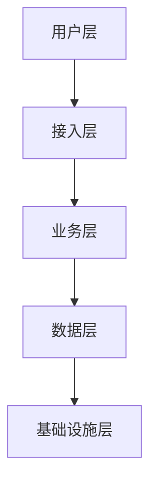

# 技术匹配指南

## 一、技术方案编制基本原则

### 1.1 核心原则
1. **特殊要求优先**：招标文件有明确规定时，严格按其要求编制，不得自行发挥
2. **通用规范参考**：无特殊要求时，依据本文档的通用规范编制
3. **逐条响应原则**：评分标准中列出的任何分值点（即使仅0.1分），均需有对应的文字说明或描述
4. **禁止模糊表述**：严禁使用"可能""大概""也许""应该""左右"等不确定性词汇

### 1.2 技术方案质量目标
- 让评委相信"你能解决问题"
- "华丽的辞藻"不如"落地的方案"，"先进的技术"不如"匹配的需求"
- 核心三问：能不能做？（证明能力）→ 怎么做？（展示方案）→ 为什么选你？（差异化优势）

## 二、盲评技术分满分八大要素

| 序号 | 要素 | 具体要求 | 检查清单 |
|-----|------|---------|---------|
| 1 | **架构严谨完整** | 方案结构覆盖项目全生命周期，无遗漏章节 | 对照评分表逐一核对 |
| 2 | **标题精准吸睛** | 标题直接点明主旨，重要亮点和卖点前置 | 评委扫一眼标题就能理解内容 |
| 3 | **自制高效索引** | 目录层级3-4级，页码对应准确 | 过少信息不足，过多繁琐 |
| 4 | **内容高度响应** | 每个评分点必须有对应段落，且标题编号对应招标条款 | 响应矩阵逐一验证 |
| 5 | **关键信息凸显** | 核心技术指标、优势参数使用加粗/表格突出 | 确保5秒内能被评委关注 |
| 6 | **核心优势醒目** | 做到"人无我有、人有我优、人少我多、人低我高" | 差异化竞争力明确列出 |
| 7 | **图文结合呈现** | 字不如数，数不如图 | 架构图、流程图、甘特图、对比表 |
| 8 | **文本规范严谨** | 小四宋体、1.5倍行距、无错别字和语法错误 | 格式检查清单逐项确认 |

## 三、技术参数响应方法

### 3.1 参数响应三步骤
1. **提取**：从招标文件逐条提取技术参数要求
2. **对照**：与投标产品/服务的技术指标一一对照
3. **标注**：标注正偏离（优于要求）、无偏离（一致）、负偏离（低于要求）

### 3.2 技术偏离表规范
```markdown
| 序号 | 招标参数 | 投标参数 | 偏离说明 | 偏离类型 | 支撑材料 |
|-----|---------|---------|---------|---------|---------|
| 1 | CPU≥8核 | 16核 | 性能优于要求 | 正偏离 | 产品规格书P15 |
| 2 | 内存≥32GB | 32GB | 完全满足 | 无偏离 | 产品规格书P15 |
| 3 | 响应时间≤3秒 | 2.5秒 | 优于要求 | 正偏离 | 性能测试报告 |
| 4 | 并发用户≥500 | 300 | 低于要求 | 负偏离 | 需说明替代方案 |
```

**偏离类型说明**：
- **正偏离**：投标产品技术参数优于招标文件要求（加分项）
- **无偏离**：与招标文件参数完全一致
- **负偏离**：投标产品技术参数低于招标文件要求（必须给出替代方案或说明）

### 3.3 负偏离处理策略
1. 评估负偏离是否为实质性条款（★号条款不允许负偏离）
2. 如非实质性条款，给出替代技术方案或弥补措施
3. 说明负偏离不影响整体性能和项目效果的理由
4. 提供行业标准或实践案例作为支撑

## 四、技术方案编写要领

### 4.1 三大核心要领

#### A. 主题鲜明
- **标题点题**：善用标题直接点明主旨，重要亮点和卖点前置
- **论证清晰**：阐述技术方案和服务承诺需明确具体，避免使用网络通用的空话、套话、大话
- **目标**：确保评委能迅速把握核心思想

#### B. 表达精准
- **量化支撑**：介绍公司、产品、施工能力、服务方式时，优先使用数据和图表
- **逻辑自洽**：内容表述前后一致，避免自相矛盾
- **严谨用语**：技术参数必须带单位，且与招标原文严格一致

#### C. 行文规范
- **语言严谨**：杜绝使用非正式口语化表达
- **无错别字**：确保无语法错误和错别字
- **专业术语**：使用行业标准术语，首次出现时给出全称和缩写

### 4.2 将主观分"写实"的六种方法

| 方法 | 具体操作 | 适用场景 |
|-----|---------|---------|
| **理念先进** | 引用权威文献（国家最新政策、行业标准、技术白皮书） | 项目概述、需求分析 |
| **制度健全** | 提供支撑性的制度文件作为附件 | 质量管理、安全管理 |
| **团队出色** | 详细列出关键人员（尤其是项目经理）的资质履历 | 人员配置 |
| **工具多样** | 清晰列出并辅以图形展示（如使用软件界面截图） | 开发工具、测试工具 |
| **方法实用** | 提供具体的操作流程或指南 | 实施方法 |
| **图表精准** | 确保图表内容详实、清晰、完善 | 全篇 |

## 五、各章节编写要求

### 5.1 工程类技术方案（14章结构）
1. **项目概述**：项目背景、建设目标、建设范围
2. **需求分析**：摘录招标文件核心需求→重点分析（明确1/2/3点）→关键技术难点→补充建议
3. **施工图纸**（如适用）：按招标文件要求提供
4. **施工组织设计/流程**：施工总体部署、分阶段实施计划
5. **项目经理及团队**：按"简历→身份证→学历→职业资格→荣誉→劳动合同→社保→纳税→任命书→业绩"顺序排列
6. **工程量清单**（如适用）：逐项报价、计算过程清晰
7. **设备配置方案**：设备清单、技术参数、供应商选择
8. **项目管理计划**：进度管理、质量管理、沟通管理、风险管理
9. **质量标准与控制**：质量标准、检测方法、验收标准
10. **安全生产措施**：安全生产制度、应急预案、培训计划
11. **环境保护措施**：环保方案、排放标准、绿色施工
12. **服务保障体系**：培训计划、技术支持、售后服务
13. **风险预案**：项目风险识别、风险评估、应对措施
14. **合理化建议**：对项目的优化建议和创新方案

### 5.2 服务类技术方案
1. 项目概述
2. 需求深度分析（摘录需求→核心需求→技术难点→补充建议）
3. 服务总体方案
4. 服务流程与标准
5. 人员配置方案
6. 质量控制方案
7. 应急预案
8. 培训与知识转移
9. 售后服务方案

### 5.3 产品/设备采购类技术方案
1. 产品概述
2. 技术参数响应表（逐条对照）
3. 产品功能详述
4. 技术架构说明
5. 生产/供货方案
6. 检验与验收方案
7. 安装调试方案
8. 培训方案
9. 售后与维保方案

## 六、可视化要求

### 6.1 必须可视化的内容
- **系统架构图**：使用Mermaid或PlantUML生成
- **实施进度计划**：使用甘特图
- **组织架构图**：项目团队结构
- **流程图**：关键业务流程、施工流程
- **对比表**：技术参数对比、方案对比

### 6.2 Mermaid代码示例


### 6.3 图表规范
- 风格与正文统一，避免花哨繁杂
- 图片美观、大气、简洁、高清
- 图例规范、比例准确
- 图表编号连续（图1、图2... + 表1、表2...）

## 七、技术方案质量自查表

| 序号 | 检查项 | 通过 | 需改进 |
|-----|-------|-----|-------|
| 1 | 每个评分点都有对应文字说明 | [ ] | [ ] |
| 2 | 重点内容有详尽、具体的阐述 | [ ] | [ ] |
| 3 | 工程量清单/图纸要求一一对应标注 | [ ] | [ ] |
| 4 | 所有表格填写完整、计算准确 | [ ] | [ ] |
| 5 | 技术参数全部带单位 | [ ] | [ ] |
| 6 | 无"可能""大概"等模糊词汇 | [ ] | [ ] |
| 7 | 图文并茂、图表清晰 | [ ] | [ ] |
| 8 | 正偏离项明确标注并附支撑材料 | [ ] | [ ] |
| 9 | 负偏离项给出替代方案 | [ ] | [ ] |
| 10 | 标题编号与招标条款对应 | [ ] | [ ] |
| 11 | 前后无矛盾（同一参数两处数值一致） | [ ] | [ ] |
| 12 | 目录页码与实际页码对应 | [ ] | [ ] |
