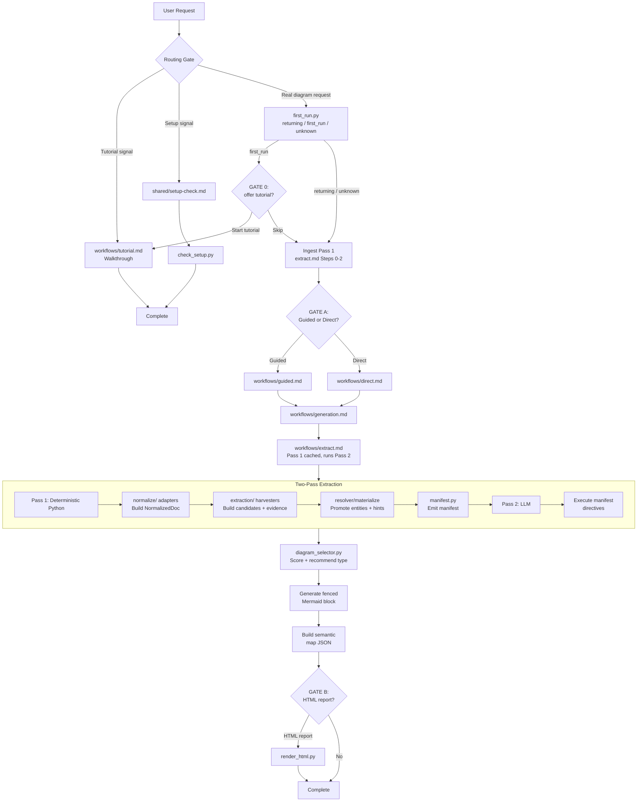

# legal-diagram

根据任意输入生成法律 Mermaid 图表，并可选导出可下载的 HTML 图形。

## 第一部分：用户指南

设置和使用该技能所需的一切：功能说明、设置、快速上手、首次运行的教程提示、交互门控、两条构建通道、HTML 导出和故障排查。

### 功能说明

`/legal-diagram` 将法律材料转化为图表。放入一份合同、粘贴一段案件描述，或仅描述一个争议，它就能生成时间线、组织结构图、义务清单、决策树或其他几种图形之一。Python 引擎读取文档结构，采集带证据的法律候选实体，提升高置信度实体，并将紧凑的未解决证据交给助手；助手随后填补缺口并选择最合适的图表类型。图表可在任何支持 Mermaid 的 Markdown 查看器中内联渲染（GitHub、VS Code、Obsidian、Claude 网页应用），并可导出为带有通俗语言讲解的 HTML 图形。

### 前提条件

- 环境 PATH 中有 Python 3.9 或更高版本。
- 对于二进制格式（`.docx`、`.pdf`、`.xlsx`、`.pptx`）和 HTML 导出：需要 `requirements.txt` 中的包。发布验证安装请使用 `constraints.txt`。Markdown、纯文本、粘贴文本和对话上下文仅需 Python 标准库，因此安装任何内容之前即可使用该技能。
- 无需特殊环境。HTML 导出默认输出到 `./diagrams/` 文件夹（不存在时自动创建），或输出到您指定的任何路径。不写入笔记文件。
- 语义节点着色是 HTML 导出中的纯 JS/CSS 实现——无需新的 Python 依赖。

### 安装/设置

1. 确认 Python：`python --version`（期望 3.9+）。
2. 安装可选解析器和 HTML 渲染器：
   ```bash
   pip install -r requirements.txt -c constraints.txt
   ```
3. 验证设置：
   ```bash
   python scripts/check_setup.py
   ```
   您应看到类似 `{"ok": true, "installed": [...], "missing": [], "optional": {...}}` 的 JSON。如果 `ok` 为 `false`，`missing` 列表会列出需要安装的必需包。`optional` 键报告可选包：`pdfplumber`（PDF 表格提取）列在其中；它的缺失不会使 `ok` 变为 `false`，也不会阻塞任何其他格式。`mermaid_vendor` 键报告离线 Mermaid 引擎是否已随附在 `assets/vendor/mermaid.min.js`；当该文件缺失时，此键会给出运行 `python scripts/fetch_mermaid.py` 的提示，HTML 导出将回退到仅源码面板或 `--allow-cdn`。即使缺少这些包，Markdown 和粘贴文本输入仍然可用。

在助手内，您也可以直接说“检查设置”（check setup）来运行此步骤。

### 快速上手

放入一份合同并请求生成图形。以下每个选项都是可点击的弹窗，而非需要输入的文字：

> 您：为这个争议绘制图表。[附件 `vendor-dispute.md`]
>
> 技能（仅首次运行）：首次使用。想要快速教程，还是直接开始生成图表？  `[开始教程]`  `[跳过，直接生成我的图表]`
>
> 您：`[跳过，直接生成我的图表]`
>
> 技能：我已读取 **vendor-dispute.md**。找到 2 个当事方、6 个事件、3 项义务。您希望如何构建？  `[引导式，逐步进行]`  `[直接生成]`
>
> 您：`[直接生成]`
>
> 技能：我绘制了一张 **时间线**，因为六个带日期的事件构成了诉讼时间脉络。该事项也可作为 **义务清单** 或 **当事方关系图** 呈现。需要其中一种吗？
> [围栏内联显示 Mermaid 时间线，节点按语义类别着色，未写入笔记]
>
> 技能：想要将完整报告保存为可打开、可打印、可分享的文件吗？  `[HTML 报告]`  `[不，只要图表]`

这就是完整的循环：一次性的教程提示、摄取并展示发现结果、选择构建方式、绘制最佳图表、说明原因，然后提供 HTML 报告。回访用户会自动跳过教程提示。

### 详细用法/深入说明

在摄取您的材料之后，技能会立即确定构建模式：引导式或直接式。这是一个强制选择。只有输入字面量 `--direct` 或 `--guided` 标志才能提前作答并跳过弹窗；该标志是您自己记录的选择。否则，无论您的请求多么详细或具体，构建模式弹窗始终显示并等待您选择。技能绝不会根据您的措辞猜测模式。单独的首次运行检查会提供教程，除非技能能确认您之前已运行过。

#### 引导式通道（默认）

交互式路径，最适合普通用户。它会消化您的输入（或者在没有文档时，根据事项类型提出一组简短问题：诉讼、公司、合规、雇佣、知识产权、隐私、破产、税务、不动产），然后在生成之前引导您通过两道阻塞门控：

1. **通俗语言摘要**——每个已填充的字段以简明语言呈现（当事方、事件、义务、主张、往来沟通、风险事项、法律依据等）。您可以确认、更正名称、补充遗漏项或删除任何内容后再继续。
2. **类型确认**——选择器推荐一种图表类型并附理由，列出备选方案；在绘制任何内容之前，您确认或切换。

生成之后，技能以弹窗选项的形式提供 HTML 报告。一个事项在一次会话中通常产生多张图表。构建模式弹窗始终以固定顺序显示两个选项并等待您的选择；它绝不会根据您的措辞预先选定一个。

HTML 导出包含语义着色层：节点按法律含义着色，使用柔和的法务调色板（当事方节点为石板蓝、法律依据为鼠尾草绿、风险为灰玫瑰色、结果为石灰色）。无障碍模式（法律依据为斜向阴影线、风险为交叉阴影线、结果为圆点）提供色盲安全辅助通道。图表控件中的高对比度切换按钮（◐）可将所有填充切换为白色背景加黑色边框和粗描边。图表下方会根据当前调色板自动生成颜色图例。

#### 直接通道（高级用户）

快速路径。当您传入字面量 `--direct` 标志（您已记录的回答，跳过弹窗），或在构建模式弹窗中选择 **直接生成** 时进入。它一次性读取所有信号并最多中断一次生成：仅当提取结果为空或图表类型置信度低于 0.50 时才停止。文件缺失和无输入的情况会在该通道运行前处理。HTML 报告是图表之后的独立弹窗。

#### 教程通道（首次运行）

引导式演练，检测您的环境并端到端运行一个完整示例（诉讼时间线或公司股权结构）。通过可拒绝的弹窗提供。一个小型状态文件（`~/.legal-diagram/state.json`，或 `$LEGAL_DIAGRAM_STATE` 指向的任何位置）记录该提示已发出，因此一旦技能能确认您是回访用户，就会停止提供。该提示仅在确认回访的信号下被抑制；在没有可写磁盘的环境中（如某些网络沙盒），状态无法确认，因此技能会提供教程而非替您决定。您也可以随时通过“tutorial”（教程）、“show me how”（演示给我看）、“first time”（第一次）或“demo”（演示）来启动它。

#### 输入格式

Markdown、纯文本、`.docx`、`.pdf`、`.xlsx`、`.pptx`、粘贴文本或当前对话。大型 PDF 会先被探测，然后询问您页码范围；扫描版 PDF（无可提取文本）会提示您改为粘贴。

提取器默认仅在 `input_source` 中输出输入文件的基本名称。完整本地路径仅在使用 `--include-source-path` 的可信内部工作流中可用。默认资源上限保护公共/共享使用：文件大小 25 MB、PDF 50 页、DOCX 5000 段落、DOCX 200 表格、DOCX 表格 5000 行、PPTX 200 张幻灯片、PPTX 5000 个文本形状、XLSX 20 个工作表、每表 XLSX 1000 行、每表 XLSX 50000 个单元格。仅对可信的本地输入使用对应的 `--max-*` 标志覆盖这些上限。

#### 图表名称

您只会看到通俗名称：时间线、日程表、流程图、决策树、组织结构图、义务清单、谁在何时做什么、思维导图、优先级网格、体验图。您可以按名称请求其中任何一种（例如“帮我做一张组织结构图”），技能会在内部映射。

#### HTML 导出

每张图表之后，技能以弹窗选项的形式提供 HTML 报告：**HTML 报告** 或 **不，只要图表**。选择报告将生成一个 HTML 图形：图表加上论文式标题、概述、“如何解读”图例、关键观察和局限性。W5 用户界面提供：

- **默认打开概述选项卡。** 第一个选项卡（概述）在提供的标记中即为活动状态，而非通过 JavaScript 应用，因此内容立即可见。
- **仅源码讲解面板。** 当 Mermaid 渲染引擎缺失（无随附文件、无 CDN）时，图表区域显示通俗语言的讲解面板而非原始图表指令。该面板解释情况，提供带有图表源码的折叠式披露区，并建议向发送方索要渲染版本。
- **高级编辑器披露区。** “高级：编辑图表的绘制指令”`<details>` 元素允许用户调整 Mermaid 源码并点击重新绘制；取消则恢复原始内容。更改仅影响图形，不影响源文档。
- **带标签的胶囊控件。** 放大、缩小、重置、高对比度（◐）、翻转（↔）和全屏（⛶）以图标加标签的胶囊形式显示，无需悬停即可辨认。高对比度适用于所有图表类型：在普通图表上它增强对比度并加深标签颜色，在彩色流程图上它还会强制白色填充加黑色描边。翻转仅在图表支持方向（流程图）时显示。
- **通俗语言导出菜单。** 保存和编辑操作是右下角的紧凑图标按钮，与图内控件保持距离。保存/导出提供：“图片（PNG），最适合电子邮件和 Word”；“锐利矢量（SVG），最适合打印和幻灯片”；“整个页面（HTML）”。保存的整页 HTML 文件保持交互性：图表源码保存在页面中，因此重新打开的文件仍可编辑、重新绘制和翻转。在全屏模式下，保存按钮移至图表框架内以保持导出可达，编辑按钮在该模式下隐藏，因为其编辑器位于框架之外。
- **教练提示。** 两条提示在首次打开时引导新用户：图表上方的提示条（“拖动以移动 · 滚动或捏合缩放 · 下方右侧为按钮”）和选项卡内容上方的浮动小弹窗（“这些选项卡中有更多详情”）。每个都有独立的“知道了”按钮并可独立关闭；每次关闭都存储在各自的 `localStorage` 键下，并在重新打开时保留。
- **ARIA 选项卡。** 选项卡行带有 `role="tablist"`；每个按钮带有 `role="tab"`、`aria-selected` 和 `id`；面板带有 `role="tabpanel"` 和 `aria-labelledby`。左/右箭头键在选项卡之间移动焦点。
- **强制浅色主题。** 图形在白色图表画布上渲染，附带浅色界面，无论查看器的操作系统是否处于深色模式（`color-scheme: light` 锁定加上 `prefers-color-scheme: dark` 强制浅色防护），因此图表绝不会落在黑色背景上。边缘标签放大以提高可读性，PNG/SVG 导出嵌入白色背景，使保存的图片与屏幕上的图形一致。
- **源文档验证选项卡。** 当提供了摘要表时，源文档选项卡将每条发现与其类别、文档中的逐字表述、锚点（段落或章节引用）和源文件名配对。未验证项以 ⚠ 标记渲染。这是图表背后的证据链。

导出会转义所有事项文本并以严格模式运行 Mermaid。当 `assets/vendor/mermaid.min.js`（未提交；按需通过 `python scripts/fetch_mermaid.py` 或 `render_html.py --fetch-engine` 随附）存在时，导出会嵌入随附的 Mermaid 包；否则显示仅源码讲解面板，除非您显式使用 `--allow-cdn` 渲染，该选项从 jsDelivr 加载固定的 Mermaid 版本（`render_html.py` 中的 `MERMAID_VERSION`，当前为 11.15.0）。您也可以预先使用 `--html` 标志跳过提示。使用 `--ui-lang en|fr` 本地化界面，使用 `--digest-table` 和 `--source-path` 附加源文档表，使用 `--relative-links` 编写相对报告的源链接。

### 故障排查

|问题|原因|解决方案|
|--------------------------------------------------------------------------|------------------------------------------------------------|----------------------------------------------------------------------------------------------------------------------------|
|需求图中出现 `Parse error ... Expecting 'NEWLINE', got 'LINE'`|`id:` 值中的连字符被词法分析为关系标记|使用字母数字 ID（`PRIV001`，而非 `PRIV-001`）。技能自动应用此防护；参见 `shared/parser-guards.md`。|
|`check_setup.py` 报告 `ok: false`|`python-docx`、`PyMuPDF` 或 `jinja2` 未安装|`pip install -r requirements.txt -c constraints.txt`。没有它们，Markdown 和粘贴文本仍可使用。`pdfplumber` 缺失仅在 `optional` 下报告，不会使 `ok` 变为 `false`。|
|HTML 导出显示 Mermaid 源码而非渲染图表|无随附的 Mermaid 资源且未启用 CDN 回退|使用 `python scripts/fetch_mermaid.py` 随附引擎（写入 assets/vendor/mermaid.min.js），或若可接受网络加载，则使用 `--allow-cdn` 重新导出。|
|PDF 生成的图表为空|扫描版（纯图像）PDF，无可提取文本|改为粘贴相关文本，或先运行 OCR。|
|技能停下来询问图表类型|内容稀少或信号混杂时选择器置信度低于 0.50|给出更明确的意图（“制作时间线”）或为事项补充更多细节。|
|组织结构图因名称含空格而渲染异常|Mermaid 节点 ID 拒绝空格和连字符|由实体规范化自动处理（`shared/parser-guards.md`）；原始名称保留在标签中。|

### 术语表

- **候选实体（Candidate）**：带类型的提取提案，包含目标字段、框架类型、规范化值、证据 ID、信号、反信号和置信度。
- **EvidencePacket**：紧凑片段加 `SourceRef`，精确告知助手候选实体的支持来源。
- **PromotionDecision**：候选实体的解析结果：`promote`（提升）、`hint`（提示）或 `suppress`（抑制），附带原因，提升时给出最终实体 ID。
- **SourceRef**：候选实体或证据包的来源溯源：默认是源文件基本名称/stdin、块 ID、标题路径、表格坐标、页码/幻灯片号/工作表号，以及可用的字符跨度。完整路径需要 `--include-source-path`。
- **丰富指令（Enrichment directive）**：清单中指示助手应填充哪个字段以及查看何处的指令。
- **ExtractionHint**：解析器未提升的标记段落，连同置信度分数交给助手。
- **ExtractionResult**：保存所有提取实体的带类型的事实真相对象。
- **首次运行检测器**：`first_run.py`，报告 `returning`（回访）、`first_run`（首次）或 `unknown`（未知），确保教程恰好提供一次，且绝不在非持久化文件系统上提供。
- **门控（Gate）**：流程中的强制弹窗选择。门控 0 提供首次运行教程，门控 A 在摄取后选择引导式或直接式，门控 B 提供 HTML 报告。
- **硬上限 1（Hard cap 1）**：直接通道的规则，最多中断用户一次。
- **通道（Lane）**：一种交互模式。教程是独立的通道；引导式和直接式是门控 A 中选择的两条构建通道。
- **清单（Manifest）**：提取脚本输出的 JSON：规范实体、提示、覆盖范围、兼容性指令、候选实体诊断和紧凑的 LLM 交接。
- **Mermaid**：一种基于文本的图表语法，可渲染为图片；本技能的输出格式。
- **NormalizedDoc**：保留结构的模型（块、标题、表格），所有输入格式都会转换为此模型。
- **选择器（Selector）**：`diagram_selector.py`，对提取的实体加意图评分，并推荐带置信度值的图表类型。
- **两遍提取（Two-pass extraction）**：先由确定性 Python 执行（第 1 遍），再由助手执行指令驱动的丰富化（第 2 遍）。

## 第二部分：技术参考

面向修改该技能的任何人：架构、设计理由、文件映射和维护说明。

### 架构概览



Python 引擎是一个五层流水线。第 0 层（`normalize/`）将任何格式转换为保留标题、列表、标题路径和表格的 `NormalizedDoc`。第 1 层（`extraction/`）从正文和表格行中采集带 `EvidencePacket` 溯源信息的类型化候选实体。第 2 层将候选实体解析为 `promote | hint | suppress`，将提升的候选实体实体化为规范的 `ExtractionResult`，并将未解决的候选实体保留为紧凑的 LLM 证据。第 3 层（`manifest.py` 和 `workflows/extract.md`）发出稳定的清单键加候选实体诊断，并仅要求 LLM 对未解决的证据返回 JSON Patch 操作。第 4 层验证丰富化结果并运行 `diagram_selector.py`。

### 关键设计决策

- **独立、Python、无外部技能依赖。** 提取是直接二进制解析（`python-docx`、`PyMuPDF`、`openpyxl`、`python-pptx`），而非移交给单独的文档工具。选择 Python 是因为文档格式提取是 Python 库占据优势的领域，且单语言包更易于复制和运行。
- **候选实体优先的精确性。** 确定性层现在广泛采集，但只有解析器批准的候选实体才能成为规范实体。中低置信度候选实体作为带证据包的提示保留，因此 LLM 无需重读整个源文件或虚构不受支持的实体即可填补缺口。
- **指令驱动的丰富化。** 清单交给助手一份明确、有界的工作清单，而非要求其“提取所有内容”。所有指令都在单一通道 `llm_enrichment.directives` 中传输，因此第 2 遍在触及范围上可预测，运行成本低。
- **门控的丰富化输出。** 对于脚本构建的清单，第 2 遍返回 JSON Patch 操作，由 `scripts/patch_gate.py` 在采用前验证：九条机械规则（证据存在性与解决情况、层级防护、脚本提升实体的不可变性、层级完整性、干净应用）将反幻觉的文字规则转化为硬性门控。
- **可衡量的丰富化质量。** 门控强制执行补丁合法性而非质量，因此单独的评估框架对第 2 遍输出评分：冻结的清单快照加上用户所有的标签文件输入 `scripts/eval_pass2.py`，它复用门控（合法性知识保持在单一位置）、应用补丁，并对期望（`field_filled`、`value_matches`、`entity_added`、`unchanged`）和禁止陷阱（`no_entity_added`、`path_untouched`）评分。分数仅为原始计数；阈值等待标签数据和至少一次评估执行存在后再设定。
- **离线优雅的导入。** 每个重量级导入都是惰性的（在需要它的适配器内部），因此 Markdown 和粘贴文本路径在零第三方包安装的情况下运行。
- **通俗语言用户界面。** Mermaid 类型名称从不到达用户；`shared/diagram-type-map.md` 中的术语表将它们映射为“组织结构图”等词语。法律词汇保留；仅隐藏技术性图表词汇。
- **单一生成核心。** `direct` 和 `guided` 仅在信息引导上不同；选择—防护—生成—交付核心只存在于 `workflows/generation.md` 中一处。
- **密度和几何是独立的轴。** `diagram_selector.py` 发出两个在生成步骤 3.4 消费的咨询信号。密度设置覆盖率，即多少比例的显著实体成为节点，按意图缩放（全面 85-95%、详细 60-75%、概览 30-45%）。几何评估布局可读性，其中广度（最宽的层级）驱动挤压，而非原始节点数：深窄图没问题，浅宽图不可读。`split` 几何判定告诉生成器在导出前沿子轴将一张图切分为多张聚焦图，绝不丢弃实体。
- **渲染加固存在于模板中，而非手工构建的页面。** 导出强制浅色主题、带柔和法务调色板的显式 Mermaid `theme: 'base'`、放大的边缘标签和白色背景图片导出。Web 应用组装路径（4b）逐字复制 `assets/html_template.html` 而非自由手写页面，因此 CLI 和 Web 应用两条路径继承相同的加固，图表绝不会渲染在渗出色查看器深色模式的透明画布上。

### 文件参考

|文件|用途|加载时机|
|-------------------------------------|-----------------------------------------------------------------|-----------------------------------|
|`SKILL.md`|路由门控：首次运行检查、摄取、构建模式门控、通俗语言规则|触发时（入口点）|
|`workflows/tutorial.md`|首次运行演练 + 设置门控|教程通道|
|`workflows/guided.md`|交互式默认通道|引导式通道|
|`workflows/direct.md`|高级用户通道，硬上限 1|直接通道|
|`workflows/generation.md`|共享的选择 → 防护 → 生成 → 交付核心|两条通道|
|`workflows/extract.md`|两遍提取子工作流|两条通道|
|`workflows/html-export.md`|FigureDescription 构建 + HTML 写入|收到 HTML 请求时|
|`workflows/eval-pass2.md`|第 2 遍质量评估：按夹具执行丰富化，使用评估 CLI 评分；包含标签会话和重新冻结流程|评估运行（维护）|
|`shared/setup-check.md`|会话缓存的依赖检查|首次提取|
|`shared/parser-guards.md`|按类型防护、实体规范化、已确认的解析器缺陷|生成前|
|`shared/figure-description-schema.md`|FigureDescription 字段、标题、图例、风险评分标准、注意事项|HTML 导出、风险分类|
|`shared/diagram-type-map.md`|30 个类别 → 类型，加上通俗语言术语表|类型解析|
|`shared/elicitation.md`|无文档的摄取问题集|引导式，无文档路径|
|`shared/node-styles.md`|语义调色板、字段 → 类别映射、CSS 类命名|生成步骤 3.5、HTML 导出|
|`references/extraction-schema.md`|字段目录、检测层级、信号|第 2 遍丰富化|
|`PORTABILITY.md`|独立分类和复制要求|维护|
|`scripts/check_setup.py`|依赖检查 → JSON|设置，每条通道|
|`scripts/first_run.py`|首次运行状态 → `{state}`（`returning`/`first_run`/`unknown`）；`--mark` 记录教程提示|路由步骤 0|
|`scripts/extract_entities.py`|编排器：规范化 → 提取 → 清单 JSON|第 1 遍（入口点）|
|`scripts/normalize/`|6 个格式适配器 + `NormalizedDoc` 模型|第 1 遍|
|`scripts/extraction/`|候选实体采集器、解析器、实体化器和 LLM 交接|第 1 遍|
|`scripts/extraction/lexicon/`|语言包和模式表（`base.py`、`en.py`）|第 1 遍|
|`scripts/extraction/domain/`|按关注点划分的实体数据类（`core`、`litigation`、`corporate`、`compliance`、`result`）|第 1 遍|
|`scripts/extraction/helpers/`|与领域无关的工具：金额、日期、主体、评分|第 1 遍|
|`scripts/extraction/context.py`|`HarvestContext` 数据类和 `AddCandidateFn` 协议|第 1 遍|
|`scripts/extraction/manifest.py`|覆盖范围映射、指令组装（通过交接）和候选实体诊断|第 1 遍|
|`scripts/extraction/schema.py`|所有数据类（实体、提示、清单类型）|由引擎导入|
|`scripts/extraction/patching.py`|RFC 6902 子集（add/replace/remove）+ V1-V9 补丁验证规则|第 2 遍门控|
|`scripts/patch_gate.py`|CLI：验证并应用 LLM JSON Patch → `{ok, findings[], enriched_extraction_result}`|第 2 遍门控（入口点）|
|`scripts/extraction/evaluation.py`|第 2 遍评分库：针对冻结清单的期望和禁止检查、分数计数|第 2 遍评估|
|`scripts/eval_pass2.py`|CLI：根据标签期望评定 LLM 补丁 → `{ok, results[], score}`|第 2 遍评估（入口点）|
|`scripts/diagram_selector.py`|丰富化提取 + 意图 → 推荐类型，加上 `density` 覆盖率目标和 `geometry` 布局可读性判定|第 2 遍之后|
|`scripts/render_html.py`|Mermaid + FigureDescription → 独立 HTML；注入源文档摘要表、本地化界面（`--ui-lang`）并随附引擎（`--fetch-engine`）|HTML 导出|
|`scripts/fetch_mermaid.py`|将固定的 Mermaid 引擎随附到 `assets/vendor/` 以支持离线导出；网络失败优雅回退到 CDN 或仅源码|HTML 导出（按需）|
|`scripts/verify_render.py`|导出后渲染检查：通过 mmdc 检测 Mermaid“Syntax error”；降级为 `unverified`，绝不静默通过|HTML 渲染验证（可选）|
|`assets/html_template.html`|Jinja2 HTML 外壳：下载工具栏、源文档验证选项卡、强制浅色主题渲染加固|HTML 导出|
|`requirements.txt`|Python 包兼容性要求|设置|
|`constraints.txt`|固定的发布验证依赖集|发布验证|
|`legal-diagram-readme.md`|本指南和技术参考|维护（运行时不加载）|

提取器回归测试位于 `scripts/tests/test_extraction.py`，可无需 pytest 独立运行。

评估夹具位于 `scripts/tests/eval/` 下：`manifests/<fixture>.frozen.json` 保存黄金清单的固定快照（一旦第 1 遍演进，故意与实时黄金清单产生差异；评分器通过 sha256 检测漂移并警告 `labels_stale`），`labels/<fixture>.pass2-labels.json` 保存用户所有的期望补丁标签。标签值由操作者所有，是事实真相：代理绝不编写或编辑它们，每个文件在用户标签会话按 `workflows/eval-pass2.md` 填充之前都保持 `labelled: false` 且期望为空。

### 维护说明

**发布检查清单。** 任何发布之前，运行：

1. 独立测试套件（`scripts/tests/` 下的每个 `test_*.py` 按约定均可独立运行；运行完整集合）：
   ```bash
   for t in scripts/tests/test_*.py; do python "$t" || exit 1; done
   ```

2. 完整 pytest 套件：
   ```bash
   python -m pytest scripts/tests/ -q
   ```

3. 校准验证（确定性指标；脚本范围的精确率/召回率门控）：
   ```bash
   python scripts/tests/calibrate.py
   ```
   当某个指标变动时，使用 `--dump-misses` 进行实例级假正例/假负例审计。

4. 黄金集成测试：
   ```bash
   python scripts/tests/run_golden.py
   ```

5. 手动浏览器冒烟测试（结构性测试未覆盖的 JS 行为）：在真实浏览器中打开渲染后的 HTML 并验证：触摸设备上的捏合缩放在缩放图表；左/右箭头键移动选项卡焦点；拖动提示条的“知道了”关闭该提示条，选项卡弹窗的“知道了”关闭选项卡提示，各自独立，且关闭文件并重新打开后两种关闭状态均保留；高对比度按钮出现在普通图表（例如时间线）上，切换时明显增强对比度；保存和编辑图标按钮位于右下角，与图内控件保持距离；进入全屏后保存仍可达而编辑被隐藏；保存“整个页面（HTML）”并重新打开后仍可编辑、重新绘制和翻转；高级编辑器的取消按钮在编辑后恢复原始图表源码。

6. 手动标志审计：对于 `SKILL.md` 或 `workflows/` 中提到的每个 CLI 标志，确认它存在于对应脚本的 `argparse` 定义中。单行做法：运行 `grep -- "<flag>" scripts/*.py`，替换为具体标志（例如 `grep -- "--matter_type" scripts/*.py`）。

7. 依赖审计（开发工具，非技能依赖）：
   ```bash
   pip install pip-audit && python -m pip_audit -r requirements.txt
   ```

---

- **脚本 CLI 是契约。** `extract_entities.py` 发出技能工作流解析的清单，包含 `candidate_manifest` 和 `llm_enrichment`；`patch_gate.py` 返回 `{ok, findings[], enriched_extraction_result}`，退出码 0/1/2；`eval_pass2.py` 返回 `{ok, fixture, labelled, gate_findings[], results[], forbidden_violations[], score}`，退出码 0（已评分）、1（门控阻止）、2（用法或解析错误）；`diagram_selector.py` 返回 `{recommended_type, rationale, alternatives, confidence, density, geometry}`（`density` 覆盖率目标和 `geometry` 可读性判定在生成步骤 3.4 消费）；`render_html.py` 返回 `{ok, output_path, file_size_kb}`；`verify_render.py` 返回 `{status, ok, error}`，`status` 为 `clean`/`syntax_error`/`unverified` 之一，退出码 0（clean 或 unverified）/ 2（syntax_error）。更改这些形态意味着同步更新 `workflows/extract.md` 和 `workflows/generation.md`。
- **第 1 遍必须保持确定性。** 脚本中不得有 `Date.now()`、`random` 或墙钟时间；结果按锚点排序，确保测试可复现。
- **提取器契约。** 新提取逻辑以候选实体采集器而非直接实体写入器的方式添加。提升阈值和实体化规则是确定性提取契约；候选实体诊断必须比规范 `extraction_result` 更丰富。
- **所有 Mermaid 安全规则都存在于 `shared/parser-guards.md`**（防护、实体规范化、已确认的解析器缺陷）。原有两个文件 `legal-diagram-quirks.md` 和 `entity-normalization.md` 已合并于此；请勿重建它们。
- **PORTABILITY.md 遵循固定章节结构**；编辑时保持其标题完整。
- **README 位置是有意为之。** 本文件位于技能文件夹中，命名为 `legal-diagram-readme.md` 而非 `README.md`，因为某些技能加载器禁止技能根目录中出现字面意义上的 `README.md`。
- **`MERMAID_VERSION` 是唯一的引擎固定点。** `scripts/render_html.py` 中的 `MERMAID_VERSION`（当前为 11.15.0）是唯一的事实来源：它流向 CDN URL、随附引擎获取和测试断言。升级它需要重新渲染黄金版本，因此请重新生成冻结快照并确认差异符合版本预期。子图到子图链接结合每个子图的 `direction` 在 11.x 上可解析，但在此前的 10.9.1 固定点上失败，因此请勿降级。
