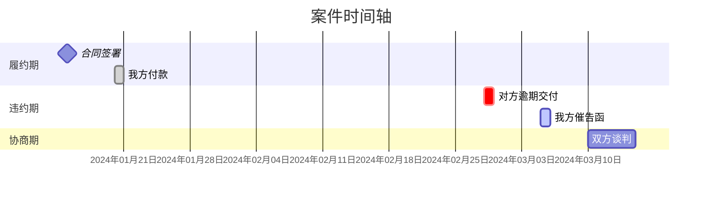

# 诉讼可视化 - 诉讼时间轴图谱专家

## 快速开始

创建诉讼时间轴图谱的步骤：

1. **事实萃取** - 从法律文书中提取关键法律事实节点
2. **视觉呈现** - 生成可视化时间轴（推荐HTML格式）
3. **明细输出** - 附带事件明细表和综合分析

## 工作流程

### 第一步：事实萃取

仔细阅读输入的法律文书/案情概要，提取所有关键法律事实节点：

**必须提取的事件类型：**
- 📄 合同签署/协议达成
- ✍️ 签名/盖章行为
- 💰 付款/收款行为
- 📦 交货/提供服务
- ⚠️ 违约事实/瑕疵交付
- 📢 催告/通知/函件
- 💬 协商/谈判
- ⚖️ 起诉/应诉/庭审
- 📋 判决/裁决
- 🔄 上诉/再审

**时间精度要求：**
- 精确到年月日（如：2024年3月15日）
- 无法确定日期时标注：
  - "月初"（1-10日）
  - "月中"（11-20日）
  - "月末"（21-31日）
  - "某年某月"（仅知道月份）

**事实归类：**
- 我方行为 - 时间轴上方标注
- 对方行为 - 时间轴下方标注
- 争议焦点 - 用特殊标记突出（🔴 或 ⭐）

### 第二步：视觉呈现

根据事实节点生成可视化图表。

#### Mermaid 甘特图格式（用于电子展示）



#### HTML时间轴格式（推荐用于打印）

创建HTML文件，包含完整的可视化时间轴，支持直接A4打印。详见参考文件 `references/html-template.md`。

#### ASCII 时间轴格式（备用）

```
                              我方行为              时间轴               对方行为
    ────────────────────────────────────────────────────────────────────────────────────────
    2024-01-15  [📄] 签署《买卖合同》                              ←─────────────────────────
                      │
    2024-01-20  [💰] 支付首期款 50万元                              ←─────────────────────────
                      │
    2024-02-28                                                       ─────────────────→ [⚠️] 逾期交付
                      │
    2024-03-05  [📢] 发送催告函                                    ←─────────────────────────
                      │
    2024-06-10  [⚖️] 向法院起诉                                    ←─────────────────────────
    ────────────────────────────────────────────────────────────────────────────────────────
    图例：📄合同  ✍️签署  💰付款  ⚠️违约  📢通知  ⚖️诉讼  🔴争议焦点
```

#### 色彩编码规范

| 法律阶段 | 推荐颜色 | RGB值 | HEX代码 |
|---------|---------|------|---------|
| 履约期 | 天蓝 | 135, 206, 250 | #87CEEB |
| 违约期 | 柔和珊瑚红 | 255, 127, 80 | #FF7F50 |
| 协商期 | 淡黄 | 255, 255, 224 | #FFFFE0 |
| 诉讼期 | 淡紫 | 221, 160, 221 | #DDA0DD |
| 复审期 | 金色 | 255, 215, 0 | #FFD700 |

### 第三步：输出结构化内容

## A4打印页面布局规范（重要）

创建可直接打印的输出时，必须遵循以下三页布局：

### 第1页：时间轴图谱
**页面内容：**
- 标题：案件名称 + "时间轴图谱"（标题最多两行，长标题使用`<br>`手动换行）
- 案件基本信息：案号、案由、关键标识（如商标号、合同号）
- 完整时间轴：所有事件按时间顺序排列
  - 每个阶段独立分组显示
  - 使用颜色区分不同阶段
  - 标注事件日期、图标、事件内容、证据

**布局要求：**
- 时间轴内容必须完整，不允许跨页
- 字号：标题18pt，正文10-11pt
- 边距：1.2cm
- 每页底部标注"第 1 页 / 共 3 页"
- **不显示图例说明**（节省空间，颜色通过阶段标题区分）

### 第2页：事件明细表
**页面内容：**
- 标题：案件名称 + "事件明细表"（标题最多两行，长标题使用`<br>`手动换行）
- 案件基本信息：案号、关键标识
- 法律阶段划分表：阶段、时间区间、状态、时长
- 案件总时长统计：从申请到终审、从关键节点到终审
- 完整事件明细表：序号、时间、事件、证据、法律意义、主体

**布局要求：**
- 表格内容完整，不允许跨页
- 事件明细表建议最多12-15项
- 字号：标题18pt，表格正文9-10pt
- 每页底部标注"第 2 页 / 共 3 页"

### 第3页：综合分析
**页面内容：**
- 标题：案件名称 + "综合分析"（标题最多两行，长标题使用`<br>`手动换行）
- 案件基本信息：终审判决日期、案由等
- 争议焦点提炼：
  - 核心争议焦点（🔴 标记）
  - 辅助争议点（⭐ 标记）
  - 每个争议点列明：我方主张、对方主张、法院认定
- 证据链完整性：列出所有证据材料及状态
- 案件结果分析：各程序结果汇总表
- 案件基本信息表（左栏）/ 程序信息表（右栏）：双栏布局
- 案件总结：简要概述案件经过和最终结果

**布局要求：**
- 争议焦点最多5个
- 证据链最多15项
- 使用双栏布局优化空间利用
- 每页底部标注"第 3 页 / 共 3 页"

### HTML输出格式规范

创建可直接打印的HTML文件时，遵循以下规范：

**CSS页面设置：**
```css
@page {
    size: A4 portrait;
    margin: 1.2cm;
}

.page {
    width: 210mm;
    min-height: 297mm;
    padding: 1.2cm;
    page-break-after: always;
}

.page:last-child {
    page-break-after: avoid;
}
```

**字号规范：**
- 主标题（h1）：18pt
- 二级标题（h2）：14pt
- 三级标题（h3）：12pt
- 正文：10-11pt
- 表格内容：9-10pt
- 小字号/备注：8-9pt

**打印优化：**
```css
@media print {
    body {
        background: #fff;
    }
    .page {
        margin: 0;
        box-shadow: none;
    }
}
```

## 事件明细表标准格式

| 序号 | 时间 | 事件 | 证据 | 法律意义 | 主体 |
|:---:|:---:|:---|:---:|:---|:---:|
| 1 | 2024-01-15 | 签署《买卖合同》 | 附件1页3-5 | 确立合同关系 | 双方 |
| 2 | 2024-01-20 | 我方支付首期款50万元 | 附件2页8 | 履行付款义务 | 我方 |
| 3 | 2024-02-28 | 对方逾期交付货物 | 附件3页12 | 构成违约行为 | 对方 |

## 打印优化建议

### 色彩打印建议

- 使用柔和色调，避免鲜艳刺眼
- 确保黑白打印时仍可区分（图标辅助）
- 重点节点使用边框或背景色突出
- 表格隔行变色提高可读性

### 打印方法

**方式一：浏览器直接打印**
1. 双击打开HTML文件
2. 按 `Ctrl + P` 打开打印对话框
3. 确认设置：
   - 纸张：A4
   - 边距：默认
   - 方向：纵向
   - 取消勾选"页眉和页脚"
4. 点击打印

**方式二：另存为PDF**
1. 打开HTML文件
2. 打印时选择"另存为PDF"
3. 保存后可直接用PDF阅读器查看/打印

## 争议焦点处理

**如何识别争议焦点：**
1. 双方主张存在直接冲突的事实
2. 证据链存在断点的关键环节
3. 法律适用存在分歧的节点

**可视化标记：**
- 在时间轴上用 🔴 红圆点标记
- 事件明细表中用 ⭐ 号标注
- 在"争议焦点提炼"章节详细说明
- 争议焦点卡片使用浅红色背景突出

## 输入材料处理建议

### 常见输入类型及处理要点

**起诉状/答辩状**
- 关注诉讼请求和事实理由
- 提取主张的时间节点
- 标注举证责任分配

**证据清单**
- 关联证据页码到具体事件
- 注意证据形成时间与事件时间的匹配
- 标注关键证据

**合同文书**
- 签署时间、地点、主体
- 履约期限和关键时间节点
- 违约条款对应的时间条件

**往来函件**
- 发送时间、接收时间（如有）
- 函件性质（催告、通知、回复）
- 法律效力（中断诉讼时效、解除权行使等）

**判决书/裁定书**
- 提取案件事实认定的时间节点
- 法院对关键时间点的认定
- 各审级的时间节点和结果

### 输入材料不完整时的处理

1. **时间不明确**：标注为"约XX年XX月"或"XX年XX月上/中/下旬"
2. **主体不清晰**：在表格备注栏说明
3. **证据缺失**：在证据页码栏标注"待补充"
4. **争议事实**：双方主张分别列出，用分号或换行分隔
5. **时间跨度大**：使用"~"符号表示期间

## 质量检查清单

输出前检查以下项目：

### 内容完整性
- [ ] 所有关键事实节点均已提取
- [ ] 时间精度符合要求（精确到日或标注模糊度）
- [ ] 图标系统使用正确
- [ ] 色彩编码符合规范
- [ ] 争议焦点已明确标注

### 表格完整性
- [ ] 事件明细表信息完整（序号、时间、事件、证据、法律意义、主体）
- [ ] 法律阶段划分清晰
- [ ] 证据链列出所有关键证据

### 打印布局
- [ ] 第1页：时间轴单独完整，不跨页
- [ ] 第2页：事件明细表单独完整，不跨页
- [ ] 第3页：综合分析内容合理布局
- [ ] 每页都有页码标注
- [ ] 字号适合A4打印（不小于9pt）
- [ ] 边距合理（1.2cm）

### 视觉效果
- [ ] 颜色柔和专业
- [ ] 重点内容突出
- [ ] 黑白打印时可读
- [ ] 标题不超过两行

## 风格原则

1. **专业冷静** - 使用柔和色系，避免鲜艳刺眼
2. **逻辑清晰** - 时间推进一目了然
3. **重点突出** - 争议焦点醒目标注
4. **证据绑定** - 每一事件关联证据来源
5. **提交友好** - 适合法庭质证和客户展示
6. **布局规范** - 严格遵循三页A4打印布局

## 参考文件

- `references/mermaid-patterns.md` - Mermaid 甘特图详细模式参考
- `references/html-template.md` - HTML打印模板参考
- `references/icon-system.md` - 图标系统完整说明
