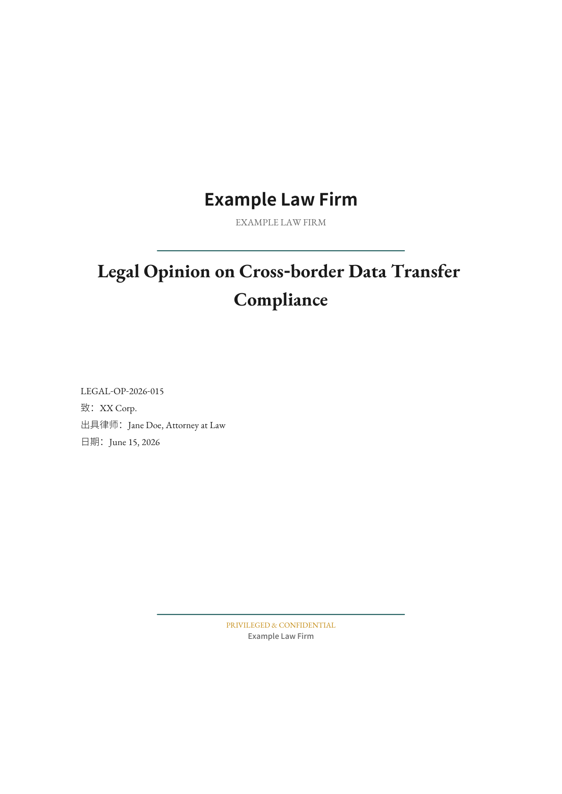

# LexFolio

> 法律级 Markdown 转 PDF 排版引擎，深度适配中文（CJK）文书场景。

[English](README.md) | [中文](README_ZH.md)

[](https://www.apache.org/licenses/LICENSE-2.0)
[](https://www.python.org/downloads/)
[](https://docs.astral.sh/ruff/)



## 特性

- **CJK 感知排版** — 中西文混排字体配对、中文标点挤压、孤行控制
- **印刷级 PDF 输出** — 三线表、品牌色装饰线、专业页面几何参数
- **四种文档模板** — `opinion` 法律意见书、`memo` 备忘录、`review` 审查报告、`analysis` 分析意见
- **八种排版预设** — `standard`、`executive`、`mobile`、`editorial`、`academic`、`deep`、`matrix`、`redline`
- **三套品牌配色方案** — 可通过 `theme.json` 或 front matter 切换
- **Markdown 原生写作** — 标题、引用、表格、加粗/斜体、脚注全部用 Markdown 书写
- **Butterick 级默认值** — 对照 Clifford Chance、A&O Shearman、King & Spalding 文书格式调校

---

## 法律文书的排版问题

法律实践长期受制于打字机时代的路径依赖。法律意见书、备忘录、审查报告普遍充斥着逼仄的页边距、系统默认字体、紧密的行距，以及滥用的全大写字母。结果是文书在与读者对抗，而非服务读者。

**优秀的排版不是装饰，而是认知工效学。**

Matthew Butterick 在《Typography for Lawyers》中明确指出：专业排版能最大限度降低视觉疲劳，使读者注意力穿透文字、直达法律论证核心。这不是审美偏好，而是职业义务。美国第七巡回上诉法院甚至官方建议律师避免使用 Times New Roman，因为法官在快速扫视时无法记住文书内容。

LexFolio 正建立在这一基础之上。

---

## 设计四柱

LexFolio 的排版引擎围绕四大支柱构建，源自 Butterick 理论框架，并对照 **Clifford Chance**（高伟绅）、**A&O Shearman**（安理雅司）、**King & Spalding**（金杜斯伯丁）的视觉规范验证。

### 1. 字体战略与层级

在英美法系高端文书中，使用 Times New Roman 被视为"缺乏选择"与冷漠的标志。比例字体（Proportional fonts）是不可妥协的标准。LexFolio 采用：

| 角色 | 字体 | 选型逻辑 |
|---|---|---|
| 正文（中文） | 思源宋体 Noto Serif SC | 衬线字体，字母占据较宽水平空间，极高易读性与庄重感 |
| 标题（中文） | 思源黑体 Noto Sans SC | 无衬线字体，形成干脆利落的层级对比，建立现代化文档层级树 |
| 正文（西文） | EB Garamond | 浓厚学术气息，备受司法界推崇 |

如已授权商业字体（Century Schoolbook、Palatino、Equity、Tiempos），可在 `theme.json` 中配置替换。

### 2. 空间几何

物理空间布局直接决定文本的"呼吸感"。

- **行宽控制**：严格控制在 45-90 字符之间，平均 65 字符最为舒适（系统默认 1 英寸页边距会导致单行字符过多，眼球回溯极易疲劳）
- **页边距**：默认 28mm 侧边距，接近 Butterick 主张的 1.5-2.0 英寸标准
- **行距**：采用字体大小的 120-145%（Word 的"双倍行距"实际产生 233%，"1.5倍"产生 175%，均超出人类阅读最佳区间）

每个排版预设都经过调校，确保文本始终处于认知阅读带内。

### 3. 强调的克制

全大写（ALL CAPS）和下划线（Underlining）被视为极度不专业的视觉噪音——它们破坏单词轮廓，大幅降低阅读速度。LexFolio 强制执行克制的强调纪律：

- **仅允许加粗与斜体**，禁止全大写与下划线
- **单空格法则**：标点后只能使用一个空格（双空格会导致"白色河流"）
- **不间断空格**：§、¶ 符号与数字之间自动应用硬空格，防止连贯术语在行尾被切断
- **标点挤压**：全角标点（，。；：、！？""''《》【】（）—…）渲染时缩小至 80% 字号，实现更紧凑专业的行内排版

### 4. 引用容器

超过三行的引用不应仅仅加上冗余的双引号。Butterick 强调"引用容器（Block Quotations）"的绝对规范。LexFolio 自动检测每个引用块的性质，应用差异化视觉封装：

| 类型 | 检测规则 | 视觉处理 |
|---|---|---|
| **法条** | 以"第X条/款/项/目/章/节"开头 | 宋体、无底纹、上下细线分隔、左右缩进 |
| **判例** | 以中英文双引号开头 | 楷体、品牌色左侧竖线、浅灰底纹、左右缩进 |
| **一般引用** | 兜底 | 标准引用块缩进 |

这种视觉封装技术能在不打断主线逻辑的前提下，清晰界定律师观点与法庭原文的边界。

---

## 中英混排的工程实现

中文法律文书天然涉及大量中英混排（法条名称、当事人名称、合同条款引用）。LexFolio 的字体管理器（`FontManager`）对文本进行逐字符扫描，按 CJK / Latin / 全角标点三段切分，分别包裹字体标签：

- 中文字符 → 思源宋体
- 西文字符 → EB Garamond
- CJK↔Latin 边界 → 自动插入可控宽度的间距（默认 2pt）

这比 ReportLab 默认的中英挤在一起要好很多，也优于手动在 Markdown 里加 `<font>` 标签的做法。

---

## 排版矩阵

三大文书家族 × 九种生产级规范，每种对标国际顶尖律所实务标准。

### 文档模板

| 家族 | 模板 | 默认预设 | 默认配色 | 封面 | 对标 |
|---|---|---|---|---|---|
| **法律意见书** | `opinion` | standard | B（青蓝琥珀） | 完整品牌封面 | Clifford Chance 意见书格式 |
| **备忘录** | `memo` | executive | A（深蓝靛蓝） | Memo 抬头表 | A&O Shearman 内部备忘录 |
| **合同审查** | `review` | redline | B（青蓝琥珀） | 无 | King & Spalding 审查报告 |
| **法律分析** | `analysis` | deep | B（青蓝琥珀） | 无 | 通用分析意见 |

### 八种排版预设

| 预设 | 性格 | 适用场景 |
|---|---|---|
| `standard` | 均衡默认 | 通用法律文档 |
| `executive` | 大字号紧凑行距 | 决策层快速阅读要点 |
| `mobile` | 宽边距短行宽 | 小屏阅读体验优化 |
| `editorial` | 杂志级标题层级 | 对外出版物 |
| `academic` | 衬线正文左对齐，宽右页边距 | 学术论文风格 |
| `deep` | 强化标题层级对比 | 长篇多层级法律意见书 |
| `matrix` | 横排 A4 紧凑表格 | 条款逐项对比分析 |
| `redline` | 宽松行距大字号 | 合同逐条审查批注 |

### 三种品牌配色

| 方案 | 名称 | 适用场景 |
|---|---|---|
| A | 深蓝 + 靛蓝 | 传统企业、金融机构、政府机关 |
| B | 深青蓝 + 琥珀 | 科技企业、数据平台、跨境合规 |
| C | 石墨黑 + 钴蓝 | 互联网公司、AI 创业公司 |

---

## 快速上手

### 安装

```bash
pip install -r requirements.txt
```

### 命令行用法

```bash
# 基础转换
python run.py input.md

# 使用文档模板（opinion / memo / review / analysis）
python run.py input.md -t opinion

# 指定配色方案和排版预设
python run.py input.md -s B --preset executive

# 生成示例 PDF 查看全部功能
python run.py --demo -t opinion

# 列出所有预设或模板
python run.py --list-presets
python run.py --list-templates
```

### Python API

```python
from engine.api import md_to_pdf

# 基础转换
md_to_pdf("input.md", "output.pdf")

# 带选项转换
md_to_pdf(
    "input.md",
    "output.pdf",
    color_scheme="B",
    preset="executive",
    template="opinion",
)
```

---

## Markdown 语法

### Front Matter

```yaml
---
doc_type: opinion              # opinion | memo | review | analysis
title: 法律分析意见
author: 张三律师
date: 2026年6月15日
ref_no: 法意〔2026〕第015号
addressee: XX公司
confidential: true             # 机密标识
firm_name_cn: "你的律师事务所"    # 覆盖律所名称
firm_name_en: "Your Law Firm"
color_scheme: B                # A | B | C
font_provider: noto            # noto（founder 为别名）
layout_preset: standard        # 见上方预设表
---
```

### 支持的语法

| 语法 | 说明 |
|---|---|
| `# H1` / `## H2` / `### H3` | 三级标题（H1 附品牌色装饰线） |
| `> 引用文本` | 引用块（自动识别法条/判例/一般引用） |
| `**分析意见**：...` | 分析意见段落（品牌色顶条） |
| `| 表头 | ... |` | 三线表（斑马纹 + 数字列右对齐） |
| `---` | 分割线 |
| `<!-- pagebreak -->` | 强制分页 |
| `<!-- sigfooter -->` | 签署页尾部装饰 |
| `>right 文本` | 右对齐段落（落款、签署信息） |
| `^[1]^` | 脚注上标（自动置于前方标点之前） |

---

## 自定义

### 律所品牌

在 front matter 中按文档设置：

```yaml
firm_name_cn: "你的律师事务所"
firm_name_en: "Your Law Firm"
```

或在 `theme.json` → `cover.firm_name_cn` / `firm_name_en` 全局设置。

### 自定义配色

在 `theme.json` → `color.schemes` 中添加新方案：

```json
{
  "color": {
    "schemes": {
      "D": {
        "name": "自定义",
        "primary": "#1a1a2e",
        "secondary": "#16213e",
        "accent": "#0f3460"
      }
    }
  }
}
```

然后使用：`python run.py input.md -s D`

### 自定义字体

编辑 `theme.json` → `font.providers` 指向自己的 `.ttf` 文件。LexFolio 的字体管理器自动处理中英混排，无需在 Markdown 里手动加字体标签。

---

## 字体许可

本项目仅包含**开源字体**（SIL Open Font License 1.1）：

| 字体 | 协议 | 用途 |
|---|---|---|
| 思源宋体 Noto Serif SC | OFL | 正文 |
| 思源黑体 Noto Sans SC | OFL | 标题 |
| EB Garamond | OFL | 西文正文 |

`founder` 字体方案为 `noto` 的别名（向后兼容）。如已授权商业字体（Century Schoolbook、Palatino、Equity、Tiempos 或方正系列），请在 `theme.json` 中配置——**请勿**将商业字体提交到公开仓库。

---

## 项目结构

```
LexFolio/
├── engine/               # 核心渲染引擎
│   ├── api.py            # 公开 API: md_to_pdf()
│   ├── theme.py          # 主题配置加载器
│   ├── fonts.py          # 字体注册 + 中英混排
│   ├── styles.py         # ParagraphStyle 工厂
│   ├── parser.py         # Markdown → Block 列表
│   ├── renderer.py       # Block → ReportLab flowable
│   ├── cover.py          # 封面页构建器
│   └── chrome.py         # 页眉 / 页脚 / 页码
├── fonts/                # 开源 TTF 字体（OFL）
├── templates/            # 文档模板配置（JSON）
├── theme.json            # 主主题配置
├── run.py                # CLI 入口
├── _demo.md              # 示例 Markdown
├── pyproject.toml        # 打包配置
└── requirements.txt      # Python 依赖
```

---

## 参与贡献

欢迎贡献！请阅读 [CONTRIBUTING.md](CONTRIBUTING.md) 了解开发流程。

1. Fork 本仓库
2. 创建功能分支（`git checkout -b feature/amazing-feature`）
3. 提交改动（`git commit -m 'Add amazing feature'`）
4. 推送到分支（`git push origin feature/amazing-feature`）
5. 发起 Pull Request

## 许可证

本项目基于 Apache License 2.0 许可——详见 [LICENSE](LICENSE) 文件。

`fonts/` 目录下的字体文件遵循 SIL Open Font License 1.1。

## 致谢

LexFolio 的设计哲学受教于：

- **Matthew Butterick**《Typography for Lawyers》——法律排版的基础性著作
- **Clifford Chance**、**A&O Shearman**、**King & Spalding** 公开的视觉规范
- 美国联邦法院关于上诉简报的排版指南

---

## 关于作者

**GantianBro** —— 顾名思义，是淦天的大兄，坐标江苏，lawyer。

做这个项目的初衷很简单：我懒得再排版了，docx 真的难用。

> 法律也可以享受美学。

LexFolio 是给同行的一份礼物——让法律人专注于论证本身，把排版的认知工效学交给引擎。
