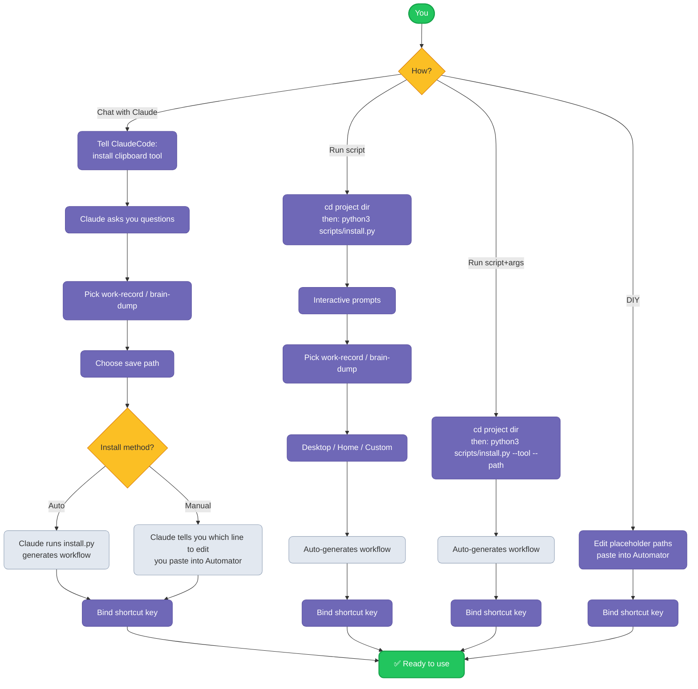

> English | [中文](README.md)

# Mac Clipboard to Markdown

Quickly save macOS clipboard content to Markdown notes via keyboard shortcut.

---

## Overview

Two macOS Automator tools that save clipboard content to Markdown notes via keyboard shortcuts.

### work-record.applescript

Silent mode. Copy text → press shortcut → content appended to `Work record.md` with timestamp, newest on top.

- Dynamic YAML frontmatter detection
- Auto-creates file with template if missing
- Graceful fallback for files without frontmatter

**Use case**: Quick capture of snippets and temporary notes.

### brain-dump.applescript

Interactive mode. Prompts for filename, tags, and description before saving to `brain dump/` folder.

- Auto-generated YAML frontmatter
- Multiple tags support
- Optional description

**Use case**: Categorized notes with metadata.

---

## Installation



### Method 1: AI-Assisted (Recommended)

Run in Claude Code (make sure `SKILL.md` is in an accessible directory):

> 「Install clipboard to markdown tool」

or `/mac-clipboard-to-md`

Claude will guide you through tool selection, path setup, and installation.

### Method 2: Interactive Terminal

First, download and enter the project directory:

```bash
git clone https://github.com/cyontheway/mac-clipboard-to-md.git
cd mac-clipboard-to-md          # ⚠️ must be in this directory
```

Then run:

```bash
python3 scripts/install.py
```

Follow the prompts to select tools and paths, workflow auto-generated. Then bind a keyboard shortcut in System Settings.

### Method 3: CLI Arguments (One-shot)

Make sure you're in the project directory first, then:

```bash
# Single tool
python3 scripts/install.py --tool work-record --path "~/Desktop/Work record.md"
# Both tools
python3 scripts/install.py --tool all --work-record-path "~/Desktop/Work record.md" --brain-dump-path "~/Desktop/brain dump/"
```

**Parameters:**

| Parameter | Description |
|-----------|-------------|
| `--tool` | `work-record`, `brain-dump`, or `all` |
| `--path` | Save path (single tool) |
| `--work-record-path` | File path for work-record (when `--tool all`) |
| `--brain-dump-path` | Folder path for brain-dump (when `--tool all`) |

Example — install brain-dump only, save to desktop:
```bash
python3 scripts/install.py --tool brain-dump --path "~/Desktop/brain dump/"
```

### Method 4: Manual Setup

1. Edit placeholder paths in the `.applescript` files
2. Open Automator → New → Quick Action (no input, any application)
3. Drag "Run AppleScript", paste script content, save
4. Bind shortcut in System Settings → Keyboard → Keyboard Shortcuts → Services

### Need to change the path after installation?

Open Finder（`Cmd+Shift+G` → `~/Library/Services/`）→ right-click the `.workflow` → Open With → Automator → edit the AppleScript path → save.

---

## Directory Structure

```
mac-clipboard-to-md/
├── SKILL.md                   ← AI install wizard (Claude Code)
├── scripts/
│   └── install.py             ← Auto installer (interactive & CLI)
├── work-record.applescript    ← Silent mode script
├── brain-dump.applescript     ← Interactive mode script
├── CHANGELOG.md               ← Version history
├── README.md                  ← 中文说明
├── README.en.md               ← English
└── LICENSE
```

---

## License

MIT License
