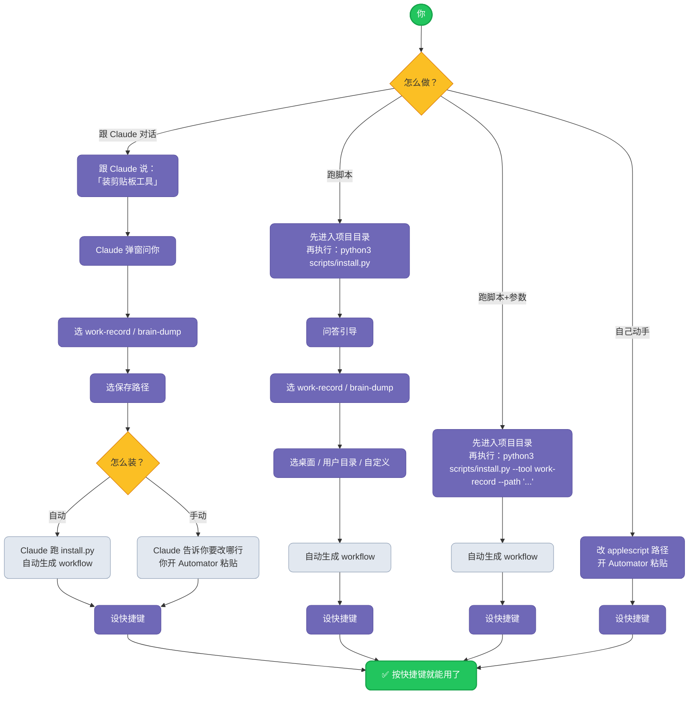

> [English](README.en.md) | 中文

# Mac Clipboard to Markdown

一键将 Mac 剪贴板内容保存到 Markdown 笔记。

---

## 简介

两款 macOS Automator 工具，使用 AppleScript 和快捷键将剪贴板内容保存至 Markdown 笔记。

### work-record.applescript

静默模式。复制文本 → 按快捷键 → 自动追加到 `Work record.md`，带时间戳倒序排列。

- 动态定位 YAML frontmatter，不受行数变化影响
- 文件不存在时自动创建模板
- 无 frontmatter 的文件也兼容

**适用场景**：随手记录零散信息、临时笔记。

### brain-dump.applescript

交互模式。按快捷键后依次弹窗输入文件名、标签、描述，保存到 `brain dump/` 文件夹。

- 自动生成 YAML frontmatter
- 支持多标签
- 可选描述字段

**适用场景**：需要分类归档的内容。

---

## 安装方法



### 方式一：AI 引导（推荐）

在 Claude Code 中（确保 `SKILL.md` 在 Claude 可访问的目录内）输入：

> 「装剪贴板工具」

或 `/mac-clipboard-to-md`

Claude 会弹窗引导你完成选工具、选路径、安装全过程，不需要手动操作终端。

### 方式二：终端交互

先下载项目并进入目录：

```bash
git clone https://github.com/cyontheway/mac-clipboard-to-md.git
cd mac-clipboard-to-md          # ⚠️ 一定要进目录再跑后面的命令
```

然后运行：

```bash
python3 scripts/install.py
```

按提示选择工具和保存路径，自动生成 workflow，只需再设快捷键。

### 方式三：终端参数（一步到位）

先下载项目并进入目录（同上），然后：

```bash
# 单个工具
python3 scripts/install.py --tool work-record --path "~/Desktop/Work record.md"
# 两个一起装
python3 scripts/install.py --tool all --work-record-path "~/Desktop/Work record.md" --brain-dump-path "~/Desktop/brain dump/"
```

不弹窗，指定好参数直接装。

**参数说明：**

| 参数 | 说明 |
|------|------|
| `--tool` | `work-record` 或 `brain-dump` 或 `all` |
| `--path` | 保存路径（单个工具时用） |
| `--work-record-path` | work-record 的文件路径（`--tool all` 时用） |
| `--brain-dump-path` | brain-dump 的文件夹路径（`--tool all` 时用） |

示例 — 只装 brain-dump，存到桌面：
```bash
python3 scripts/install.py --tool brain-dump --path "~/Desktop/brain dump/"
```

### 方式四：手动安装

1. 修改脚本中的占位路径为你的实际路径
2. 打开「自动操作」→ 新建「快速操作」（无输入，任何应用）
3. 拖入「运行 AppleScript」，粘贴对应脚本内容
4. 保存后去「系统设置 → 键盘 → 键盘快捷键 → 服务」绑定快捷键

### 装完想改路径怎么办？

自动安装后如果后悔了（比如想改 brain-dump 的保存位置），不用重装：

1. 打开 Finder（`Cmd+Shift+G` 输入 `~/Library/Services/`）
2. 找到对应的 `.workflow`（例如 `Brain Dump.workflow`）
3. 右键 → 打开方式 → 「自动操作」
4. 在 AppleScript 代码里直接改路径那行，Cmd+S 保存

---

## 目录结构

```
mac-clipboard-to-md/
├── SKILL.md                   ← AI 安装向导（Claude Code）
├── scripts/
│   └── install.py             ← 自动安装器（参数/交互双模式）
├── work-record.applescript    ← 静默模式脚本
├── brain-dump.applescript     ← 交互模式脚本
├── CHANGELOG.md               ← 版本历史
├── README.md                  ← 中文说明
├── README.en.md               ← English
└── LICENSE
```

---

## License

MIT License
