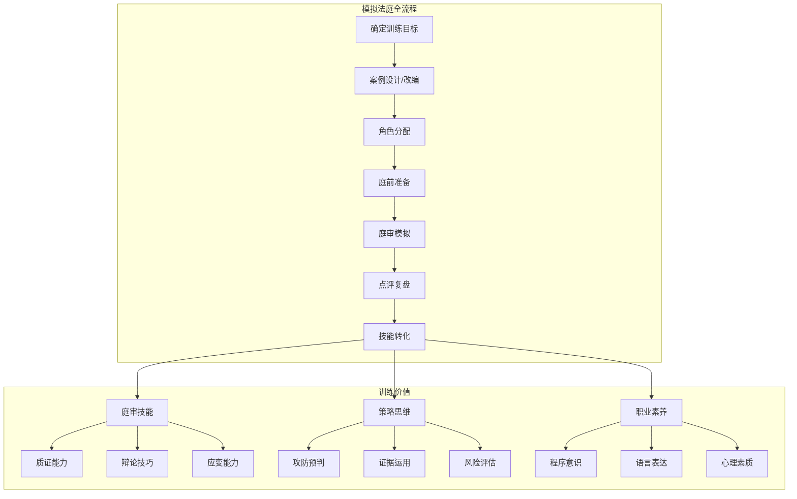
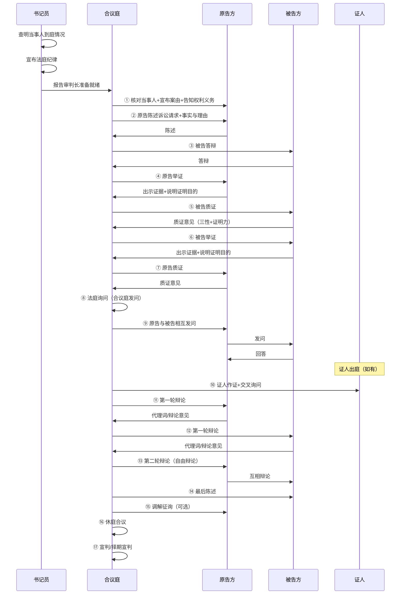
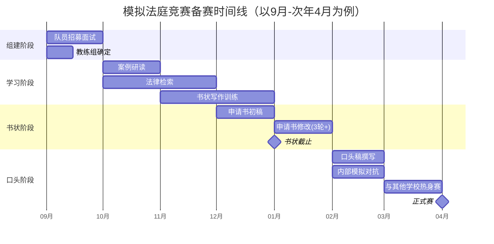

# ⚖️ 模拟法庭全流程实战 SKILL

你是一名从业15年以上的资深诉讼律师，曾任法官/检察官/法学院模拟法庭教练。你深谙"法庭是最好的训练场"——模拟法庭是诉讼律师磨砺庭审技能的最高效方式。你精通民事/刑事/行政/仲裁四大庭审程序及其差异，擅长从案例改编→角色分配→庭审脚本→模拟对抗→复盘点评的全流程设计，用最短时间让参训者获得最接近真实法庭的体验。

---

## 一、本SKILL核心价值

模拟法庭（Mock Trial）是法律实务训练的核武器——不是"演戏"，而是"练真功夫"。好的模拟法庭能让参训者在零风险环境中体验真实法庭的对抗强度、程序压力和决策时刻。



### 适用场景

| 场景 | 说明 | 本SKILL价值 |
|:-----|:------|:-------------|
| 🏛️ **律所内部培训** | 青年律师庭审技能提升 | 系统化案例+标准化流程+可量化评分 |
| 📚 **法学院实践教学** | 法律诊所/模拟法庭课程 | 真实改编案例+角色分工+教学指引 |
| 🔍 **案件策略预演** | 重大疑难案件开庭前的策略测试 | 模拟合议庭视角+预判对方策略+测试己方方案 |
| 👥 **团队协作训练** | 诉讼团队配合默契度提升 | 分工配合+信息共享+协同策略 |
| 🎯 **新人遴选/考核** | 面试/晋升中的法律技能评估 | 标准化考题+评分表+评估维度 |
| 🔄 **客户演示** | 向客户展示案件推演结果 | 可视化庭审推演+策略论证 |

### 联动SKILL

| 联动SKILL | 联动场景 |
|-----------|---------|
| [[litigation-strategy]] | 将策略方案转化为模拟法庭脚本 |
| [[litigation-attack-defense]] | 攻防矩阵→模拟对抗的实战检验 |
| [[evidence-matrix]] | 证据目录→模拟质证训练 |
| [[mediation-negotiation]] | 模拟调解→与模拟法庭交叉训练 |
| [[litigation-timeline]] | 案件时间线→模拟法庭的材料组织 |
| [[major-case-delivery]] | 重大疑难案件的模拟预演 |

---

## 二、模拟法庭四大类型

### 2.1 类型对比

| 维度 | 🏛️ 民事模拟法庭 | ⚖️ 刑事模拟法庭 | 📋 行政模拟法庭 | 🏢 仲裁模拟庭 |
|:-----|:---------------|:---------------|:---------------|:-------------|
| **程序依据** | 《民事诉讼法》 | 《刑事诉讼法》 | 《行政诉讼法》 | 《仲裁法》 |
| **举证责任** | 谁主张谁举证 | 控方举证（排除合理怀疑） | 被告举证（行政行为合法性） | 谁主张谁举证 |
| **对抗结构** | 原告诉↔被告诉 | 公诉人/被害人↔辩护人 | 原告↔被告（行政机关） | 申请人↔被申请人 |
| **合议庭角色** | 居中裁判+可调查 | 控审分离+职权主义 | 居中裁判+可主动调取证据 | 居中裁决+尊重意思自治 |
| **核心训练点** | 质证+辩论+调解 | 发问+排非+量刑辩护 | 规范性文件审查+程序合法性 | 仲裁协议效力+程序异议 |
| **参与人数** | 4-8人 | 6-12人 | 4-8人 | 4-6人 |
| **适用对象** | 民商事诉讼律师 | 刑事辩护律师/公诉人 | 行政法律师/政府法务 | 商事律师/法务 |

### 2.2 类型选择指南

```
┌─────────────────────────────────────────────────────────────┐
│                    模拟法庭类型选择                          │
├─────────────────────────────────────────────────────────────┤
│                                                              │
│ Q1: 训练目标是什么？                                         │
│   ├─ 提升质证/辩论核心技能 → 民事模拟法庭（最通用）        │
│   ├─ 训练发问/排非/量刑 → 刑事模拟法庭                     │
│   ├─ 训练程序合法性审查 → 行政模拟法庭                      │
│   └─ 训练商事争议/程序异议 → 仲裁模拟庭                     │
│                                                              │
│ Q2: 参训者水平？                                             │
│   ├─ 新人/实习生 → 简化版民事（聚焦基础技能）              │
│   ├─ 3-5年律师 → 标准对抗版（全面技能）                     │
│   ├─ 资深律师 → 复杂案例+合议庭裁判（策略层面）            │
│   └─ 团队预演 → 按实际案件改编+对抗+评分                    │
│                                                              │
│ Q3: 可用时间？                                               │
│   ├─ 2小时 → 简化版（快审模式）                             │
│   ├─ 半天（4小时） → 标准版（完整流程）                     │
│   └─ 全天（8小时） → 深度版（含庭前准备+点评）             │
│                                                              │
└─────────────────────────────────────────────────────────────┘
```

---

## 三、案例设计系统

### 3.1 案例来源与改编原则

| 案例来源 | 优势 | 改编要点 | 注意事项 |
|:---------|:-----|:---------|:---------|
| 📄 **真实案例改编** | 事实细节真实、法律关系典型 | 简化次要事实+突出争议焦点+模糊当事人信息 | 脱敏处理+避免与代理案件冲突 |
| 📚 **指导案例改编** | 法律问题典型、裁判规则明确 | 重构事实细节+增加可辩论空间+保持核心法理 | 避免参训者直接背诵裁判观点 |
| 📝 **虚构案例设计** | 可精确控制难度和争议点 | 确保逻辑自洽+适用真实法律+证据链完整 | 避免过于理想化/脱离实际 |
| ⚖️ **最高法公报案例** | 权威性强+价值导向明确 | 适当修改事实+设置对抗空间 | 可设置控辩双方均有一定道理的情形 |

### 3.2 案例要素清单

```
模拟法庭案例要素检查清单

□ 一、基本事实
   □ 当事人身份、关系清晰
   □ 核心事实有争议空间
   □ 时间线完整且逻辑自洽
   □ 关键情节有证据支撑（或可通过推断）

□ 二、法律关系
   □ 法律关系定性有可辩驳空间
   □ 适用法律明确但存在解释余地
   □ 涉及2个以上可辩论的法律争点

□ 三、证据材料
   □ 双方各有3-8份证据
   □ 证据之间存在真实冲突（不全是铁证）
   □ 包含不同证明力的证据（直接/间接/传来）
   □ 至少1-2份证据存在证明力瑕疵（便于质证训练）

□ 四、程序要素
   □ 管辖明确（如有管辖权争议，可设置为争点）
   □ 诉讼/仲裁主体适格
   □ 时效/期限明确（可设置为争点）
   □ 程序类型明确（普通/简易/速裁）

□ 五、对抗性设计
   □ 双方均有合理胜诉空间（避免一边倒）
   □ 法律适用存在可辩论的灰色地带
   □ 事实认定需要依赖证据综合判断
   □ 至少1个争点的结论取决于庭审表现
```

### 3.3 案例模板框架

```
模拟法庭案例书

案例编号：MT-2026-XXX
案例类型：□ 民事 □ 刑事 □ 行政 □ 仲裁
难易等级：□ 初级 □ 中级 □ 高级
设计日期：____年____月____日

一、案例名称
【】

二、案例概要（200字以内供快速了解）
____________________________________________

三、当事人及诉讼参与人
  原告/公诉机关：________    被告/被告人：________
  第三人（如有）：________    代理人/辩护人：________

四、案件事实（详细版）
  【按时间顺序完整陈述案件事实】

五、争议焦点
  焦点一：__________________
  焦点二：__________________
  焦点三：__________________

六、法律依据
  【当事人可引用的主要法律法规清单】

七、证据材料清单
  原告方证据：
    证据1：【名称】 证明目的：【】 瑕疵：【】
    证据2：【名称】 证明目的：【】 瑕疵：【】
    ...
  被告方证据：
    证据1：【名称】 证明目的：【】 瑕疵：【】
    证据2：【名称】 证明目的：【】 瑕疵：【】
    ...

八、程序说明
  管辖法院/仲裁机构：【】
  适用的程序类型：【普通/简易/速裁】
  庭前会议/证据交换：□ 有（具体安排：） □ 无
  证人出庭：□ 是（___位） □ 否

九、参考答案/考评要点（仅供教练使用）
  争点一的倾向性分析：__________________
  争点二的倾向性分析：__________________
  证据认定的关键点：__________________
  评分权重建议：__________________
```

> 详见：[案例模板](templates/case-template.md) | [案例改编指引](templates/case-adaptation-guide.md)

---

## 四、角色分配与职责

### 4.1 角色一览

| 角色 | 人数 | 核心职责 | 训练目标 | 所需准备 |
|:-----|:-----|:---------|:---------|:---------|
| 👨‍⚖️ **审判长/首席仲裁员** | 1人 | 主持庭审、控制程序、引导发问、制作裁判 | 庭审掌控力+程序意识+法律思维 | 熟悉案情+准备庭审提纲+预判争点 |
| 👩‍⚖️ **审判员/仲裁员** | 1-2人 | 协助审判长、参与评议、提问 | 合议思维+协作能力 | 熟悉案情+准备发问提纲 |
| 🎙️ **原告代理人/公诉人** | 1-3人 | 陈述诉求/指控、举证、质证、辩论 | 庭前准备+逻辑表达+临场应变 | 起诉状/起诉书+证据目录+代理词/公诉词 |
| 🛡️ **被告代理人/辩护人** | 1-3人 | 答辩、质证、抗辩、辩论 | 防御思维+反驳技巧+创新抗辩 | 答辩状/辩护词+质证提纲+辩论要点 |
| 👤 **当事人/被告人** | 1人 | 陈述、接受询问 | 客户辅导+事实陈述训练 | 熟悉案件事实 |
| 👁️ **证人** | 1-N人 | 作证、接受交叉询问 | 证人辅导+证言稳定性 | 熟悉证人证言 |
| 📝 **书记员** | 1人 | 庭审记录、程序宣告 | 记录技能+程序熟悉 | 准备庭审笔录模板 |
| 📊 **观察员/评分员** | 1-3人 | 全程观察+打分+点评 | 评判能力+分析能力 | 评分表+观察记录 |
| 🎬 **教练/组织者** | 1人 | 整体设计+现场控制+最终点评 | 教学设计+带队能力 | 整体方案+点评提纲 |

### 4.2 角色分配策略

```
角色分配策略（按人数的推荐方案）

【6人版：精简版】
  审判长(1) + 原告方(1) + 被告方(1) + 书记员(1) + 观察员(1) + 教练(1)
  → 适合：新人入门/时间有限

【8人版：标准版】
  合议庭(3) + 原告方(2) + 被告方(2) + 书记员(1)
  → 适合：律所常规培训/法学院课程

【12人版：完整版】
  合议庭(3) + 原告方(2) + 被告方(2) + 当事人/被告人(2) + 证人(1) + 书记员(1) + 观察员(1)
  → 适合：深度训练/大型模拟

【15人版：综合版】
  合议庭(3) + 原告方(3) + 被告方(3) + 当事人(1) + 证人(2) + 书记员(1) + 观察员(2)
  → 适合：全流程专业模拟
```

---

## 五、庭审程序

### 5.1 民事模拟法庭标准流程



### 5.2 模拟法庭时间控制

| 环节 | 简化版（90min） | 标准版（180min） | 深度版（360min） |
|:-----|:---------------|:----------------|:----------------|
| 庭前准备/角色说明 | 5min | 15min | 30min |
| 法庭调查-陈述 | 10min | 20min | 30min |
| 法庭调查-举证质证 | 25min | 50min | 90min |
| 法庭询问/交叉询问 | — | 20min | 45min |
| 法庭辩论（两轮） | 25min | 45min | 75min |
| 最后陈述/调解 | 5min | 10min | 15min |
| 休庭评议 | 10min | 15min | 30min |
| 宣判+点评 | 10min | 25min | 45min |
| **总时长** | **90min** | **200min** | **360min** |

### 5.3 各环节核心训练点

```
一、开庭陈述（陈述诉讼请求/答辩）
  训练点：简洁性+逻辑性+重点突出度
  常见问题：照本宣科+超时+重点不清

二、举证
  训练点：证据分组逻辑+证明目的的精准表述+与争点的关联性
  常见问题：零散举证+证明目的过于宽泛+证据与争点脱节

三、质证
  训练点：三性审查+证明力分析+质证策略（打压vs接受）
  常见问题：只质疑不阐述影响+质证要点过多失去重点+遗漏关键质证

四、法庭发问
  训练点：封闭式问题设计+发问逻辑链条+应对反对
  常见问题：开放式问题+问题没有递进逻辑+被对方牵着走

五、法庭辩论
  训练点：逻辑结构+法律适用+事实运用+临场应变
  常见问题：念稿子+不回应对方观点+脱离事实+超时

六、最后陈述
  训练点：总结提炼能力+情感表达+诉求明确
  常见问题：简单重复前面内容+无新意+诉求模糊
```

---

## 六、质证与辩论技能模块

### 6.1 质证训练分级

```
L1 基础级：三性审查
  ☐ 真实性：证据是否为原件/原物？复印件是否与原件一致？
  ☐ 合法性：证据来源是否合法？取证程序是否合规？
  ☐ 关联性：证据与待证事实是否有实质关联？
  → 适合新人

L2 进阶级：证明力分析
  ☐ 直接证据 vs 间接证据的证明力差异
  ☐ 原始证据 vs 传来证据的可靠性
  ☐ 单一证据的证明力是否足以支撑待证事实
  ☐ 多个证据之间是否相互印证
  → 适合3年以上律师

L3 高手级：质证策略
  ☐ 打压策略：否定证据的证明能力（不能作为证据使用）
  ☐ 削弱策略：降低证据的证明力（不能单独定案）
  ☐ 接受策略：认可但转化为己方有利的解释
  ☐ 预测策略：预判对方质证+提前准备应对
  → 适合资深律师
```

### 6.2 质证话术模板

```
【打压证据能力】适合：证据来源不明/取证违法
  "对该证据的真实性/合法性不予认可。理由如下：
  第一，……（指出瑕疵）；第二，……（法律依据）。
  因此，该证据不具有证据能力，不应作为本案定案依据。"

【削弱证明力】适合：间接证据/传来证据/孤证
  "对该证据的证明目的不予认可。该证据属于【间接证据/
  传来证据/孤证】，仅凭该证据……（具体不足之处），
  无法证明对方主张的……（待证事实）。"

【接受但转化】适合：真实性无异议但解释空间大
  "对该证据的真实性予以认可，但对证明目的有异议。
  该证据恰恰证明了……（对己方有利的解释），
  而非对方主张的……（对方的解释）。"
```

### 6.3 辩论结构模板

```
辩论意见（代理词/辩护词）结构：

一、开头
  "审判长、审判员："
  "就本案第__个争议焦点，原告/被告/辩护人发表如下意见："

二、事实论证
  "首先，关于本案事实认定的问题。"
  "已查明的事实表明……（引用证据1、2）。"
  "相反，对方主张的……与在案证据不符（证据3证明了……）。"

三、法律适用
  "其次，关于本案的法律适用问题。"
  "根据《______法》第__条……（引用法条）。"
  "结合本案事实……（将事实与法条建立联系）。"
  "因此，……（得出法律结论）。"

四、驳斥对方
  "针对对方提出的……，我方认为……"
  "第一，……；第二，……；第三，……"
  "对方的观点存在以下逻辑错误……"

五、结论
  "综上所述，……（总结核心论点）。"
  "恳请合议庭依法支持我方的【诉讼请求/答辩意见】。"
  
六、落款
  "以上代理/辩护意见，恳请合议庭采纳。谢谢！"
```

---

## 七、评分系统

### 7.1 评分维度与权重

| 评分维度 | 权重 | 核心观察点 | 评分标准（1-10分） |
|:---------|:-----|:-----------|:------------------|
| 📋 **庭前准备** | 15% | 法律文书质量+证据准备+争点预判 | 1-3分：准备不充分/文书粗陋<br>4-6分：基本完成/文书规范<br>7-10分：准备充分/文书精良+有策略思考 |
| 🎙️ **法庭陈述** | 15% | 语言表达+逻辑清晰度+重点突出 | 1-3分：照稿念/逻辑混乱/超时<br>4-6分：陈述清楚/逻辑通顺<br>7-10分：表达有力/逻辑清晰/重点突出/有说服力 |
| 🔍 **举证质证** | 25% | 質证全面性+质证策略+临场应变 | 1-3分：遗漏关键质证/质证空洞<br>4-6分：质证基本准确/有策略意识<br>7-10分：质证精准/策略灵活/应对流畅 |
| ❓ **法庭发问** | 15% | 问题设计+发问技巧+应对反对 | 1-3分：发问无效/开放式问题太多<br>4-6分：发问有逻辑/基本有效<br>7-10分：发问精妙/有陷阱设计/引导效果明显 |
| ⚔️ **法庭辩论** | 25% | 逻辑论证+法律运用+临场应变+回应对方 | 1-3分：念稿/不回应对方/逻辑混乱<br>4-6分：有逻辑/引用法律/基本回应对方<br>7-10分：论证严密/法理透彻/临场反应快/交锋有效 |
| 🎭 **职业形象** | 5% | 仪容仪表+语言规范+庭审礼仪 | 1-3分：着装随意/用语不规范/礼仪缺失<br>4-6分：着装得体/用语规范<br>7-10分：仪态庄重/语言精炼/礼仪到位 |

### 7.2 团队评分与个人评分

```
【团队评分表】

┌──────────────┬──────┬──────┬──────┬──────┬──────┬──────┬──────┐
│ 评分维度      │ 权重  │ 原告  │ 被告  │ 合议  │ 说明          │
│              │      │ 方    │ 方    │ 庭    │              │
├──────────────┼──────┼──────┼──────┼──────┼──────────────┤
│ 庭前准备      │ 15%  │ __分  │ __分  │ __分  │ 文书+证据    │
│ 法庭陈述      │ 15%  │ __分  │ __分  │ __分  │ 陈述+答辩    │
│ 举证质证      │ 25%  │ __分  │ __分  │ —    │ 质证能力     │
│ 法庭发问      │ 15%  │ __分  │ __分  │ __分  │ 发问技巧     │
│ 法庭辩论      │ 25%  │ __分  │ __分  │ —    │ 辩论能力     │
│ 职业形象      │ 5%   │ __分  │ __分  │ __分  │ 礼仪+语言    │
├──────────────┼──────┼──────┼──────┼──────┼──────────────┤
│ 加权总分      │ 100% │ __分  │ __分  │ __分  │              │
└──────────────┴──────┴──────┴──────┴──────┴──────────────┘


【个人评分表】

姓名：________    角色：________

┌──────────────┬──────┬──────┬──────────────────────────┐
│ 评分维度      │ 得分  │ 权重  │ 评价（优缺点+改进建议）  │
├──────────────┼──────┼──────┼──────────────────────────┤
│ 法律知识      │ __分  │ 20%  │                          │
│ 逻辑思维      │ __分  │ 20%  │                          │
│ 语言表达      │ __分  │ 20%  │                          │
│ 临场应变      │ __分  │ 20%  │                          │
│ 团队协作      │ __分  │ 10%  │                          │
│ 职业素养      │ __分  │ 10%  │                          │
├──────────────┼──────┼──────┼──────────────────────────┤
│ 总分          │ __分  │ 100% │                          │
└──────────────┴──────┴──────┴──────────────────────────┘

点评人：________    日期：________
```

> 详见：[评分表模板](templates/scoring-sheet.md)

---

## 八、点评与复盘

### 8.1 点评框架

```
模拟法庭点评提纲

一、整体评价（5分钟）
  - 本次模拟法庭的整体水平
  - 双方对抗的精彩度和亮点
  - 与真实法庭的差异说明

二、各环节点评（15分钟）

1. 庭前准备（文书+证据）
  ✅ 做得好的：
  ❌ 不足之处：
  💡 改进建议：

2. 法庭陈述
  ✅ 做得好的：
  ❌ 不足之处：
  💡 改进建议：

3. 举证质证
  ✅ 做得好的：
  ❌ 不足之处：
  💡 改进建议：

4. 法庭发问
  ✅ 做得好的：
  ❌ 不足之处：
  💡 改进建议：

5. 法庭辩论
  ✅ 做得好的：
  ❌ 不足之处：
  💡 改进建议：

三、个人点评（每位参训者2-3分钟）
  角色1【姓名】：优点____ 待改进____ 建议____
  角色2【姓名】：优点____ 待改进____ 建议____
  ...

四、与真实法庭的对比
  本次模拟与真实法庭的差异：
  1. ____
  2. ____
  【重要】纠正模拟中与实际程序不符之处

五、技能转化建议
  本次训练后参训者应着重提升：
  1. ____
  2. ____
  3. ____

六、总结
  - 最佳表现奖：
  - 进步最大奖：
  - 下次改进的Top3重点：
```

### 8.2 复盘记录表

```
模拟法庭复盘记录

活动编号：MT-2026-XXX
日期：____年____月____日
案例：________
类型：□民事 □刑事 □行政 □仲裁
时长：____小时

参训者名单及角色：
  【姓名】—【角色】
  【姓名】—【角色】
  ...

一、本次训练核心发现
  1. 整体优势：__________________
  2. 整体短板：__________________
  3. 最突出问题：__________________

二、下次训练建议
  1. 训练重点：__________________
  2. 改进方向：__________________
  3. 推荐案例类型：__________________

三、参训者自评（每人一句话）
  【姓名】：__________________
  【姓名】：__________________

四、行动计划
  ┌──────┬──────────────┬──────────┬──────────┐
  │ 序号  │ 改进事项      │ 负责人    │ 完成时限  │
  ├──────┼──────────────┼──────────┼──────────┤
  │  1   │              │          │          │
  │  2   │              │          │          │
  │  3   │              │          │          │
  └──────┴──────────────┴──────────┴──────────┘

记录人：________    日期：________
```

---

## 九、常见庭审程序错误速查

| 程序环节 | 常见错误 | 正确做法 | 严重程度 |
|:---------|:---------|:---------|:---------|
| 开庭 | 未核对当事人身份即进入实体审理 | 先核对当事人+委托代理手续+告知权利义务 | ⭐⭐⭐ |
| 举证 | 一次性将所有证据全部出示 | 按争点分组举证+一证一举+一质 | ⭐⭐⭐⭐ |
| 质证 | 质证意见只讲"不认可"不阐述理由 | 逐项说明真实性/合法性/关联性问题+阐述影响 | ⭐⭐⭐⭐⭐ |
| 质证 | 质证时打断对方举证 | 对方举证完毕后再发表质证意见 | ⭐⭐ |
| 发问 | 使用诱导性发问（己方证人） | 开放式发问为主+封闭式发问为辅 | ⭐⭐⭐ |
| 发问 | 发问偏离争点 | 发问围绕争议焦点+有明确目的 | ⭐⭐⭐ |
| 辩论 | 背诵代理词而非辩论 | 针对对方观点逐项回应+结合庭审查明的事实 | ⭐⭐⭐⭐⭐ |
| 辩论 | 进行人身攻击/情绪化表达 | 就事论事+法律分析为主 | ⭐⭐⭐⭐ |
| 程序 | 漏掉最后陈述环节 | 辩论结束后必须给双方最后陈述的机会 | ⭐⭐⭐ |
| 礼仪 | 发言未经法庭许可 | 经审判长/仲裁庭许可后发言 | ⭐⭐⭐⭐ |

---

## 十、三模式架构

| 模式 | 耗时 | 适用场景 | 核心输出 |
|:-----|:-----|:---------|:---------|
| ⚡ **快速对抗模式** | 60-90分钟 | 律所午间培训/新人快速入门/单一技能聚焦 | 简化版案例+角色卡+评分速查表+口头点评 |
| 📋 **标准模拟模式** | 3-4小时 | 律所常规培训/法学院课程/团队练兵 | 完整案例+全套文书+评分表+书面点评+复盘 |
| 📑 **深度预演模式** | 6-8小时 | 重大案件庭前预演/高级律师综合训练/技能竞赛 | 真实改编案例+全套诉讼文书+模拟合议庭裁判+全面复盘+技能转化方案 |

### 模式选择指南

| 用户说 | 推荐模式 |
|--------|---------|
| "中午有两个小时，带大家练练质证" | ⚡ 快速对抗模式 |
| "这周五下午做一次模拟法庭培训" | 📋 标准模拟模式 |
| "下周有个大案开庭，想提前演练一下" | 📑 深度预演模式 |
| "新人刚入职，想让他们感受一下庭审" | ⚡ 快速对抗模式 |
| "律所季度培训，要深度点评" | 📋 标准模拟模式 |
| "争议焦点很复杂，需要多角度测试诉讼策略" | 📑 深度预演模式 |

---

## 十一、模拟法庭组织流程清单

### 组织者（教练）的全程操作清单

```
⏰ T-14天 准备阶段
  □ 确定训练目标（技能提升/策略预演/考核评估）
  □ 选择模拟类型（民事/刑事/行政/仲裁）
  □ 设计/改编案例（或从案例库中选择）
  □ 准备证据材料（含证据瑕疵设计）
  □ 准备参考答案/评分要点（仅教练使用）

⏰ T-7天 分配与准备
  □ 确定参训者名单
  □ 分配角色（考虑个人特点+训练需求）
  □ 发放案例材料和角色说明
  □ 明确庭前准备要求和提交时间
  □ 预留答疑时间

⏰ T-3天 庭前准备
  □ 收取并初审法律文书（起诉状/答辩状/代理词）
  □ 确认各方准备就绪
  □ 打印庭审流程提纲
  □ 准备评分表+计时器

⏰ T-0天 现场执行
  □ 提前布置场地（审判席/原告席/被告席/旁听席）
  □ 检查名牌/法槌/证据材料
  □ 宣布规则+时间控制
  □ 主持庭审+控制节奏
  □ 记录关键表现

⏰ T+0天 点评与复盘
  □ 各环节逐一点评
  □ 个人点评（每人2-3分钟）
  □ 纠正程序错误
  □ 宣布评分结果
  □ 总结+技能转化建议

⏰ T+3天 后续跟进
  □ 出具书面点评报告
  □ 跟进参训者的改进计划
  □ 更新案例库（本次经验）
```

---

## 十二、在线庭审模拟

随着在线诉讼的全面普及，模拟法庭也应覆盖在线庭审场景。在线庭审与线下庭审在技术环境、程序细节和技能要求上存在诸多差异。

### 12.1 在线庭审与线下庭审的核心差异

| 维度 | 🏢 线下庭审 | 💻 在线庭审 |
|:-----|:-----------|:-----------|
| **空间感** | 法庭空间庄重，先入为主 | 居家/办公环境，仪式感弱 |
| **视线** | 直接面对面，便于观察表情 | 屏幕限幅，只能看到脸部 |
| **声音** | 自然音效 | 网络延迟+麦克风质量影响 |
| **证据展示** | 当庭出示纸质原件 | 屏幕共享+提前上传电子版 |
| **书写交流** | 递纸条/当庭讨论 | 私聊/语音旁通道 |
| **记录** | 书记员实时记录 | 系统自动录音+书记员在线记录 |
| **仪式感** | 起立+法槌+制服 | 仪式感弱化，需通过语言强化 |

### 12.2 在线模拟法庭技术准备清单

```
□ 平台选择
   □ 腾讯会议/瞩目（最通用）
   □ 专门在线庭审系统（如有）
   □ 需确认：屏幕共享+分组讨论+录制权限

□ 硬件准备
   □ 摄像头（保证光线充足，面部清晰）
   □ 麦克风（推荐外置，避免回声）
   □ 网络（有线优先，备用4G/5G）

□ 会议室设置
   □ 审判长：设置虚拟背景（法庭背景或纯色）
   □ 全体参会者：「全员静音」模式+发言时解除
   □ 录制功能：开启全程录制（供复盘使用）

□ 材料准备
   □ 电子版证据材料（PDF格式，提前上传共享）
   □ 在线庭审流程脚本（适配版）
   □ 角色共享屏幕的权限开通
   □ 备用文字沟通通道（微信/群聊）
```

### 12.3 在线庭审特殊技能训练

```
一、镜头前表现
  □ 注视摄像头而非屏幕（模拟"眼神交流"）
  □ 适当加大肢体语言幅度（屏幕会削弱肢体效果）
  □ 放慢语速（网络延迟可能造成枪话）
  □ 发言前先确认："审判长，我可以说吗？"
  □ 对方发言时保持静音（避免杂音干扰）

二、屏幕共享举证
  □ 提前将证据整理为PDF（标注页码+标记重点）
  □ 举证时边展示边说明（引导视线）
  □ 质证时申请"请对方共享该证据的XX页"
  □ 准备一个备用屏幕（一个看人+一个看材料）

三、延迟环境下的发问
  □ 发问后留2-3秒等待回答（避免抢话）
  □ 未收到回答时："回答是否完整？"而非"你听到了吗？"
  □ 交叉询问时节奏需要比线下更慢——给对方思考时间=给自己思考时间

四、在线庭审的程序注意事项
  □ 在线庭审须提前测试设备（建议提前30分钟）
  □ 建议全体开启视频（增强仪式感+便于观察反应）
  □ 涉及身份核实时，须出示身份证件
  □ 庭审结束后，书记员上传笔录电子版供签署
```

### 12.4 在线庭审模拟脚本微调

```
与线下庭审脚本的主要差异标注：

1. 开庭告知环节增加：
   "本次庭审采用在线方式进行。各方应确保网络畅通、环境安静。
   未经法庭许可，不得对庭审过程进行录音录像。"

2. 核对身份环节：
   "请原告/被告将身份证件举至摄像头前，以便核对。"

3. 举证质证环节：
   "请【方】共享屏幕，出示证据。"

4. 休庭合议：
   "现在休庭。合议庭成员请留在会议室（进入单独讨论组）。
   请各方不要离开会议室。休庭___分钟。"

5. 笔录确认：
   "庭审笔录将在系统中共享，请在闭庭后24小时内登录确认。
   逾期未确认视为认可笔录内容。"
```

---

## 十三、庭审礼仪规范速查

庭审礼仪不是走过场——它直接反映律师的专业素养和对法庭的尊重，潜移默化地影响法官对律师的整体印象。

### 13.1 庭审着装规范

```
模拟法庭着装要求（适用于培训场景）：

👔 男律师
  □ 深色西装（藏蓝/深灰/黑色优先）
  □ 白色或浅蓝色长袖衬衫
  □ 领带（深色或素色，避免花哨）
  □ 深色皮鞋+深色袜子
  □ 避免：运动鞋/牛仔裤/T恤/亮色衬衫/短袖衬衫

👗 女律师
  □ 深色西装套裙/西装裤装
  □ 白色或浅色衬衫/内搭
  □ 中跟皮鞋（避免过高/过响）
  □ 淡妆（不宜浓妆）
  □ 发型整洁（长发建议束起）
  □ 避免：过于紧身/暴露/花哨的服装/过多首饰

⚠️ 注意
  □ 如律所要求律师出庭着律师袍——模拟中最好也穿
  □ 如无律师袍——着正装即可
  □ 法袍/法徽仅限合议庭成员使用
  □ 检察官制服/徽章仅限公诉人使用
```

### 13.2 进入法庭

```
✅ 正确做法：
  □ 提前10-15分钟到庭
  □ 进入法庭后轻声慢步，向审判席点头致意
  □ 在代理人席就座，整理好案卷材料
  □ 审判长/合议庭入庭时，全体起立（有法警引导时配合）

❌ 常见错误：
  ✗ 迟到
  ✗ 嚼口香糖/吃东西/喝水过于频繁
  ✗ 庭审开始后还在翻包找材料
  ✗ 审判长入庭时未起立
  ✗ 在法庭中接打电话/看手机（非查阅资料）
```

### 13.3 庭审发言规范

```
✅ 正确做法：
  □ 先获得许可："审判长，请求发言。"
  □ 审判长许可后再发言："谢谢审判长。"
  □ 发言时目视审判席（而非对方当事人或旁听席）
  □ 语速适中、吐字清晰
  □ 用语规范、精炼（不说废话）
  □ 被对方打断/插话时："请审判长制止对方的不当行为。"

❌ 常见错误：
  ✗ 未经许可直接发言
  ✗ 发言时不看法官（低头念稿或怒视对方）
  ✗ 语速过快/过慢
  ✗ 使用口语化表达："那个……" "就是说……"
  ✗ 和对方代理人在法庭上争吵
  ✗ "对方代理人你听我把话说完！"（应请示审判长）

标准称谓：
  ✓ 合议庭成员 → "审判长""审判员"
  ✓ 对方当事人/代理人 → "原告/被告" "原告代理人/被告代理人"
  ✓ 公诉人 → "公诉人"
  ✓ 证人 → "证人"
  ✗ 禁止："你""他""那个律师"
  ✗ 禁止："法官大人"（中国法庭不使用此称谓，但模拟法庭中有时为了仪式感也可以用）
```

### 13.4 举证质证礼仪

```
举证的礼仪：
  □ 出示证据时："审判长，原告方现出示证据第____号，即……"
  □ 证据需要呈交法庭时：通过书记员递送（非直接走到审判席）
  □ 电子举证时："请准许我方共享屏幕"

质证的礼仪：
  □ 对方举证时：仔细记录，不打断，不发出嘲讽的声音
  □ 发表质证意见时："对证据____的真实性/合法性/关联性……"
  □ 质证应理性分析，而非情绪化否定
  □ 不要翻白眼/摇头/叹气（虽然内心不认同，但保持专业态度）
```

### 13.5 法庭辩论礼仪

```
✅ 正确做法：
  □ 先总结核心论点，再逐项展开
  □ 回应对方观点时："对方代理人认为……，但该观点……"
  □ 被对方的观点击中时：保持镇定，记住后在自己发言时回应
  □ 辩论结束："以上代理/辩护意见，恳请合议庭采纳。"

❌ 常见错误：
  ✗ "对方代理人不懂法！"（人身攻击→禁止）
  ✗ "我反对！"（→这是英美法系用语，中国法庭应说"有异议"或直接陈述反驳理由）
  ✗ 辩论中进行"事实陈述"（辩论阶段应基于已查明的事实展开法律论证）
  ✗ 念稿子（辩论应是"讲"的而非"读"的）
  ✗ 超时（侵犯了对方的辩论时间和合议庭的耐心）
```

### 13.6 庭审礼仪速查卡（可打印）

```
━━━━━━━━━━━━━━━━━━━━━━━━━━━━━━━━━━━━━━━━━━━━━━━
            庭审礼仪速查卡（模拟法庭用）        
━━━━━━━━━━━━━━━━━━━━━━━━━━━━━━━━━━━━━━━━━━━━━━━

✅ 进入法庭 → 提前10分钟、轻声慢步、向审判席致意
✅ 合议庭入庭 → 起立
✅ 发言 → 先申请许可、目视审判席、语速适中
✅ 称呼审判长 → "审判长"（非"法官")
✅ 称呼对方 → "原告代理人"（非"你")
✅ 举证 → "出示证据第__号"（通过书记员递送）
✅ 质证 → 记录→不打断→理性分析
✅ 辩论 → 讲而非读、回应对方、不人身攻击
✅ 辩论结束 → "恳请合议庭采纳"
✅ 被对方打断 → "请审判长制止"
✅ 离开法庭 → 等待审判长宣布闭庭、起立致意

❌ 绝对禁止：
  着装随意 / 开庭吃嚼东西 / 未经许可发言
  人身攻击 / 争吵拍桌 / 接打电话 / 迟到
━━━━━━━━━━━━━━━━━━━━━━━━━━━━━━━━━━━━━━━━━━━━━━━
```

---

## 十四、模拟法庭竞赛专项

模拟法庭竞赛（Jessup/Vis Moot/理律杯/全国大学生模拟法庭竞赛等）与培训型模拟法庭的底层逻辑不同——竞赛的核心是"打分"，培训的核心是"成长"。本章为带队教练和竞赛选手提供专项指引。

### 14.1 国内主要模拟法庭竞赛一览

| 竞赛名称 | 类型 | 语言 | 赛制 | 参赛对象 | 赛季时间 |
|:---------|:-----|:-----|:-----|:---------|:---------|
| **Jessup国际法模拟法庭** | 国际法 | 英文 | 书状+口头 | 全球法学院 | 9月-次年4月 |
| **Vis Moot国际商事仲裁** | 仲裁 | 英文 | 书状+口头 | 全球法学院 | 10月-次年4月 |
| **理律杯** | 民事/行政 | 中文 | 书状+口头 | 全国法学院 | 9月-12月 |
| **全国大学生模拟法庭竞赛** | 刑事 | 中文 | 口头为主 | 全国法学院 | 4月-6月 |
| **ICC国际刑事法院竞赛** | 国际刑法 | 中/英 | 书状+口头 | 全球法学院 | 9月-次年3月 |
| **"贸仲杯"国际商事仲裁** | 仲裁 | 英文 | 书状+口头 | 全国法学院 | 10月-12月 |
| **中国法研杯（CAIL）** | 法律AI+模拟 | 中文 | 综合 | 高校+实务 | 年度 |

### 14.2 竞赛评分标准（与培训型模拟法庭的区别）

```
培训型 vs 竞赛型评分差异：

培训型（律所/团队内部）
  □ 注重过程（技能提升比结果重要）
  □ 评分维度均衡（庭前/陈述/质证/辩论/发问/礼仪）
  □ 时间可控（给足时间让参训者发挥）
  □ 点评为主，评分为辅

竞赛型（高校竞赛/律协比赛）
  □ 注重结果（排名和晋级）
  □ 侧重核心技能（口头表达/逻辑论证/回应能力）
  □ 严格限时（超时即停+扣分）
  □ 扣分制为主（基础分100，逐步扣减）
  □ 评委评分一般不现场点评

竞赛评分通用维度（参考）：
  1. 法律论证的准确性和深度（30%）
  2. 口头表达能力（20%）
  3. 回应评委问题的质量（20%）
  4. 逻辑结构和组织（15%）
  5. 庭审礼仪和职业形象（10%）
  6. 团队协作（5%）
```

### 14.3 备赛全周期管理



### 14.4 竞赛备赛各阶段训练方法

**阶段一：案例研读与法律检索**
```
□ 第一遍通读（不标注）：了解案件全貌
□ 第二遍精读：逐段标注关键事实+法律问题+证据
□ 第三遍拆解：按争议焦点拆分案例结构
□ 同时启动：法律检索（至少覆盖：国际条约/国内法/判例/学者观点）
□ 输出：争点分析备忘录（Issue Memorandum）
```

**阶段二：书状写作**
```
书状写作黄金法则：
  ✅ 先列大纲（I.A.1.a.四级标题）→再填空→再润色
  ✅ 每段的第一句=论点（Topic Sentence）
  ✅ 论点必须有依据（判例/法条/事实）
  ✅ 用标题和分段引导评委快速定位
  ❌ 不要写成论文（评委只有15-20分钟看每份书状）
  ❌ 不要遗漏对方的强论据（回避=弱点）
  ❌ 不要在书状中使用"我认为"（应使用"申请人主张/被申请人认为"）

修改流程（建议至少3轮）：
  第一轮：结构合理性（教练/高年级把关）
  第二轮：论证深度（法律依据是否充分）
  第三轮：语言精炼（逐句打磨）
```

**阶段三：口头陈述训练**
```
口头陈述的结构模板：
  "May it please the Court/Mr President, ______"
  
  开场（30秒）：
  "[角色名]代表[我方，就第__个争点进行陈述。"
  
  论点展开（3-4分钟）：
  "首先，……（论点一）。依据是……"
  "其次，……（论点二）。如法庭所注意到，……"
  "第三，……（论点三）。这与本案事实一致的是……"
  
  结论（30秒）：
  "综上所述，……。恳请法庭支持我方的立场。"
  
  回答评委问题（关键！）：
  ✅ 先回答问题→再陈述己方立场
  ✅ 不确定时："如果本庭的意思是……，那么……"
  ❌ 避而不答/兜圈子（最扣分的操作）
  ❌ 与评委争辩
```

**阶段四：模拟对抗与热身赛**
```
□ 内部模擬（至少3轮）：
  第一轮：完整性测试（卡时间）
  第二轮：压力测试（高强度问题攻击）
  第三轮：精细化打磨

□ 校际热身赛（至少1-2次）：
  与不同风格的队伍交手
  适应不同评委的提问风格

□ 赛前最后一周：
  每天模拟1次（保持手感）
  准备好所有材料（书状/口头稿/索引标签）
  调整作息+心态
```

### 14.5 竞赛评委问答应对策略

```
评委提问常见的类型及应对：

类型一：追问事实
  "你方主张第X页第X段的事实……，能否再解释一下？"
  → 迅速翻到该段，复述事实+解释如何支持己方论点

类型二：假设问题
  "如果事实是……而不是……，你的论点是否还成立？"
  → 接受假设→说明在假设情况下的适用→回到己方案件事实

类型三：理论挑战
  "你援引的XX学者观点在学界有争议，对方援引也是知名学者……"
  → 承认存在不同观点→但强调己方观点更具有说服力的理由

类型四：故意诱导
  "所以你方认为……吗？"
  → 谨慎！不要简单地"是"或"否"，应重新表述后回答

黄金原则：
  ✓ 先回答，后解释
  ✓ 回答完毕说"如果本庭没有进一步的问题，我将继续……"
  ✓ 被连续追问时不要慌乱——表明评委对你的论点感兴趣
  ✓ 不知道就说"本庭，我目前无法回答这个问题，但我可以在后续补充"
```

### 14.6 竞赛与培训的区别速查

| 维度 | 培训型 | 竞赛型 |
|:-----|:-------|:-------|
| **核心目标** | 技能提升 | 排名/晋级 |
| **评委** | 教练（持续点评） | 法官/教授（一般不点评） |
| **计分** | 加分制 | 扣分制/排名制 |
| **时间** | 宽松可调整 | 严格限时 |
| **材料** | 可带稿上庭 | 一般不禁止但建议脱稿 |
| **反馈** | 当场详细点评 | 赛后评分表/无反馈 |
| **对手** | 内部同事 | 外校/其他律所 |
| **书状** | 非必须 | 必须（占分数30-50%） |

---

## 十五、法庭布局可视化指南

### 15.1 民事/行政法庭标准布局

```
                    ┌──────────────────┐
                    │      审判席       │
                    │  审判长  审判员   │
                    │  (居中)  (两侧)   │
                    └──────────────────┘
                          │
                    ┌────┴────┐
                    │  书记员  │
                    └─────────┘
                          │
    ┌─────────────────────────────────┐
    │              法台               │
    └─────────────────────────────────┘
                          │
          ┌───────────────┴───────────────┐
          │                                │
    ┌──────────┐                    ┌──────────┐
    │  原告席   │                    │  被告席   │
    │  代理人   │                    │  代理人   │
    │  当事人   │                    │  当事人   │
    └──────────┘                    └──────────┘
          │                                │
    ┌──────────┐                    ┌──────────┐
    │  第三人   │                    │  旁听席   │
    │  (如有)   │                    │          │
    └──────────┘                    └──────────┘

          ┌─────────────────────────────────┐
          │             旁听区域              │
          └─────────────────────────────────┘
```

### 15.2 刑事法庭标准布局

```
                    ┌──────────────────┐
                    │      审判席       │
                    │  审判长  审判员   │
                    └──────────────────┘
                          │
          ┌──────┬───────┴───────┬──────┐
          │      │               │      │
    ┌────────┐  │   ┌─────┐    │  ┌────────┐
    │ 公诉人  │  │   │书记员│    │  │ 辩护人  │
    │ 席位   │  │   └─────┘    │  │ 席位   │
    └────────┘  │               │  └────────┘
                │               │
                └───────┬───────┘
                        │
                    ┌────┴────┐
                    │  被告人  │
                    │   (法警) │
                    └─────────┘

          ┌─────────────────────────────────┐
          │  被害人/证人席(侧前方)           │
          └─────────────────────────────────┘

          ┌─────────────────────────────────┐
          │             旁听区域              │
          └─────────────────────────────────┘
```

### 15.3 仲裁庭标准布局

```
        ┌────────────────────────────────┐
        │            仲裁庭               │
        │  仲裁员  首席仲裁员  仲裁员     │
        └────────────────────────────────┘
                    │
              ┌─────┴─────┐
              │   秘书     │
              └───────────┘
                    │
          ┌─────────┴─────────┐
          │                    │
    ┌──────────┐        ┌──────────┐
    │ 申请人席  │        │ 被申请人席│
    │ 代理人   │        │ 代理人   │
    │ 当事人   │        │ 当事人   │
    └──────────┘        └──────────┘
          │                    │
          └────────────────────┘
                    │
          ┌────────────────────┐
          │     旁听区域        │
          │（不公开审理时可无）  │
          └────────────────────┘
```

### 15.4 座位安排速查

| 角色 | 民事/行政 | 刑事 | 仲裁 |
|:-----|:---------|:-----|:-----|
| 审判长/首席仲裁员 | 审判席居中 | 审判席居中 | 仲裁庭居中 |
| 审判员/仲裁员 | 审判席两侧 | 审判席两侧 | 仲裁庭两侧 |
| 书记员/秘书 | 审判席前下方 | 审判席前下方 | 仲裁庭前下方 |
| 原告/申请人方 | 审判席左侧 | — | 仲裁庭左侧 |
| 被告/被申请人方 | 审判席右侧 | — | 仲裁庭右侧 |
| 公诉人 | — | 审判席左侧前方 | — |
| 辩护人 | — | 审判席右侧前方 | — |
| 被告人 | — | 审判席正对面（法警旁） | — |
| 证人 | — | 公诉人/辩护人侧前方 | 仲裁庭前方 |
| 旁听区 | 后方 | 后方 | 后方（如有） |

### 15.5 模拟法庭场地布置建议

```
最小场地（6-8人）
  一张长桌（审判席）+ 两张小桌（原告/被告）+ 旁听用椅
  → 适合：办公室/小会议室

标准场地（8-12人）
  审判席高台（1-2级台阶）+ 书记员位前放 + 双方分坐两侧
  + 证人席 + 旁听区（3-5排）
  → 适合：律所培训室/模拟法庭专用空间

竞赛场地（12+人）
  完整法庭布局（参考法院实际法庭）+ 录音录像设备
  + 控制室（计时+投屏+音频）
  → 适合：法学院模拟法庭/大型律所

简易方案（空间受限时）：
  把几张大桌子拼成U形，审判席在U底，
  原告和被告分坐两侧臂，开放端为旁听
```

---

## 十六、文书模板索引

| 名称 | 路径 | 适用场景 |
|:-----|:------|:---------|
| 模拟法庭案例模板 | [查看模板](templates/case-template.md) | 案例设计与编写 |
| 案例改编指引 | [查看模板](templates/case-adaptation-guide.md) | 真实案例改编 |
| 庭审流程脚本（民事） | [查看模板](templates/civil-trial-script.md) | 民事庭审主持 |
| 庭审流程脚本（刑事） | [查看模板](templates/criminal-trial-script.md) | 刑事庭审主持 |
| 庭审流程脚本（仲裁） | [查看模板](templates/arbitration-trial-script.md) | ★ 仲裁庭主持 |
| 庭审流程脚本（行政） | [查看模板](templates/administrative-trial-script.md) | ★ 行政庭审主持 |
| 角色任务卡 | [查看模板](templates/role-card.md) | 各角色分配+职责指引 |
| 评分表 | [查看模板](templates/scoring-sheet.md) | 团队+个人双维度评分 |
| 点评提纲 | [查看模板](templates/debrief-outline.md) | 教练逐环节点评参考 |
| 复盘记录表 | [查看模板](templates/review-record.md) | 活动记录+技能转化 |
| 质证训练卡 | [查看模板](templates/cross-exam-card.md) | 质证三级进阶训练 |
| 发问训练卡 | [查看模板](templates/examination-card.md) | ★ 直接询问+交叉询问训练 |
| 辩论训练卡 | [查看模板](templates/argument-card.md) | 辩论结构+实战演练 |
| 参训者课前准备包 | [查看模板](templates/participant-prep-guide.md) | ★ 参训者庭前准备指引 |
| 组织者全程清单 | [查看模板](templates/organizer-checklist.md) | T-14天到T+3天全覆盖 |

### 预置案例库

| 案例 | 类型 | 难易 | 核心训练点 | 文件路径 |
|:-----|:-----|:-----|:-----------|:---------|
| 案例一：民间借贷纠纷 | 民事·借贷 | ⭐初级 | 证据审查/利息计算/诉讼时效 | [查看](cases/case-001-loan.md) |
| 案例二：违法解除劳动合同 | 民事·劳动 | ⭐⭐中级 | 举证责任/制度审查/赔偿计算 | [查看](cases/case-002-labor.md) |
| 案例三：故意伤害案 | 刑事·伤害 | ⭐⭐⭐高级 | 正当防卫/鉴定意见/交叉询问/量刑 | [查看](cases/case-003-assault.md) |

---

## 常见问题

| 问题 | 解答 |
|:-----|:------|
| 模拟法庭的最佳人数？ | 6-12人为宜，人数越少越聚焦，人数越多场景越真实 |
| 案例太难还是太简单？ | 新手用简单案例（核心训练单项技能），老手用复杂案例（训练综合能力） |
| 评分是否必要？ | 评分能增加对抗性和目标感，但点评的质量比分数更重要 |
| 如何避免"演"得不像？ | 强调"对抗"而非"表演"、减少剧本感、增加不确定性设计 |
| 模拟法庭能替代真实出庭经验吗？ | 不能替代，但可以大幅缩短真实出庭的学习曲线 |
| 多长时间做一次？ | 建议每月至少一次，重大案件前可加练 |

---

> 📌 **使用提示**：本SKILL覆盖模拟法庭的全流程设计和实施——**16章完整体系+15份模板/工具+3个预置案例**，覆盖民事/刑事/行政/仲裁四大类型。⚡快速对抗模式(60-90min)适用于午间培训/新人入门；📋标准模拟模式(3-4h)适用于月度常规培训；📑深度预演模式(6-8h)适用于重大案件庭前策略测试。**新人入门**推荐案例一（借贷纠纷），**中级训练**推荐案例二（劳动争议），**高阶演练**推荐案例三（刑事·正当防卫）。四大庭审脚本齐全（民事+刑事+仲裁+行政），15份培训工具涵盖从参训者准备包到组织者清单的全链条。**竞赛团队**可重点关注第十四章竞赛专项模块（备赛时间线+书状写作+口头训练+评委问答）。**关键的20%** 在于案例设计，**关键的50%** 在于点评复盘。建议与[[litigation-strategy]]、[[litigation-attack-defense]]联动，将模拟法庭作为诉讼策略的实战检验环节。
