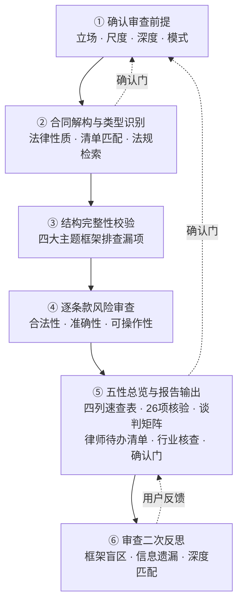
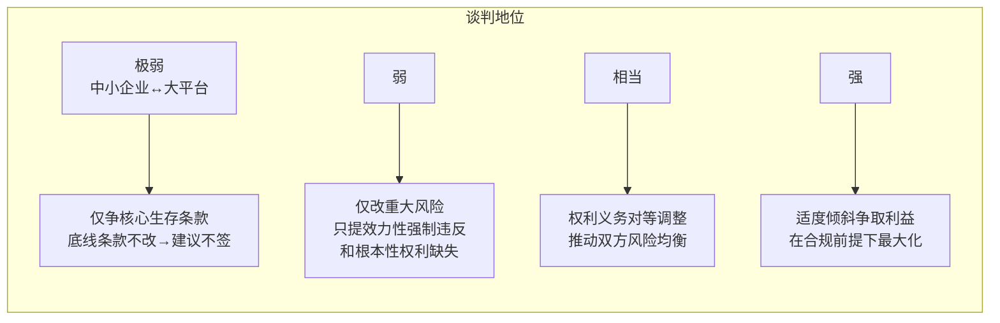
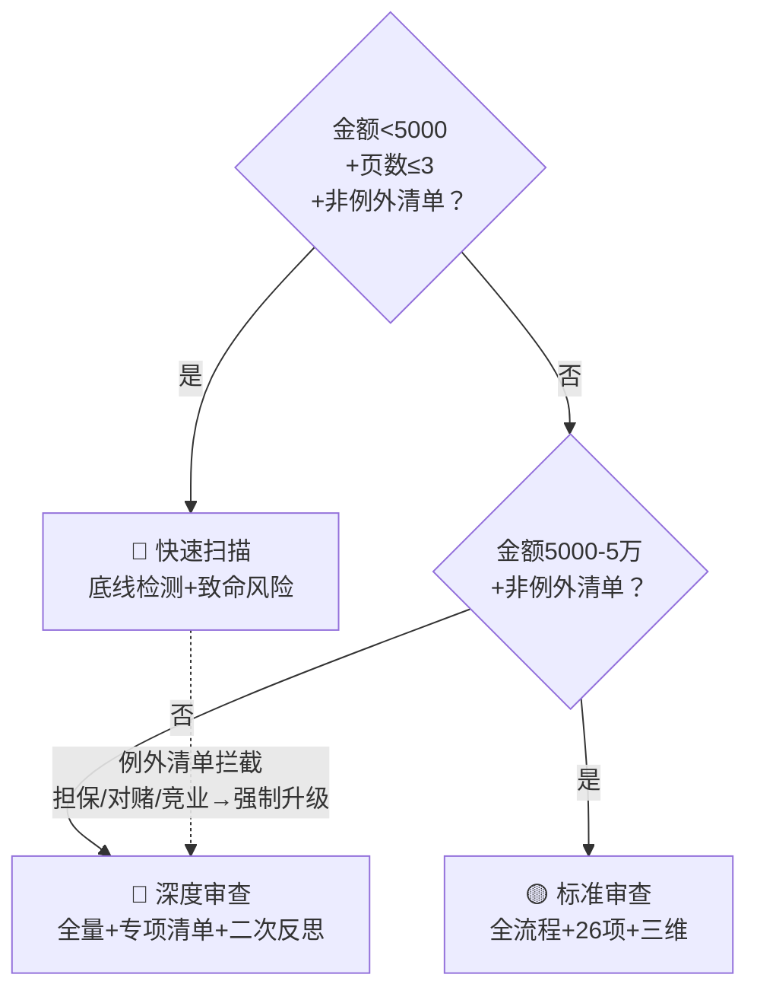

# 战略级合同审查

## 审查总流程

合同审查遵循"由大及小、先整体后局部"的逻辑，分六个阶段推进：



1. **确认审查前提** — 明确立场（含多方确认）、修改尺度、审查深度、输出模式
2. **合同解构与类型识别** — 判断合同法律性质，匹配专项审查清单，扫描配套文件，检索行业法规
3. **结构完整性校验** — 基于四大主题框架排查漏项（持续性合同叠加特殊框架）
4. **逐条款风险审查** — 合法性、准确性、可操作性三维审查，叠加通用审查增强模块
5. **五性总览与报告输出** — 含四列对照速查表、五性总览（周延/可操作/合规/公平/倾向）、26项速查（仅列风险项）、谈判优先级矩阵、决策提示、**律师待办确认清单（必填）**、**行业背景核查清单（必填）**、确认门（含元认知复核选项）

### 审查的推理形式

合同审查本质上是一种**逐条款的函数映射**，而非逐项打勾的检查清单：

```
对每个条款T，并行执行三道独立检验：
  L(T) = 合法性检验  → 是否违反效力性/管理性强制规定
  A(T) = 准确性检验  → 是否存在歧义/矛盾/未定义关键术语
  O(T) = 可操作性检验 → 是否量化可验证/权利行使条件明确/违约责任可执行
  R(T) = max(L风险, A风险, O风险)  →  映射至 🔴🟠🟡🔵

整体评价 = 结构完整性（四大主题 × 民法典470条必备条款）
         + 逐条 R(T) 汇总
         + 五性总览（周延/可操作/合规/公平/倾向）
```

> 三道检验彼此独立并行，取最高风险值——合法性致命则整体致命，不因准确性"没问题"而降级。六阶段工作流是上述推理形式的操作展开。

共有三个确认门：①第一阶段（审查前提）；②第二阶段末尾（合同类型确认）；③第五阶段末尾（用户反馈修正+元认知复核选项）。

---

## 第一阶段：确认审查前提

审查前必须确认三个核心要素，缺少任何一个都会导致审查方向偏差：

1. **代表立场** — 甲方/乙方/中立/多方。不同立场决定风险容忍度和修改力度。若用户未说明，必须先询问。
   - **一般情况（单方委托）**：代表单一甲方或乙方，按对应的风险容忍度和修改尺度审查。这是默认模式。
   - **特殊情况（多方/混合立场）**：当合同涉及三方及以上当事人（如联合体协议、三方采购、委托+担保复合结构）或同一集团内关联公司之间签约时，审查立场不再是简单的"甲/乙"二分。此时**必须主动向用户确认**：①审查应站在哪一方/哪几方的立场？②是否存在"集团利益最大化"的总体目标（此时个别条款可能对某一关联方不利但对全局最优）？③是否需要对不同条款段落切换立场（如总包商面对业主条款vs面对分包商条款）？确认后标注审查立场为"多方-详见审查前提说明"。
2. **修改尺度** — 根据用户谈判地位选择四个级别：



   - **仅争核心生存条款**：谈判地位极弱（如中小企业面对大型平台格式合同），执行底线思维+风险分级：
     * **底线条款（必须争）**：效力性强制规定违反 + 涉及商业存亡的核心条件（如付款周期→不导致资金断裂、违约责任→不导致一次违约即全盘崩塌、知识产权→核心资产不流失）。底线条款不改→建议客户不签。
     * **非底线条款（力争）**：不涉及存亡但明显不公的条款，尝试以"合理化建议"而非"修改要求"的方式提出（对方更可能接受），如无法修改则记录风险并提示客户履约注意事项。
     * **不可争条款（接受+预警）**：对方核心商业模式条款，接受但向客户出具风险提示函——明确该条款风险及最坏后果，由客户书面确认知晓后决策。
     * **配套保护措施**：底线条款也无法全部修改时，启动替代保护——补充协议调整权利义务、关键承诺邮件确认（《民法典》第469条书面形式包括电子邮件）、付款前要求对方书面确认关键履约节点。
     * **内部留痕**：出具法务风险提示函，逐条列明不可修改的条款及其风险后果，提交业务负责人签字确认后再推进签约。详见 `references/general-methodology.md` 第五章"弱势方合同审查策略"。
   - **仅改重大风险**：谈判地位弱，只提效力性强制规定违反和根本性权利缺失
   - **权利义务对等调整**：谈判地位相当，推动双方风险分配均衡
   - **适度倾斜争取利益**：谈判地位强，在合规前提下最大化己方利益
3. **输出模式** — 表格对比版 / 直接修改版 / 审阅痕迹模式 / 清洁版 / 法律意见书。若用户未指定，默认输出法律意见书格式。
   - **表格对比版**：原条款 | 风险点 | 修改建议 | 优先级 四列对照，便于快速定位和内部流转

若用户上传了合同文件但未说明立场和尺度，**先询问再审查**，避免无效输出。

### 1.1 沟通深化（补充信息获取）

审查合同切忌闭门造车。除确认立场/尺度/模式外，**必须主动向用户索要以下周边信息**，这些信息直接影响审查方向：

1. **交易背景和目的**：为什么要签这份合同？客户通过这份合同想达成什么？
2. **各方地位强弱**：谁是格式文本提供者？谁更渴望促成交易？
3. **客户核心关切**：客户最担心什么？（付款安全/质量保障/知识产权流失/违约风险）
4. **历史相关文件**：合作意向书、会议纪要、框架协议、此前版本合同——核对是否存在冲突约定

若用户暂时无法提供以上信息，审查报告中注明"基于合同文本本身审查，未结合交易背景"。

### 1.2 审查深度确认

审查深度不是一律平等的。合同价值和风险大小决定了审查应该投入的精力。本阶段通过主动检索合同特征，**主动建议审查深度**，由用户确认。

**第一步：主动检索合同特征指标**

在进入正式审查前，从合同文本中提取以下客观指标，作为深度建议的依据：

| 指标 | 提取方式 | 用途 |
|------|---------|------|
| 合同总页数 | 数页码 | 极短合同（≤2页）可能存在条款严重缺失或高度浓缩的高风险条款 |
| 合同金额 | 搜索"元""万元""金额""价款"等关键词 | 金额越小，修改合同的谈判成本越容易超过合同价值 |
| 合同类型 | 第二阶段类型识别的预判结果 | 某些合同类型无论金额大小、页数多少，天然高风险 |
| 主体数量 | 识别签约方个数 | ≥3方时为多方合同，启动多方立场确认（见1.0节代表立场） |

**第二步：匹配深度建议**

| 深度级别 | 适用条件 | 审查范围 | 预计耗时 |
|---------|---------|---------|---------|
| 🔵 **快速扫描** | 金额\u003c5000元 且 页数≤3页 且 非例外清单合同类型 | 底线条款检测（主体资格、担保/连带责任、管辖权、违约金显著异常、效力性强制规定违反）+ 26项速查表中致命级风险项 + 五性校验合规性维度 + 结构完整性快速扫描 | 约10分钟 |
| 🟡 **标准审查** | 金额5000-5万元 且 非例外清单合同类型；或用户明确要求 | 快速扫描全部 + 四大主题框架完整审查 + 26项速查全量 + 逐条款三维审查（合法性/准确性/可操作性）+ 谈判优先级矩阵 + 行业背景核查（可简化） | 约30分钟 |
| 🔴 **深度审查** | 金额\u003e5万元；或合同类型在例外清单中；或用户明确要求；或涉及多方主体 | 标准审查全部 + 专项清单全量 + 四类陷阱条款关联审视 + 持续性合同叠加框架 + 配套文件完整扫描 + 法务库双层检索 + 行业法规专项检索 + 官方示范文本对照 | 全流程 |



**第三步：例外清单强制升级**

以下合同类型，不论金额多少、页数多少，**不得建议快速扫描**，必须建议标准或深度审查：

| 合同类型 | 强制最低深度 | 原因 |
|---------|------------|------|
| 担保合同/保证合同 | 🔴 深度 | "无限连带责任保证"六个字可致签字人倾家荡产 |
| 对赌协议/估值调整条款 | 🔴 深度 | 回购义务可达数千万，行权期限争议频发 |
| 竞业限制协议 | 🔴 深度 | 影响范围横跨数年、数个行业 |
| 股权转让/股权代持合同 | 🟡 标准（建议深度） | 涉及控制权变更和出资义务 |
| 建设工程合同 | 🟡 标准（建议深度） | 工程质量责任长期存续 |
| 格式合同中含"连带""保证""无限"字样 | 🔴 深度 | 高度浓缩的高风险条款 |

**第四步：主动建议，用户确认**

基于以上三步，主动向用户提出深度建议：

> "本合同 [页数X页 / 金额约X元 / 合同类型XX]。建议采用 [快速扫描/标准审查/深度审查]。是否同意？如需调整审查深度请告知。"

用户选择快速扫描时，**必须额外确认**：

> "快速扫描模式将跳过以下内容：行业背景核查、专项条款深度分析、商业底层逻辑审查、争端解决策略分析。但以下致命风险项必须检查——主体资格、担保/连带责任、管辖权、违约金显著异常、效力性强制规定违反。确认使用快速扫描？"

**第五步：输出时标注被跳过项目**

快速扫描或标准审查结束后，在审查报告"审查前提"部分明确列出：

```markdown
- 审查深度：[快速扫描/标准审查/深度审查]
- 已覆盖：[列出覆盖的审查维度]
- 未覆盖：[列出被跳过的审查维度及升级路径]（如"行业背景核查未覆盖，如需可升级至深度审查"）
```

**三个配套设计铁则**：

1. **不跳过致命风险**：快速扫描即使砍掉大量环节，必须保留"底线条款检测"——主体资格、无限连带责任/担保责任、管辖权约定、违约金显著异常、效力性强制规定违反。深度分级是"60分/80分/95分"，不是"全/半/无"。
2. **例外清单自动拦截**：上述例外清单中的合同类型，即便页数和金额触发"快速扫描"建议，也必须自动升级至标准或深度审查。**合同页数/金额与法律风险之间不是线性关系。**
3. **主动告知被跳过的项目**：审查完成后明确告知用户哪些维度未被覆盖、未覆盖的后果、以及升级审查的路径。这不只是免责声明，是让使用人做知情决策。

---

## 第二阶段：合同解构与类型识别

### 2.1 判断合同法律性质

不要仅看合同标题。很多合同标题与实质法律关系不一致（如名为"合作协议"实为"借款合同"），必须穿透标题分析实质交易安排。

判断方法：根据合同中双方的核心权利义务配置，对照《民法典》典型合同分则条款，确定合同的法律性质。若为混合合同（包含多种典型合同要素），需识别各部分分别适用何种法律规则。

### 2.2 匹配专项审查清单

识别合同类型后，读取 `references/contract-checklists.md` 中对应的专项审查清单（含15类合同索引和通用审查增强模块）。未匹配到的合同类型适用通用四大主题框架+通用增强模块。

### 2.2A 清单相关性过滤

匹配到专项清单或通用增强模块后，**不能机械全量应用**——必须逐项过滤。不同类型的合同有不同的核心风险维度，不相关条款当禁用。

**过滤规则**：
1. 逐一审视清单中的每一条审查要点，自问：**"这个审查维度与本合同的实质交易内容是否相关？"**
2. 不相关则标注"不适用"，不在报告中列出。不能因为清单里有就硬套。
3. 存在交叉但不是核心问题的，简单标注并跳过，不在报告中展开。

**常见误配示例**（必须避免）：

| 合同类型 | 会被机械加载但不应使用的清单项 | 原因 |
|---------|---------------------------|------|
| 建设工程·设计合同 | §12 农民工工资保障、安全事故责任条款 | 设计合同无施工现场，不涉及农民工/安全事故 |
| 建设工程·监理合同 | §12 劳务分包有效性条款 | 监理合同不含施工分包关系 |
| 劳动合同·高管聘用 | §13 加班费条款 | 高管通常适用不定时工作制，无加班费 |
| 股权代持合同 | §9 股权转让22项中的"其他股东优先购买权" | 代持关系不涉及对外转让 |
| 通用增强·背靠背条款 | 商标代理合同 | 仅适用于付款链场景（总包→分包→供应商），非此类合同禁用 |
| 通用增强·26项之"反商业贿赂条款" | 1200元商标代理合同 | 小额标准化服务，明显不匹配 |

**输出**：在审查报告中标注"清单过滤：原[XX项]→适用[YY项]，过滤[ZZ项]（原因）"。

### 2.3 法务库动态检索增强（双层检索策略）

内嵌清单覆盖的合同类型有限。为确保审查深度，**每次审查都必须执行双层检索**，补充审查视角。

**法务库信息**：kb_id = `3vNMfptGg-GhH_LBH_0tiMyqJxvmA5aJR7v369x3QyA=`

**第一层检索 — 合同类型专项文章**：
1. 用 `search(source="kb", kb_id="3vNMfptGg-GhH_LBH_0tiMyqJxvmA5aJR7v369x3QyA=", question="[合同类型] 审查要点 风险条款")` 检索
2. 对检索到的高相关性文章，用 `fetch` 读取核心内容
3. 将检索到的审查要点与内嵌清单合并，去重后纳入审查

**第二层检索 — 合同涉及的核心法律问题通用文章**：
合同类型专项文章搜不到时，**不要放弃**。转用本合同涉及的法律风险维度进行检索。例如：
- 合同含个人信息条款 → 搜 "个人信息 保护 法 合同 条款"
- 合同含格式条款 → 搜 "格式条款 审查 风险"
- 合同含违约金条款 → 搜 "违约责任 条款 设置"
- 合同含大额付款 → 搜 "背靠背 付款 条款 风险"

**合同类型与检索关键词映射**（常见但未内嵌清单的类型）：

| 合同类型 | 一层关键词 | 二层维度关键词 |
|---------|-----------|---------------|
| 借款合同/担保合同 | 借款合同 担保 审查 风险 | 担保 保证 连带 抵押 质押 |
| 建设工程合同 | 建设工程 施工合同 审查 风险 | 工期 质量 验收 分包 转包 |
| 物业服务合同 | 物业 服务合同 审查 风险 | 业委会 公共收益 安保义务 |
| 买卖合同 | 买卖合同 审查 风险 条款 | 所有权保留 风险转移 验收 |
| 服务合同 | 服务合同 审查 风险 要点 | 服务质量 验收标准 解除 |
| 许可/特许经营合同 | 特许经营 许可合同 审查 风险 | 许可范围 费用 终止 |
| 合作/合伙协议 | 合作协议 合伙 审查 风险 | 控制权 利润分配 退出 |

**注意**：法务库中的文章可能存在时效性，引用其中的法条时仍需按4.4节的法条引用规范进行验证和标注"请核实"。

### 2.4 配套文件扫描

很多合同存在"主合同薄、义务外包"的结构——大量实体义务通过"见附件X""按公司XX制度执行"等形式引用外部文件。必须在审查开始时系统扫描。

**扫描步骤**：
1. 通读合同全文，列出所有引用的外部文件（如"见附件""按XX规约执行""遵守XX手册""参照公司XX制度"）
2. 对每个外部文件标注三个维度：**是否已提供** / **是否经双方签字确认** / **是否可由一方单方修改**
3. 凡出现"未提供"或"可单方修改"或"未经确认"的文件，在结构完整性校验中作为独立风险维度标注

典型高发场景：
- 物业服务合同 → 《业主手册》《管理规约》《装修管理协议》
- 采购合同 → "按甲方采购管理制度""见质量验收标准附件"
- 劳动合同 → "按公司规章制度""见员工手册"

### 2.5 前置程序审查

对于法律法规设置了前置程序的交易，在签合同之前必须履行，否则可能影响合同效力或导致责任。根据交易内容（主体、标的、方式），结合法律法规强制性规定，确定是否需要前置程序。

**常见前置程序**：

| 交易类型 | 前置程序 | 未履行的后果 |
|---------|---------|------------|
| 国有企业转让国有资产 | 资产评估 + 报国资委或政府审批 | 转让行为可能无效 |
| 转让探矿权/采矿权 | 地质矿产主管部门审批 | 转让合同未生效 |
| 对方公司提供担保 | 股东会/董事会决议（审查人数、签字是否符合章程） | 担保可能无效（《公司法》第16条） |
| 上市公司重大资产重组 | 证监会核准 | 交易无法实施 |
| 外资并购涉及国家安全 | 反垄断审查 + 国家安全审查 | 交易被否决 |

**输出**：审查报告中标注"已核查前置程序：[是/否需要]→[是否已完成]"。如需但未完成，作为致命风险标注。

### 2.6 合同类型确认门

在进入第三阶段前，向用户简短确认合同类型识别是否正确：

**输出格式**："识别本合同为 [XX合同类型]，适用 [内嵌清单§X / 通用方法论 + 通用增强模块]。是否正确？"

该确认门快速通过即可，不需要长篇报告。若用户纠正，重新匹配审查框架。

---

## 第三阶段：结构完整性校验

基于四大主题框架对合同结构做整体扫描，识别结构性漏项。四大主题是审查的顶层框架，确保不遗漏重要维度：

| 主题 | 核心问题 | 审查子维度 | 作用 |
|------|---------|-----------|------|
| **交易主体** | 签约各方是否有能力、有资格完成本合同交易？ | 主体身份、资质许可、通讯地址与送达、第三人履约约定 | 核查行为能力与资质合规 |
| **交易内容** | 合同的标的、价款、权利归属是否明确完整？ | 标的规格/数量/质量、价款构成、知识产权归属、售后服务、术语定义 | 明确交易核心约定 |
| **交易方法** | 履约、交付、验收、结算的每一步是否有可操作的标准？ | 履约时间/地点/批次、交接/运输/投保规则、验收标准与程序、结算与付款、通知送达 | 量化履约流程 |
| **问题处理** | 合同出问题时，各方的权利、责任和救济路径是否清晰？ | 违约判定与责任、不可抗力/情势变更、合同解除条件、争议解决、生效/失效条件 | 覆盖异常场景处理规则 |

同时对照《民法典》第470条规定的必备条款（当事人、标的、数量、质量、价款、履行期限地点方式、违约责任、争议解决方法）做底线校验。

### 持续性服务合同的叠加框架

若合同为持续性服务合同（物业、维保、外包、SaaS、服务外包等，周期≥1年），在上述四大主题基础上叠加以下五个特殊审查维度：

| 叠加维度 | 审查要点 | 重要性 |
|---------|---------|--------|
| **服务质量可持续性** | 服务标准是否量化可验证？有无渐进退化风险（第一年认真、第三年敷衍）？是否有定期满意度评估机制？ | 服务合同的"生命线"——标准不可量化则等于无标准 |
| **中期调整机制** | 价格是否锁定？有无调价触发条件？调价条件是否客观（CPI挂钩）而非主观（"成本变化"）？业主方是否有单方否决权？ | 3年合同期内的价格风险往往大于签约时的价格判断 |
| **退出/交接机制** | 解约程序是否明确？业主单方解约权有无？交接义务是否约定（资料/图纸/客户信息/预付费用清算）？ | 物业合同最常见的纠纷就是"不让你走"和"走了也不好好交接" |
| **商业连续性保障** | 服务中断时有无应急措施？更换服务商时的过渡期如何保障？是否有服务商破产/退出后的预案？ | 研发办公楼/生产厂房等对连续性要求高的场景尤为重要 |
| **单方规则变更限制** | 服务商是否有权单方修改服务标准/管理制度？如有，是否需业主方确认？新规则是否对旧合同有溯及力？ | 防止"签了一份合同，三年后被改成了另一份" |

持续性合同若未约定以上维度的相关内容，在第5.1节五性校验中标注为"持续性维度缺失"。

**输出**：列出合同结构中缺失的条款维度，标注缺失条款可能导致的法律后果。

---

## 第四阶段：逐条款风险审查

### 4.0 审查铁则——禁止一次通过

**核心教训**（来自委托加工合同审查的两次返工）：找到高风险条款后不能停止审查。**每次逐条款审查后，必须强制做一次系统性二轮回查**，使用以下工具：

1. **26项速查表逐项标注**：每一轮审查结束后，用通用审查增强模块的26项高频风险点逐条核验，标注✅/⚠️/—。这是质量核验表，不是演示文稿。
2. **配套文件完整扫描（2.4阶段）**：所有引用的外部文件必须在审查前提中标注"已提供/未提供"，未提供的附件不能默认"没问题"。
3. **分散条款关联审视**：同一事项分散在合同多处的条款（报价+知识产权+违约责任+终止处理），必须画关联图，识别联动后的风险。

**输出**：报告中标注"一轮审查X项→二轮回查补充Y项"。

### 4.0 行业法规专项检索（限受监管行业）

若合同涉及以下受监管行业，**在进入条款审查前，必须先用 search(source="web") 检索该行业的最新核心法规和司法解释**：

| 行业 | 须检索的法规类型 | 示例 |
|------|----------------|------|
| 物业 | 国务院条例+省级条例+地方法规 | 《物业管理条例》《湖北省物业服务和管理条例》 |
| 建设工程 | 建筑法+招投标法+地方法规 | 《建筑法》《建设工程质量管理条例》 |
| 金融/借贷 | 银保监会规章+司法解释 | 利率管制规定（LPR4倍）、民间借贷司法解释 |
| 劳动用工 | 劳动合同法+地方条例 | 《劳动合同法》、地方工资支付条例 |
| 医疗/药品 | 卫健部门规章+药监局规章 | 《医疗器械监督管理条例》 |
| 房地产 | 城市房地产管理法+地方法规 | 预售、网签、限购政策 |

**输出**：在审查报告中标注"已检索行业法规：XX条例/XX办法（版本/修订时间）"，并在条款审查中引用行业法规条文时，同时与《民法典》一般规定对比，标注特殊法优先适用的情况。

### 4.0A 官方示范文本检索（平行步骤）

部分合同类型有国家主管部门发布的官方示范文本——对照示范文本审查比对照法条更直接有效。**在行业法规检索的同时，必须平行检索该合同类型是否有官方示范文本。**

**常被忽视的示范文本来源**：

| 合同类型 | 官方示范文本 | 发布机构 |
|---------|------------|---------|
| 商标代理 | 《商标代理委托合同示范文本》 | 国家知识产权局（2024年12月） |
| 专利代理 | 《专利代理委托合同示范文本》 | 国家知识产权局（2024年12月） |
| 商品房买卖 | 《商品房买卖合同示范文本》 | 住建部/工商总局 |
| 建设工程施工 | 《建设工程施工合同（示范文本）》（GF-2017-0201） | 住建部/工商总局 |
| 物业服务 | 各地住建部门发布的物业服务合同示范文本 | 省级住建部门 |

**检索方法**：用 `search(source="web", question="[合同类型] 示范文本 国家知识产权局/住建部/工商总局")` 检索。

**使用方法**：将本合同与示范文本逐项对照，标注"本合同缺失但示范文本要求"的条款，作为结构完整性缺陷和风险提示的依据。

**注意**：示范文本不是强制性的，但对照后可以发现"行业标准"与"本合同"的差距，有助于判断合同的公平性和完整性。

### 4.1 合法性审查
- 是否违反效力性强制性规定（导致条款无效）
- 是否违反管理性强制性规定（可能导致行政处罚）
- 区分强制性规定与任意性规定，前者有约束力，后者可约定排除
- 标注司法解释与法律条文的层级差异
- 注意新旧法衔接与时效问题

### 4.2 准确性审查
- 表述是否存在歧义（同一条款两种以上合理解释）
- 条款之间是否存在矛盾
- 关键术语是否有定义
- 数量/期限/比例等是否明确可执行

### 4.3 可操作性审查
- 履行标准是否量化可验证
- 行使权利的条件和程序是否明确
- 违约责任是否具有可执行性（而非空泛的"承担法律责任"）

### 4.3A 重点性审查（叠加视角）

不是所有条款同等重要。根据客户的核心交易目的，对条款分级对待：

- **核心利益条款**：围绕客户交易目的的核心条款（如卖方的付款安全和交付条件，买方的质量保障和验收权）——审查深度最深，逐字逐句
- **一般权利义务条款**：标准审查
- **辅助格式条款**：快速通过，不消耗过多审查精力

**操作**：在逐条款审查前，先标注出哪些条款属于"核心利益条款"，对这些条款的审查投入最大精力。

### 4.3B 可行性审查（叠加视角）

审查交易安排是否具有操作性、是否存在履行障碍、障碍是否可控：

- 约定的履行时间是否合理？——应考虑主管部门办结时间、客户自身履约能力
- 交易对方的履行能力是否匹配？——注册资本与交易规模是否相当、历史履约能力如何
- 外部限制条件是否可控？——行政许可、第三方配合、天气/季节性因素

**操作**：对关键履约节点做"如果对方无法按时履行，我方有什么替代方案"的压力测试。

### 4.4 法条引用规范

审查中引用法条时必须遵循以下规范：
- 精确到条文号和生效时间，不说"根据相关规定"
- 引用前先检索验证法条现行有效状态
- 标注"请核实"，指定权威验证渠道（北大法宝、威科先行等）
- 检索不到时如实告知"未检索到"，绝不捏造条文

---

## 第五阶段：五性总览与报告输出

审查的实质分析已经在前四个阶段完成。第五阶段定位为**汇总呈现**：将分散的审查结论按五性维度重新排列，让读者一眼看到五维状态全貌——不是独立验证环节，是对已有分析的结构化梳理。

### 5.1 五性校验

对前四阶段审查结果做最终核验。以下标准源自原文完整表述：

| 校验维度 | 完整标准 |
|---------|---------|
| **周延性** | 合同涵盖了该交易事项的全部外延，不存在漏项。**周延 = 绝对必要条款 + （沟通结果反哺 + 自我经验补充 + 行业特性 + 常见问题 + 行业分析报告梳理 + 商业性理解）**。具体操作：对照《民法典》第470条+交易特点+行业特征+沟通结果+法律经验，逐项排查漏项。例如：租赁合同需介绍房屋内部设施（行业特征）；成套工业采购需约定调试/试车/验收/备品备件（交易特点）；技术开发需约定权利归属和技术合同备案（交易特点）；危废处置合同需约定主体资质（行业特征） |
| **可操作性** | 在周延基础上，合同条款内容明确、逻辑流畅、方便实施。三层要求：①权利义务明确——不能出现模糊描述和歧义表达；②逻辑恰当——条款按时间顺序或事务发展顺序排列，符合事物发展一般规律；③表述准确——合同作为书面法律文件，用语规范准确。验收条款的典型问题："正常运行"→应细化为"连续72小时无重大故障，功能点与需求规格说明书一致" |
| **合规性** | 合同主体应具备签署合同的能力和资质。能力=主体行为能力（不具备则合同效力存在瑕疵，可能无效或被撤销）；资质=从事特定行为的法定资格（通过行政许可取得，不具备则影响合同目的实现）。反面示例：个人签危废处置合同、无烟草专卖许可证转售烟草、无资质施工队承包工程 |
| **公平性** | 双方权利义务大致平衡，强调互为交易的等值性和合同风险合理分配——包括权利义务确定、风险分配、违约责任的公平。注意：《民法典》公平原则是基于市场经济交易秩序和交易规则的相对公平，非绝对对等，合同可以也必然具有一定的倾向性 |
| **倾向性** | 对公平性的修正和补充，两层含义：①存在倾斜是正常的；②倾斜程度须适当——适度倾斜。过度倾斜=将对方吓跑+丧失签约可能性。即使己方强势，也不能用力过猛达到"显失公平"的程度。具体：交易中占主导地位时可争取更多权利，但不可构成显失公平；处于劣势时，专注权利义务严重不平等条款和影响重大的违约后果，而非在管辖约定等边缘条款上消耗

### 5.2 风险定级与分类

所有风险按两个维度标注：

**风险等级**：🔴 致命（效力瑕疵/违法）/ 🟠 重大（核心权利缺失或严重失衡）/ 🟡 中等（条款模糊/操作困难）/ 🔵 轻微（表述优化）

**问题类型**：标注风险的根本原因类别，便于后续合同修订时按类型批量处理：

| 类型 | 含义 | 示例 |
|------|------|------|
| 条款缺失 | 合同完全遗漏了应当约定的内容 | 无验收标准、无知识产权归属、无保密条款 |
| 条款违法 | 条款内容违反效力性或管理性强制规定 | 排除人身损害赔偿请求权、约定管辖违反专属管辖 |
| 条款模糊 | 条款用语含混、多义或不可量化验证 | "合理期限""及时通知""重大违约" |
| 条款失衡 | 权利义务配置显著不利于审查方 | 单方任意解除权、全部风险转嫁、无限连带责任 |
| 条款冲突 | 合同内不同条款对同一事项的规定相互矛盾 | 付款时间在第3条和第8条不一致 |

每个风险还须标注：
- **引爆条件**：什么情况下这个风险会实际爆发
- **法律依据**：对应的法条条文号和生效时间

### 5.3 多方案输出

每个风险按以下规则提供三种路径（至少两种）：

| 路径 | 类型 | 适用场景 | 内容要求 |
|------|------|---------|---------|
| **路径A** | 核心修改 | 有谈判筹码，可直接修改条款 | 给出替代条款全文、法律依据、可能引发的新风险和适用条件 |
| **路径B** | 折中/最小修改 | 谈判筹码有限，只能微调 | 在原条款基础上做最小改动，标注保留的风险和让步边界 |
| **路径C** | 替代控制 | 条款完全不可改 | 不修改条款本身，通过书面锁定事实/履约流程改造/第三方对冲/证据固化/分批操作五类工具实现等效风险控制。**详见 `references/general-methodology.md` 第六章——改不了条款时怎么保护自己。** |

> 路径A是理想解，路径B是约束解，路径C是底线解。三者不是"好→中→差"的降级关系——在不同谈判场景下各有其最优性。

**不给唯一结论或"推荐方案"**，给多方案让律师根据具体场景选路径，价值判断和最终决策权留给法律人。

### 5.4 谈判优先级矩阵

风险分析不是终点——律师需要知道"谈判桌上怎么打"。在报告末尾，将识别出的风险按**「法律重要性 × 谈判可行性」**两轴分类为四象限：

| 象限 | 标签 | 含义 | 谈判策略 |
|------|------|------|---------|
| **法律重+谈判可行** | 🔴 必争条款 | 不改会有实质性法律风险，且我方有筹码推动修改 | **集中火力**：重点论证、据理力争、不做交换 |
| **法律重+谈判难** | 🟠 观察条款 | 风险高但对方难以让步（如格式合同核心条款） | **迂回管控**：通过履约监督、补充协议、备忘录管控风险，不强行推动条款修改 |
| **法律轻+谈判可行** | 🟡 筹码条款 | 我方不太在意，但对方可能在意 | **主动让渡**：在必争条款上让步换取对方在本类条款上的妥协 |
| **法律轻+谈判难** | 🔵 放弃条款 | 影响有限且难以推动 | **不提**：节省谈判精力，避免分散核心议题焦点 |

**输出**：在报告末尾以矩阵表格列出所有发现的风险及其象限归属。

### 5.5 26项高频风险速查核验

审查报告末尾**必须**附带通用审查增强模块中26项高频风险点的核验结果表。格式如下：

```markdown
## 26项高频风险速查核验

| # | 风险点 | 核验结果 | 说明 |
|---|--------|----------|------|
| [编号] | [风险点名] | ⚠️ / 🔴 | [简要说明——仅出口触发风险项，✅的不列] |
```

> 只输出触发警示的项（⚠️和🔴），通过项（✅）不罗列。该表格是**质量核验表**——确保审查覆盖了所有常见风险维度，而非新增内容。

### 5.5A 小额合同的替代审法

当合同金额较小、修改合同的谈判成本可能超过合同价值时，审查报告必须额外提供**「不修改合同的底线保护方案」**——不逐条修改合同文本，而是通过签约前后的邮件确认、承诺函等方式实现等效风险控制。

**判断标准**：合同金额 < 5000元（或服务费 < 1万元），且对方使用不可协商的格式模板。

**替代保护工具包**：

| 风险类型 | 替代保护方式 | 法律依据 |
|---------|------------|---------|
| 代理机构未尽告知义务 | 签约前要求代理机构通过邮件书面确认"两件商标经初步检索无不得注册障碍" | 《民法典》第469条：书面形式包括信件、电报、电传、电子邮件 |
| 工作时限不明确 | 付款当日邮件明确"请于X月X日前完成商标检索并提交申请"，对方回复确认即为合意 | 同上 |
| 退费条件过窄 | 付款前要求对方邮件确认："如商标因检索可预见的原因被驳回，应退还代理费" | 同上的合同补充合意 |
| 商标图样不明确 | 邮件附上图样文件，要求对方确认"以此图样为准" | 证据固化 |
| 联系人/送达不明确 | 邮件确认双方联系人及邮箱，约定"合同履行中一切通知以本邮箱为准" | 填补合同送达条款空白 |

**输出**：在决策提示部分增加"替代方案"小节，列出不需要修改合同但可以达到等效保护的3-5条关键行动。

### 5.5B 可复用示范条款（自动生成）

不再单独设立提取流程。在逐条分析的路径A修改方案中，凡具有跨合同复用价值的修改示范文本，自动标注复用标签：

```
> [修改示范文本]
> 🏷️ 可复用 | 类型：[通用型/类型专属] | 适用：[合同类型] | 防范风险：[一句话]
```

**两类复用**：
- **通用型**（任何合同可用）→ 送达条款、保密条款、完整协议条款、不可抗力条款
- **类型专属**（仅该类合同）→ 商标代理告知义务条款、物业服务调价条款等

报告模板中的"可复用示范条款"章节直接从上述标签汇总生成，不额外再做一轮检索-提炼流程。

---

### 5.6 报告格式（强制遵循）

**输出纪律**：
- 以下模板是合同审查2.0的唯一定制输出格式，每次审查必须严格遵循，章节顺序、标题层级、字段名称不得增删改
- 语言正式：使用法律书面语，禁止口语化/比喻/网络用语
- 每个法律结论附法条条文号，标注"请核实"及验证渠道
- 重大风险必须提供至少2条应对路径，各自含修改示范文本+法律依据+风险+适用条件
- 四列速查表是导航，逐条详细分析是核心——两者缺一不可，顺序不可颠倒

```markdown
# [合同名称] 审查报告

## 审查前提
- **代表立场**：[甲方/乙方/中立/多方]
- **修改尺度**：[仅争核心生存条款/仅改重大风险/权利义务对等调整/适度倾斜争取利益]
- **合同类型识别**：[法律性质认定]（《民法典》相关条文）
- **专项清单**：[匹配的审查框架 + 法务库检索结果]
- **补充信息**：[交易背景提供情况 / 基于合同文本本身审查]

---

## 结构完整性校验

### 配套文件扫描
| 引用文件 | 位置 | 已提供？ | 是否双方确认？ | 是否可单方修改？ | 风险 |
|----------|------|----------|--------------|----------------|------|

### 四大主题框架扫描
| 主题 | 核验结果 |
|------|----------|
| **交易主体** | [核查结论：主体信息/资质/送达地址] |
| **交易内容** | [核查结论：标的/价款/知识产权/术语定义] |
| **交易方法** | [核查结论：履约/验收/结算/付款] |
| **问题处理** | [核查结论：违约责任/解除/争议解决/不可抗力] |

### 持续性合同叠加框架（如适用）
| 维度 | 核验结果 |
|------|----------|
| 服务质量可持续性 | [结论] |
| 中期调整机制 | [结论] |
| 退出/交接机制 | [结论] |
| 绩效考核 | [结论] |

### 民法典第470条必备条款校验
| 必备条款 | 核验 |
|----------|------|
| 当事人 | ✅/⚠️/🔴 |
| 标的 | ✅/⚠️/🔴 |
| 数量 | ✅/⚠️/🔴 |
| 质量 | ✅/⚠️/🔴 |
| 价款 | ✅/⚠️/🔴 |
| 履行期限地点方式 | ✅/⚠️/🔴 |
| 违约责任 | ✅/⚠️/🔴 |
| 争议解决 | ✅/⚠️/🔴 |

---

## 风险总览——四列对照速查表

| 类型 | 优先级 | 条款位置 | 原条款摘要 | 风险点 | 修改建议 |
|------|--------|----------|-----------|--------|----------|
| [缺失/违法/模糊/失衡/冲突] | 🔴 **必争** | 第X条 | [原文关键句] | [一句话风险] | [一句话建议] |
| 🟠 **调整** | ... | ... | ... | ... |
| 🟡 **建议** | ... | ... | ... | ... |
| 🔵 **备忘** | ... | ... | ... | ... |

---

## 风险条款详细分析

### 🔴 高风险

---

#### 🔴 风险[N]：[风险标题]

**条款位置**：第X条[X]款

**条款原文**：
> [原文引用]

**风险描述**：
[具体法律风险分析，包含"这意味着什么"的深度解读，必要时从己方、对方、法院居中视角展开竞争性解读]

**法律依据**：《民法典》第X条（条文核心内容）。（请核实——北大法宝/威科先行）

**可废止条件**：[什么新事实/新证据/新法规出现会推翻上述风险判断。如无此条件，标注"无——基于现行有效法律，判断确定性高。"]

**应对路径**：

**路径A（推荐/核心修改）**：
> [修改示范文本]
- **依据**：《民法典》第X条
- **风险**：[修改后可能产生的新风险]
- **适用条件**：[什么情况下选这条路]

**路径B（折中/最低修改）**：
> [修改示范文本]
- **依据**：[法律依据]
- **风险**：[修改后仍存在的风险]
- **适用条件**：[什么情况下选这条路]

**路径C（替代控制/不可改时）**：
> [根据 risk 类型从五类工具中选择：书面锁定事实 / 履约流程改造 / 第三方对冲 / 证据固化 / 分批操作。详见 references/general-methodology.md 第六章对照表和具体操作]
- **依据**：[法律依据]
- **风险**：[替代措施的局限性]
- **适用条件**：[条款完全不可协商时]

---

### 🟠 中等风险

---

[同上结构，每个风险独立编号]

---

### 🟡 低风险

---

[简要分析，可合并多条]

---

## 补充发现

[如适用：第一轮审查遗漏的补充风险]

---

## 五性总览

| 维度 | 结论 | 说明 |
|------|------|------|
| **周延性** | ✅/⚠️/🔴 | [具体说明缺失内容] |
| **可操作性** | ✅/⚠️/🔴 | [具体说明操作障碍] |
| **合规性** | ✅/⚠️/🔴 | [具体说明合规问题] |
| **公平性** | ✅/⚠️/🔴 | [具体说明失衡条款] |
| **倾向性** | [整体偏甲方/偏乙方/基本对等] | [说明倾向程度和合理性] |

---

## 26项高频风险速查（仅列触发风险项）

| # | 风险点 | 核验结果 | 说明 |
|---|--------|----------|------|
| [编号] | [风险点名] | ⚠️ / 🔴 | [简要说明——只输出触发项，✅的不列] |
| ... | [仅列⚠️🔴项] | ... | ... |

---

## 谈判优先级矩阵

| 象限 | 条款 | 理由 |
|------|------|------|
| 🔴 **必争** | [条款名] | [法律重要性+谈判可行性分析] |
| 🟠 **观察** | [条款名] | [迂回管控方式] |
| 🟡 **筹码** | [条款名] | [可交换的对价] |
| 🔵 **放弃** | [条款名] | [放弃理由] |

---

## 决策提示

### 本报告看完后需要做的决策

1. [决策事项1——具体行动建议]
2. [决策事项2——具体行动建议]
...

---

## 可复用示范条款

### 通用型

#### [条款序号]. [条款名称]
- **适用**：通用 | **防范风险**：[一句话]
- **示范文本**：
  > [条款全文]

### 类型专属

#### [条款序号]. [条款名称]
- **适用**：[合同类型] | **防范风险**：[一句话]
- **示范文本**：
  > [条款全文]

---

## 📋 律师待办确认清单

### 签约前必须确认
| # | 确认事项 | 去哪里确认 | 影响什么条款 |
|---|---------|-----------|-------------|

### 需业务部门确认
| # | 确认事项 | 去哪里确认 | 影响什么条款 |
|---|---------|-----------|-------------|

### 供谈判参考
| # | 确认事项 | 用途 |
|---|---------|------|

---

## 🔍 行业背景核查清单

### 需要"走出去"了解
| # | 核查事项 | 核查渠道 | 影响什么决策 |
|---|---------|----------|-------------|

### 了解后回头看条款
| 了解结果 | 条款策略变化 |
|----------|-------------|

---

**以上是本次审查的全部内容。你对审查的深度/方向有调整要求吗？是否有遗漏的风险维度需要补充审查？**

> **元认知复核**（可选）：是否调用溯因推理技能对本报告做三问复核？①对方最大谈判筹码是什么？②一年后最可能出事的三个条款？③报告中最容易被法院推翻的判断？需已安装溯因推理Skill。
```|---|---------|----------|-------------|
| A | [如：行业毛利率] | [行业内人士/行业协会] | [判断价格锁定的真实风险] |
| B | [如：上游原材料价格走势] | [市场报价平台] | [决定调价条款要不要加] |
| C | [如：对方资信状况] | [企查查/裁判文书网/信用中国] | [判断违约金可执行性] |
| D | [如：对方产能/履约能力真实性] | [现场考察/行业内人士] | [评估系统性交期风险] |
| E | [如：替代供应商情况] | [行业协会/企业名录] | [决定谈判筹码] |
| F | [如：行业监管/执法环境] | [监管部门网站/行业处罚公告] | [判断"协商处理"在现实中是否成立] |
| G | [如：物流/保险安排] | [物流部门/承运人合同] | [出事后甲方的救命稻草在哪] |

### 了解后回头看条款
| 了解结果 | 条款策略变化 |
|----------|-------------|
| [如果XX] | [YY条款从"建议"升为"必争"] |

## 确认门
在进入下一步（谈判/签署）之前：
1. **待办清单**：上述确认事项，是否全部需要？优先级是否需要调整？
2. **行业核查**：上述行业背景核查项目是否全覆盖？是否有补充？
3. **审查深度**：当前修改尺度是否需要调整？
4. **遗漏问题**：是否有我遗漏的风险维度或特殊要求？

```


1. **审查前先问立场** — 没有立场的审查是无效审查
2. **穿透标题看实质** — 合同标题≠法律性质
3. **法条必须检索验证** — 不凭记忆引用，引用即标注"请核实"
4. **风险必须排序+标注引爆条件** — 不做风险罗列，做风险地图
5. **给多方案不给唯一结论** — 决策权留给法律人
6. **报告是行动手册不是教科书** — 每个判断附推理链条，可逆向验证
7. **区分法定要求与实务建议** — 前者有约束力，后者供决策参考
8. **不给无法回溯的断言式结论** — 每个法律判断结论必须附推理链条或依据来源
9. **报告末尾主动邀请元认知复核** — 确认门中提示可选溯因推理三问复核
10. **小额合同必须提供替代方案** — 合同金额<5000元时，在决策提示中额外提供"不修改合同的底线保护清单"
11. **持续审视审查框架的适用性** — 如果审查过程中发现框架不适配本合同类型，在二次反思中记录并建议框架扩展
12. **路径A修改方案自动生成可复用标签** — 具有跨合同复用价值的修改示范文本标注🏷️可复用，报告自动汇总

---

## 关联技能

合同审查不是孤立动作。在你的Skill库中，它与其他技能构成审查网络：

| 关联技能 | 关系 | 触发场景 |
|----------|------|----------|
| 法条检索 | 内嵌调用 | 审查引用法条时验证现行有效性（§4.4）；高频法条原文见 references/general-methodology.md 附录 |
| 争议焦点识别 | 下游衔接 | 合同发生争议后，审查中标注的"条款模糊"项可直接输入争议焦点识别，快速定位核心争点 |
| 法律风险识别（外部监管） | 并行互补 | 合同对方涉及许可资质、行政处罚记录时，签约前并行运行此技能排查对方监管风险 |
| 内部合规风险识别 | 并行互补 | 合同引用了企业内部制度（"按公司XX制度执行"）时，该制度本身的合规性需另行审查 |
| 溯因推理 | 方法调用 + 元认知复核 | 合同关键条款存在多种可能解释时提供竞争性假设；审查报告完成后可选三问复核（对方最大筹码/最可能出事条款/最易被推翻判断） |

---

## 参考文件索引

| 文件 | 用途 | 何时读取 |
|------|------|---------|
| `references/general-methodology.md` | 通用审查方法论（四大主题框架+商业底层逻辑+持续性合同审查维度+**弱势方审查策略**） | 第三、四阶段审查时；修改尺度为"仅争核心生存条款"时必读第五章 |
| `references/contract-checklists.md` | 15类专项合同审查清单 + 通用审查增强模块（陷阱条款识别+26项高频风险点+背靠背条款+三维度合规风险+最高检风险提示） | 第二阶段匹配到对应合同类型时 + 第四阶段叠加通用增强模块 |
| 法务知识库（kb_id: `3vNMfptGg-GhH_LBH_0tiMyqJxvmA5aJR7v369x3QyA=`） | 各类合同的专业审查文章（280篇，持续更新） | 第二阶段2.3节动态检索时 |
| `references/report-example.md` | **完整审查报告范例**（委托加工合同-甲方立场）——展示§5.6模板在真实合同中的完整呈现形态 | 首次使用本技能时必读；执行审查时作为格式参照 |
