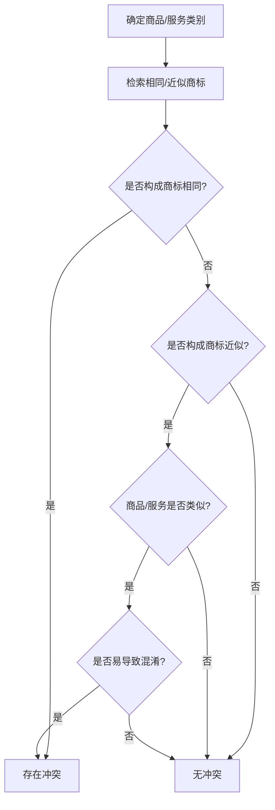

# 商标侵权判断分析技能

## 概述

本技能基于以下法规文件，提供系统化、专业化的商标侵权判断分析服务：
- 《中华人民共和国商标法》(2026修订，2027年1月1日施行)及其实施条例
- 国家知识产权局《商标侵权判断标准》(国知发保字〔2020〕23号)及其《理解与适用》
- 《商标审查审理指南》(2021版) - 商标注册检索判断指引

**适用场景**：
- 代理人判断涉案商标是否构成侵权
- 客户侵权风险咨询答复
- 商标案件分析与证据固定
- 商标相同/近似性判断
- 混淆可能性分析
- 商标注册检索判断

分析前，先读取以下参考资料以获取完整的判断标准：
- `references/trademark_law_2027.md` - 商标法（2026修订·2027.1.1施行）全文+新旧对照表
- `references/trademark_law_core_provisions.md` - 商标法核心条款参考（2019修正版·现行有效，2027.1.1废止）
- `references/trademark_infringement_standards.md` - 商标侵权判断标准
- `references/trademark_examination_guide_2021.md` - 商标审查审理指南要点
- `references/trademark_use_evidence_guide.md` - 商标使用证据详细指南
- `references/trademark_use_management_notice_2025.md` - 商标使用管理通知（2025年11月）
- `references/trademark_use_management_notice_interpretation_2025.md` - 商标使用管理通知解读（2025年12月）
- `references/non_traditional_mark_distinctiveness_guide.md` - 非传统商标（三维标志/颜色组合/声音商标）显著特征判定指引（CNIPA官方指引·文本提取版）
- `references/goods_services_classification_guide.md` - 商标注册用商品和服务分类（尼斯分类/区分表/类似群）理解指引（CNIPA官方指引·文本提取版）

## 一、技能使用流程

当用户提出商标侵权判断请求时，按以下流程处理。**每个 🛑 标记处必须暂停、向用户展示当前结论、等待用户确认后再继续。**

1. **明确请求类型**:
   - 代理人案件分析 → 使用四.1分析意见格式
   - 客户快速咨询 → 使用四.2快速答复模板
   - 商标注册检索判断 → 执行二.3检索流程

2. **收集基本信息**:
   - 权利人商标信息(商标号、核定类别、有效期、核准样式)
   - 涉嫌侵权行为描述(使用场景、商品/服务、载体)
   - 相关证据材料(照片、截图、合同等)

   🛑 **CHECKPOINT 0 — 信息完整性确认**：
   向用户展示已收集的信息清单。如缺少关键信息（商标号、核定类别、涉嫌侵权标识），**不得继续**，必须先向用户索要缺失信息。

3. **执行五步法分析（含知识库联动检索）**:

   **第一步：商标使用性判断**
   → **检索法规**：《商标法》第2条第2-3款、《商标侵权判断标准》第1-5条
   → **知识库**：ima笔记知识库（中华人民共和国商标法、商标侵权判断标准）

   🛑 **CHECKPOINT 1 — 商标使用性结论确认**：
   向用户展示：涉案行为是否构成"商标的使用"及理由。
   - 若 **不构成商标使用**：直接跳至「综合结论」（不构成侵权），跳过步骤2-5，进入 CHECKPOINT 6。
   - 若 **构成商标使用**：继续下一步。

   **第二步：许可情况判断**
   → **检索法规**：《商标法》第55条、《商标法实施条例》第69条
   → **知识库**：ima笔记知识库（中华人民共和国商标法实施条例）

   🛑 **CHECKPOINT 2 — 许可情况确认**：
   向用户展示：是否存在有效许可。若存在许可且在范围内 → 跳至「综合结论」（不构成侵权），跳过步骤3-5，进入 CHECKPOINT 6。

   **第三步：商品/服务类似性判断**
   → **检索法规**：《商标侵权判断标准》第9-12条
   → **知识库**：ima笔记知识库（商标审查审理指南2021版）

   🛑 **CHECKPOINT 3 — 商品/服务类似性结论确认**：
   向用户展示：商品/服务是否相同/类似及理由。
   - 若 **不类似且非驰名商标**：跳至「综合结论」（不构成侵权），进入 CHECKPOINT 6。
   - 若类似/相同，或涉及驰名商标跨类保护：继续下一步。

   **第四步：商标相同/近似性判断**
   → **检索法规**：《商标审查审理指南》第4章、《商标侵权判断标准》第13-17条
   → **知识库**：ima笔记知识库（商标审查审理指南2021版、商标侵权五步法分析）

   🛑 **CHECKPOINT 4 — 商标相同/近似性结论确认**：
   向用户展示：商标相同/近似判断结果及三合一方法分析。
   - 若 **既不近似也不相同**：跳至「综合结论」（不构成侵权），进入 CHECKPOINT 6。
   - 若构成相同或近似：继续下一步。

   **第五步：混淆可能性判断**
   → **检索法规**：《商标法》第72条第2项、《商标侵权判断标准》第19-21条
   → **知识库**：ima笔记知识库（中华人民共和国商标法、商标侵权判断标准）

   🛑 **CHECKPOINT 5 — 混淆可能性结论确认**：
   向用户展示：五因素综合分析和混淆可能性结论。

4. **输出分析结果**:

   🛑 **CHECKPOINT 6 — 最终结论与输出格式确认**：
   向用户展示完整的分析意见（含综合结论、侵权类型、建议措施、法规依据）。
   确认用户对结论无异议后，再输出最终版本。

5. **后续跟进**:
   - 如需进一步证据，告知用户补充
   - 如需专业法律意见，告知咨询律师
   - 记录案例到实务工具库，供后续参考

### 1.1 本地法规与标准文件索引

执行商标侵权分析时，可直接查阅以下技能内置本地文件（路径可达、无需联网）：

| 文件 | 内容 | 适用场景 |
|------|------|---------|
| `references/trademark_law_2027.md` | 商标法核心条款（注册条件/侵权认定/救济赔偿） | 商标法核心条款检索 |
| `references/trademark_infringement_standards.md` | 侵权判断标准条文详解（国知发保字〔2020〕23号） | 侵权判断标准检索 |
| `references/trademark_examination_guide_2021.md` | 商标相同/近似判断标准（隔离观察/整体比对/主要部分比对） | 商标审查审理指南2021版 |
| `references/trademark_law_core_provisions.md` | 商标法核心条文 | 核心条文快速查阅 |
| `references/trademark_use_evidence_guide.md` | 商标使用证据指引 | 使用证据认定 |
| `references/trademark_use_management_notice_2025.md` | 商标使用管理2025年规定 | 使用管理规范 |
| `references/trademark_use_management_notice_interpretation_2025.md` | 商标使用管理2025年规定解读 | 使用管理规范解读 |
| `references/non_traditional_mark_distinctiveness_guide.md` | 非传统商标显著特征判定（三维/颜色组合/声音；缺乏显著特征情形+经使用取得） | 非传统商标显著性评估、混淆显著性要素、功能性正当使用抗辩 |
| `references/goods_services_classification_guide.md` | 商品服务分类体系、区分表/类似群结构、同一种或类似判断 | 第三步商品/服务类似性判断、商标检索、核定范围界定 |
---

## 二、核心判断体系

### 2.1 标准分析流程(五步法)

对每一个商标侵权判断请求，严格按以下五步递进分析：

#### 第一步：是否构成"商标的使用"

判断涉案行为是否属于商标法意义上的商标使用(用以识别商品或服务来源的行为)。

**商标使用的具体形式**：

**商品商标使用**：
- 直接贴附、刻印、烙印、编织等方式附着于商品/包装/容器/标签/附加标牌/说明书/价目表
- 使用在商品销售合同、发票、票据、收据、进出口检验检疫证明、报关单据等交易文书
- 在广播、电视、媒体、出版物、广告牌、邮寄广告等广告宣传中使用
- 在展览会、博览会等场合使用

**服务商标使用**：
- 直接用于服务场所：介绍手册、招牌、店堂装饰、工作人员服饰、招贴、菜单、价目表
- 用于服务相关用品：奖券、办公文具、信笺等
- 用于服务交易文书：发票、汇款单据、提供服务协议、维修维护证明
- 在广播、电视、媒体、出版物、广告牌等广告宣传中使用

**不属于商标使用的情形**：
- 商标注册信息的公布或者商标注册人关于对其注册商标享有专用权的声明
- 未在公开的商业领域使用
- 仅作为赠品使用(赠品上未单独标注商标)
- 仅有转让或许可行为而没有实际使用
- 仅以维持商标注册为目的的象征性使用(如：仅在年报中标注商标)

**实务判定示例**：
- ✗ 不构成商标使用：企业年报中标注"公司持有XXX商标"，仅说明权利归属
- ✗ 不构成商标使用：赠品上未单独标注商标，仅标注企业名称
- ✓ 构成商标使用：商品外包装、销售合同、宣传材料中标注商标

**商标使用证据举证清单**：
| 维度 | 举证要点 | 示例证据 |
|------|---------|---------|
| 载体 | 证明商标在商业活动中实际使用 | 商品包装、发票、合同、广告 |
| 时间 | 证明使用时间明确 | 销售记录上的日期、广告发布日期 |
| 地域 | 证明使用地域范围 | 销售地区、广告投放区域 |
| 知名度 | 证明商标的识别性和影响力 | 销售额、市场份额、媒体报道 |

**综合考量因素**：
- 使用人主观意图
- 使用方式可见性
- 宣传方式稳定性
- 行业惯例
- 消费者认知

**例外**：商标法第72条第4项(伪造/擅自制造商标标识)无需判断商标使用，直接进入侵权认定。

---

#### 第二步：是否未经商标注册人许可

确认是否属于以下情形之一：
- 完全未获得许可
- 超出许可范围(类别、期限、数量、店铺数量等)

**举证要点**：
- 无许可：无需举证
- 超出许可范围：许可合同、核准注册的商品类别、许可期限等证明

---

#### 第三步：商品/服务的同一种或类似关系

**比对对象**：权利人注册商标**核定使用**的商品/服务(非权利人实际使用的商品) vs 涉嫌侵权的商品/服务

**认定步骤**：
1. 查询现行《类似商品和服务区分表》中的类似群组
2. 区分表未涵盖的，综合考虑：
   - **商品**：功能、用途、主要原料、生产部门、消费对象、销售渠道
   - **服务**：目的、内容、方式、提供者、对象、场所
3. 遵循"从新兼从轻"原则

**官方查询渠道**：
- 国家知识产权局商标局官网：https://sbj.cnipa.gov.cn/
- 商标检索系统：https://sbj.cnipa.gov.cn/sbj/sbsj/
- 区分表版本更新：每年更新，需使用最新版本

**非区分表商品的类似性判断示例**：
- ✓ 类似："智能手环" vs "智能手表"(功能、用途、消费对象高度重合)
- ✗ 不类似："白酒杯" vs "白酒"(功能、用途完全不同，前者为容器，后者为饮品)

**区分表体系与类似群结构（深度参考）**：
- 第三步的类似性判断以《区分表》类似群为主要参考。区分表的类别标题、注释、类似群、具体项目及"注"（交叉检索/类似关系）的结构与运用规则，详见 `references/goods_services_classification_guide.md`（CNIPA《关于正确理解商标注册用商品和服务分类的指引》）。
- 该指引明确：同一类似群内项目原则上构成类似、不同类似群原则上不类似；部分类似群按（一）（二）分段、并结合"注"判断交叉类似关系；区分表外商品/服务按功能、用途、消费对象、销售渠道等综合判断；商标审查/驳回复审以区分表为基准，异议/无效等个案审理参照区分表并结合审查指南进行混淆可能性处理。
- **实务易错点（来自该指引）**：
  - 类似群"3503 为他人推销"指帮助他人提升商品/服务销量而提供建议、策划、咨询等服务；普通以零售或批发方式直接向消费者出售**自己**商品/服务的经营主体，无需在第35类此类上申请。将自营销售误归为"推销"是常见的类别选择错误，会直接影响"核定商品/服务"范围的界定。
  - 类似群后的"注"常规定交叉检索/类似关系（如0907"电话机"与0903"传真机"类似、并与旧版2601"手机带"交叉检索），检索与类似性判断时须一并核查"注"，不能只看类似群号本身。
  - 同一种商品/服务：名称相同，或名称不同但实质相同、相关公众一般认为属于同一事物的商品/同一方式的服务。

---

#### 第四步：商标相同或近似的认定

**比对对象**：权利人**核准注册**的商标(非实际使用的商标) vs 涉嫌侵权商标

**核心规则**：
- **组合商标**：文字部分为核心识别要素，优先比较文字部分
- **图形商标**：构图要素和整体视觉效果
- **权重顺序**：文字 > 图形 > 颜色

#### 4.1 相同/近似判断标准

##### 4.1.1 商标相同判断(参照《商标审查审理指南》)

**核心标准**：视觉效果或听觉感知基本无差别、相关公众难以分辨

**文字商标相同**：
| 情形 | 示例 | 是否相同 |
|------|------|----------|
| 仅改变字体 | "ABC" vs "ABC"(不同字体) | ✓ 相同 |
| 大小写变化 | "abc" vs "ABC" | ✓ 相同 |
| 添加通用名称 | "苹果" vs "苹果牌" | ✓ 相同 |
| 添加修饰词 | "美丽" vs "美丽的" | ✓ 相同 |
| 横竖排列变化 | 横向"ABC" vs 竖向"ABC" | ✓ 相同 |
| 间隔变化 | "A B C" vs "ABC" | ✓ 相同 |

**图形商标相同**：
- 构图要素、表现形式视觉基本无差别
- 细微差别不影响整体视觉效果的，仍认定为相同

**组合商标相同**：
- 文字构成+图形外观+排列组合方式相同
- 整体视觉基本无差别

##### 4.1.2 商标近似判断(三合一方法)

**判断方法**：
1. **隔离观察**：凭借对一方商标的印象去判断，模拟消费者真实场景
2. **整体比对**：观察整体构成和外观给人的整体印象
3. **主要部分比对**：提取发挥主要识别作用的部分进行比较

**判断标准**：以**相关公众的一般注意力和认知力**为标准

**文字商标近似情形**：
- **字形近似**："土"与"士"、"未"与"末"
- **读音近似**："华为"与"华唯"、"小米"与"晓米"
- **含义近似**："太阳"与"SUN"、"长城"与"GREAT WALL"
- **排列顺序不同**："新康得"与"康得新"(整体无含义或含义无明显区别)

**图形商标近似**：
- 构图要素、整体外观近似
- 设计风格、表现手法近似
- 整体视觉效果容易引起混淆

**组合商标近似**：
- 文字部分近似
- 图形部分近似
- 整体排列组合方式近似
- 显著识别部分近似

**近似商标判断反例**：
- ✗ 不近似："小米" vs "小米粒"(含义差异明显，相关公众不易混淆)
- ✗ 不近似："长城" vs "长江"(含义无关联，呼叫不同)
- ✓ 近似："六福" vs "六福珠宝"(核心文字相同，添加通用名称不影响)

---

#### 第五步：是否容易导致混淆(仅适用于近似商标或类似商品/服务情形)

**混淆类型**：
1. **来源混淆**：使相关公众误认为涉案商品/服务由权利人生产/提供
2. **关联混淆**：使相关公众误认为涉案方与权利人存在投资、许可、加盟或合作关系

**综合考量因素**(各因素相互影响，非决定性)：

| 因素类别 | 具体考量内容 | 权重 |
|----------|--------------|------|
| **商标因素** | 商标近似程度、显著性(固有/获得)、知名度 | 高 |
| **商品/服务因素** | 类似程度、特点、关联性 | 中 |
| **市场因素** | 销售渠道、销售场所、消费群体重叠度、价格区间 | 中 |
| **主观因素** | 使用人主观意图(攀附故意)、实际混淆证据、使用方式 | 中 |
| **其他因素** | 使用历史、市场共存情况、相关公众注意程度 | 低 |

**混淆可能性细分因素权重**(对上表类别的细化排序，从高到低)：
1. 商标知名度(高知名度商标保护范围更广)
2. 商品/服务类似程度
3. 主观意图(攀附故意)
4. 销售渠道重叠度
5. 消费群体重叠度
6. 使用历史
7. 实际混淆证据

**知名度对混淆判断的影响**：
- **高知名度商标**：保护范围更广、类似商品/服务范围更宽、混淆可能性认定标准相对宽松
- **普通商标**：按常规标准判断，需更强的近似性和类似性证据

**实务判定示例**：
- ✓ 易导致混淆：高知名度商标"茅台"在"白酒杯"商品上的使用(跨类保护)
- ✓ 易导致混淆：商品类似度极高(功能、用途、销售渠道高度重合)
- ✗ 不易导致混淆：低知名度商标，商品/服务关联性弱，销售渠道完全不同

---

### 2.2 特殊场景快速判断

#### 2.2.1 字号突出使用

**判断依据**：《商标侵权判断标准》第18条、商标法第72条第1/2项

**核心判断要点**：
1. 字号与注册商标的相同/近似性(按第四步标准判断)
2. "突出使用"的认定：字号字体/大小/颜色显著区别于其他文字
   - 示例：店铺招牌中"XX咖啡"的"XX"字号放大，其余文字缩小
3. 商品/服务的类似性(按第三步标准)

**实务反例**：字号未突出使用(如：企业名称完整标注，字号无特殊样式) → 不构成侵权

**举证要点**：
- 突出使用的照片/视频
- 消费者认知证据(如：评论区误认截图)

---

#### 2.2.2 自行改变或组合注册商标

**判断依据**：商标法第72条第1/2项

**核心要点**：
- 改变/组合后落入他人注册商标专用权范围 → 侵权
- 比对基础：以改变后的商标为准

---

#### 2.2.3 颜色附着(不指定颜色商标)

**判断依据**：《商标侵权判断标准》第16条

**核心要点**：
- 以攀附为目的附着颜色，与他人近似且混淆 → 侵权
- **攀附意图认定**：权利人商标知名度高 + 同一或关联行业 + 无正当理由

---

#### 2.2.4 电商平台/市场主办方责任

**判断依据**：商标法第72条第6项

**核心要点**：
- 明知或应知侵权不制止，或经通知后仍未采取必要措施 → 侵权
- "明知或应知"认定：接到权利人通知、明显侵权线索、重复侵权等

---

#### 2.2.5 域名侵权

**判断依据**：商标法第72条第7项

**核心要点**：
- 注册与他人注册商标相同/近似的域名
- 通过该域名从事电子商务，容易引起误认 → 侵权

---

#### 2.2.6 驰名商标特殊保护

**跨类保护原则**：
- **已注册驰名商标**：可禁止他人在不相同/不类似商品上注册/使用复制、摹仿、翻译的商标
- **未注册驰名商标**：可禁止他人在相同/类似商品上注册/使用复制、摹仿、翻译的商标

**认定因素**：
- 相关公众知晓程度
- 使用持续时间
- 宣传工作的持续时间、程度和地理范围
- 受保护记录

---

### 2.3 商标注册检索判断实务

#### 2.3.1 检索范围

**相同/近似商标检索**：
- 相同商品/服务上的相同商标
- 相同商品/服务上的近似商标
- 类似商品/服务上的相同商标
- 类似商品/服务上的近似商标

**在先权利检索**：
- 在先商标权、在先著作权、在先企业名称权、其他在先权利

---

#### 2.3.2 检索策略

**文字商标检索**：
- 完全相同检索、读音近似检索、字形近似检索、含义近似检索、逆序检索

**图形商标检索**：
- 要素分解检索、整体外观检索、构图方式检索

**组合商标检索**：
- 文字部分单独检索、图形部分单独检索、整体检索

---

#### 2.3.3 判断流程图



---

#### 2.3.4 检索报告规范

**检索报告内容结构**：
1. 检索对象(商标、商品/服务类别)
2. 检索策略(检索范围、检索关键词)
3. 检索结果(相同商标数量、近似商标数量)
4. 对比分析(逐一比对分析)
5. 结论与建议(是否存在冲突、风险等级)

---

## 三、抗辩与例外规则

> **法规依据**：《商标法》(2027)第73条（正当使用抗辩，四款递进）、《商标法》第57条第2-3款（三年不使用撤销）、第78条（不使用/合法来源抗辩）、第81条（恶意诉讼抗辩）、第76条第3款（案件中止）。

### 3.1 正当使用抗辩（第73条——重大扩展）

《商标法》(2027)第73条将正当使用抗辩扩展为四款递进体系：

#### 3.1.1 描述性/通用要素正当使用（第73条第1款）

**法律依据**：注册商标中含有的本商品的通用名称、图形、型号，或者直接表示商品的种类、性质、质量、主要原料、功能、用途、重量、数量、价值、地理来源及其他特点，或者含有的地名，注册商标专用权人无权禁止他人正当使用。

**成立条件**(需同时满足)：
1. 使用的是商标中的通用名称/描述性要素/地名
   - 示例："苹果"商标在"苹果水果"上的使用
   - 示例："纯棉"商标在"纯棉T恤"上的使用
2. 使用方式为"说明商品特点"，而非"识别来源"
3. 未造成相关公众混淆

**举证要求**：
- 行业惯例证明(该术语在行业中的通用性)
- 使用场景截图(如：商品详情页中"纯棉T恤"的"纯棉"标注)
- 无攀附性宣传的证据

**反例**：
- ✗ 不成立正当使用：将通用名称作为商标单独使用
  - 示例：在水果包装上仅标注"苹果"无其他商品信息

---

#### 3.1.2 功能性要素正当使用（第73条第2款——全新条款）

**法律依据**：三维标志、颜色组合、声音、动态标志等注册商标中含有的由商品自身的性质产生的、为获得技术效果而需有的或者使商品具有实质性价值的形状、颜色组合、声音、动态效果等，注册商标专用权人无权禁止他人正当使用。

**适用商标类型**：
- 三维标志（立体商标）
- 颜色组合商标
- 声音商标
- 动态标志商标

**成立条件**(需同时满足)：
1. 被控使用的要素属于"由商品自身性质产生"、"为获得技术效果而需有"或"使商品具有实质性价值"
2. 使用方式为正当使用（非识别来源）
3. 未造成相关公众混淆

**举证要点**：
- 该要素的功能/技术必要性证明
- 行业通用设计的证据

**实务示例**：
- ✓ 正当使用：使用圆形瓶盖设计（为密封技术效果所需），非用作商标识别
- ✗ 不成立：将他人注册的三维标志显著标注为商标使用

**关联参考（非传统商标显著特征）**：
- 三维标志、颜色组合、声音商标的显著特征判定规则（缺乏显著特征的常见情形 + 经使用取得显著特征），是认定"功能性要素正当使用"前置条件（该要素是否具有识别来源功能）的重要基础，详见 `references/non_traditional_mark_distinctiveness_guide.md`（CNIPA《关于非传统商标应当具有显著特征的指引》）。例如：商品自身三维形状、包装容器形状、通用服务设备形状、常见颜色组合、直接描述性/常见性声音等，通常缺乏固有显著特征，易被视为商品/包装/装饰或背景音，难以起到来源识别作用。

---

#### 3.1.3 指示性正当使用（第73条第3款——从判例法上升为明文法）

**法律依据**：仅为指示所提供商品的用途、适用对象、应用场景等信息或者表明真实来源，使用相关注册商标的，注册商标专用权人无权禁止他人正当使用，但容易导致混淆的除外。

**适用场景**：
- 维修服务(如："苹果手机维修")
- 商品配件销售(如："适配华为充电器")
- 兼容性说明(如："兼容佳能打印机墨盒")
- 真实来源标识

**成立条件**(需同时满足)：
1. **仅**为指示用途/适用对象/应用场景/真实来源
2. 使用方式不具备识别商品来源的功能
3. **不**容易导致混淆（关键限制）

**限制条件**：
- 不得夸大或暗示与商标权人存在关联
- 不得突出使用他人商标
- 不得使用"官方授权""正品授权"等误导性表述

**举证要点**：
- 使用范围限定(仅用于说明适配性)
- 无攀附性宣传的证据(无"官方授权""正品"等表述)

---

#### 3.1.4 先用权抗辩（第73条第4款——全新独立条款）

**法律依据**：商标注册人申请商标注册前，他人已经在同一种商品或者类似商品上先于商标注册人使用与注册商标相同或者近似并有一定影响的商标的，注册商标专用权人无权禁止该使用人在原使用范围内继续使用该商标，但可以要求其附加适当区别标识。

**成立条件**(需同时满足)：
1. **时间要求**：在商标注册人**申请商标注册前**已经开始使用
2. **在先性**：先于商标注册人使用
3. **影响要求**：该商标已"有一定影响"
4. **范围限制**：仅在**原使用范围内**继续使用
5. **附加条件**：商标注册人可要求附加适当区别标识

**"有一定影响"的考量因素**：
- 使用持续时间
- 使用地域范围
- 销售量、市场份额
- 广告宣传程度
- 相关公众知晓程度

**"原使用范围"的界定**：
- 地域范围：原使用的地域
- 商品范围：原使用的具体商品/服务
- 规模范围：原有经营规模（不得任意扩大）

**法律后果**：
- 成立：可在原范围内继续使用，但需附加区别标识
- 不成立：构成侵权，需停止使用

**与先用权抗辩的实务区别**：
| 情形 | 先用权抗辩 | 正当使用抗辩 |
|------|-----------|-------------|
| 被控标识 | 与注册商标相同/近似的商标 | 描述性要素/功能要素 |
| 使用性质 | 作为商标使用 | 非商标使用 |
| 适用条款 | 第73条第4款 | 第73条第1-3款 |
| 法律后果 | 原范围继续使用+区别标识 | 不构成侵权 |

---

### 3.2 程序例外

#### 3.2.1 销售不知情抗辩（第78条第2款）

**成立条件**(需同时满足)：
1. 不知道是侵犯注册商标专用权的商品
2. 能证明该商品是自己合法取得
3. 说明提供者

**不认定"不知情"的情形**：
- 进货渠道异常且价格明显偏低
- 拒不提供进货凭证
- 转移销毁证据
- 类似情形受处后再犯

**法律后果**：
- 成立：不承担赔偿责任，但需停止销售（第74条第2款）
- 不成立：需承担全部法律责任

---

#### 3.2.2 三年不使用抗辩（第57条第2-3款+第78条第1款）

**撤销制度（第57条第2-3款）**：
- 注册商标成为通用名称或连续三年不使用
- 任何单位/个人可申请撤销
- 审查期限：9个月+3个月延长

**侵权赔偿抗辩（第78条第1款）**：
- 被控侵权人提出不使用抗辩
- 权利人需提供侵权行为发生前**三年内**实际使用证据
- 不能证明且无其他损失 → 被控侵权人不承担赔偿责任

**正当理由**：
- 不可抗力
- 政府政策性限制
- 破产清算
- 其他不可归责于商标注册人的正当事由

**法律后果**：
- **撤销层面**：注册商标被撤销 → 商标专用权终止
- **赔偿层面**：不承担赔偿责任（不阻断停止侵权）

**核定范围关联（来自分类指引）**：应对"三年不使用"撤销时，原则上商标实际使用的商品/服务项目应与核准注册保持一致；判断"是否在核定商品上使用"应基于《区分表》界定，详见 `references/goods_services_classification_guide.md`（第五部分"在应对撤销连续三年不使用商标申请过程中"）。

---

#### 3.2.3 恶意诉讼抗辩（第81条——全新条款）

**法律依据**：对以恶意串通、单方捏造基本事实等方式提起商标诉讼的，由人民法院依法给予处罚；给对方当事人造成损失的，应当依法承担民事责任。

**适用情形**：
- 以恶意串通方式提起商标诉讼
- 单方捏造基本事实提起商标诉讼
- 明知不构成侵权仍恶意起诉

**应对策略**（被诉方）：
- 收集对方恶意起诉的证据
- 反诉请求确认不侵权
- 请求法院给予恶意诉讼处罚
- 主张恶意诉讼造成的损失赔偿

---

#### 3.2.4 案件中止情形（第76条第3款）

**可以中止案件处理的情形**：
- 商标权属存在争议
- 权利人同时向人民法院提起商标侵权诉讼
- 注册商标处于无效宣告中
- 注册商标处于续展宽展期

**中止期间**：
- 暂停侵权认定程序
- 等待商标确权程序结果
- 中止原因消除后，恢复或终结案件查处程序

---

## 四、输出规范

### 4.1 分析意见格式（详细版）

撰写商标侵权分析意见时，采用以下结构：

```
【商标侵权分析意见】

一、基本情况
   - 权利人信息:
     * 商标号:XXX
     * 核定类别:XXX(第X类)
     * 有效期:XXX
     * 核准商标样式:XXX
   - 涉嫌侵权方信息:
     * 主体名称:XXX
     * 侵权行为:
       - 使用场景/载体:XXX
       - 商品/服务:XXX
   - 比对基础:
     * 核定商品 vs 侵权商品
     * 核准商标 vs 侵权商标

二、侵权要件逐项分析
   1. 商标的使用性分析:
      □ 属于商标使用(理由:XXX)
      □ 不属于商标使用(理由:XXX)

   2. 许可授权情况:
      □ 无许可
      □ 超出许可范围(类别/期限/数量:XXX)

   3. 商品/服务类似性分析:
      □ 同一种(区分表群组:XXX)
      □ 类似
        * 理由:区分表群组XXX/功能/渠道XXX
      □ 不类似

   4. 商标相同/近似性分析:
      □ 相同(理由:XXX)
      □ 近似
        * 隔离观察:XXX
        * 整体比对:XXX
        * 主要部分比对:XXX
      □ 不近似

   5. 混淆可能性分析(适用时):
      - 商标因素:
        * 知名度:□高 □中 □低
        * 近似程度:XXX
      - 商品/服务因素:
        * 类似程度:XXX
        * 关联性:XXX
      - 市场因素:
        * 销售渠道:□重叠 □不重叠
        * 消费群体:□重叠 □不重叠
      - 主观因素:
        * 是否有攀附故意:□是 □否
        * 证据:XXX
      - 其他因素:
        * 使用历史:XXX
        * 实际混淆证据:XXX
      - 结论:
        □ 易导致混淆
        □ 不易导致混淆

三、综合结论
   - 是否构成侵权:□是 □否
   - 侵权类型:商标法第72条第X项
     * 第1项:相同商标+同一种商品
     * 第2项:近似商标+同一种/类似商品/服务
     * 第3项:销售侵权商品
     * 第4项:伪造/擅自制造商标标识
     * 第5项:未经同意更换商标
     * 第6项:帮助侵权
     * 第7项:域名侵权
   - 建议措施:
     □ 维权措施:
       * 发送律师函
       * 向市场监管部门投诉
       * 提起民事诉讼
       * 申请诉前禁令
     □ 证据固定:
       * 保全侵权商品
       * 保全网页截图
       * 保全销售数据
       * 保全宣传材料
     □ 整改措施(侵权方视角):
       * 停止使用侵权商标
       * 更换字号
       * 调整商品范围

四、参考依据
   - 法规条款（含知识库动态检索结果）:
     * 《商标法》第72条
       - 检索来源：知识库动态检索
       - 条文原文：[动态检索结果]
       - 适用要点：[结合本案的分析]
     * 《商标侵权判断标准》第X条
       - 检索来源：知识库动态检索
       - 条文原文：[动态检索结果]
       - 适用要点：[结合本案的分析]
   - 类似案例:
     * XXX法院(202X)XXX号判决
     * 核心裁判要点:XXX
   - 检索结果:
     * 检索到相同/近似商标XXX件
     * 类似商品XXX类
```

---

### 4.2 快速答复模板（简版）

```
【商标侵权风险快速评估】

一、核心结论
   - 风险等级:□高风险 □中风险 □低风险
   - 是否构成侵权:□是 □否 □不确定
   - 建议措施:XXX

二、简要分析
   - 商标使用性:□构成 □不构成
   - 商品/服务类似性:□同一种 □类似 □不类似
   - 商标近似性:□相同 □近似 □不近似
   - 混淆可能性:□易混淆 □不易混淆

三、注意事项
   - 主要风险点:XXX
   - 可采抗辩措施:XXX
   - 证据准备建议:XXX
```

---

## 五、实务工具包

### 5.1 五步法快速判断清单

| 步骤 | 核心判断问题 | 举证/核查要点 | 结论 | 如果"否"→ 直接跳转 |
|------|--------------|---------------|------|---------------------|
| 1 | 是否为商标法意义上的使用? | 商业使用载体/消费者识别性 | □是 □否 | → 不构成侵权（第72条第4项例外） |
| 2 | 是否未经许可? | 许可合同/超出许可范围证明 | □是 □否 | → 不构成侵权（有许可且在范围内） |
| 3 | 商品/服务是否相同/类似? | 区分表查询/功能/渠道比对 | □是 □否 | → 不构成侵权（除非驰名商标跨类保护） |
| 4 | 商标是否相同/近似? | 隔离观察/整体比对/主要部分比对 | □是 □否 | → 不构成侵权 |
| 5 | 是否易混淆?（仅步骤4"是"时执行） | 知名度/销售渠道/主观意图/消费群体/使用历史 | □是 □否 | → 不构成侵权（近似但不混淆） |

---

### 5.2 高频案例库

#### 商标相同/近似判断案例

| 情形 | 示例 | 是否相同/近似 | 裁判要点 |
|------|------|---------------|----------|
| 文字商标近似(字形) | "六福" vs "六福珠宝" | 近似 | 核心文字相同，添加通用名称不影响近似性 |
| 文字商标近似(读音) | "华为" vs "华唯" | 近似 | 读音近似，字形、含义相近 |
| 图形商标近似 | 圆形logo含"M"字母(麦当劳) vs 椭圆形logo含"M"字母 | 近似 | 核心识别要素(M字母)+ 整体风格近似 |
| 组合商标近似 | 文字"安踏"+ 红色图形 vs 文字"安踏"+ 橙色图形 | 近似 | 文字部分为核心识别要素，图形颜色差异不影响 |
| 文字商标不近似(含义) | "长城" vs "长江" | 不近似 | 含义无关联，呼叫不同，相关公众不易混淆 |
| 文字商标不近似(读音) | "小米" vs "小米粒" | 不近似 | 含义差异明显，相关公众不易混淆 |

#### 混淆可能性判断案例

| 情形 | 示例 | 是否易混淆 | 裁判要点 |
|------|------|-----------|----------|
| 高知名度商标跨类保护 | "茅台"在"白酒杯"商品上使用 | 易混淆 | 高知名度商标保护范围广 |
| 商品类似度极高 | "智能手环" vs "智能手表" | 易混淆 | 功能、用途、销售渠道高度重合 |
| 销售渠道完全不同 | "高端白酒" vs "普通啤酒" | 不易混淆 | 销售渠道、消费群体不重叠 |
| 低知名度商标 | 普通商标在关联性弱的商品上 | 不易混淆 | 需更强的近似性和类似性证据 |

---

### 5.3 法规索引

> 核心法规条款速查详见「九、参考法规索引」。以下仅列侵权判断专用条款：

| 法规名称 | 核心条款 | 条款编号 | 关键内容 |
|---------|---------|---------|---------|
| 《商标法》 | 商标专用权保护范围 | 第71条 | 以核准注册的商标和核定使用的商品为限 |
| 《商标侵权判断标准》 | 字号突出使用 | 第18条 | 突出使用字号与他人注册商标相同/近似的认定 |
| 《商标侵权判断标准》 | 颜色附着 | 第16条 | 以攀附为目的附着颜色的认定 |
| 《商标审查审理指南》 | 商标相同判断 | 第4章第1节 | 文字商标、图形商标、组合商标相同的标准 |
| 《商标审查审理指南》 | 商标近似判断 | 第4章第2节 | 隔离观察、整体比对、主要部分比对方法 |

→ 完整法规清单见「九、参考法规索引」。

---

## 六、常见误区与AI执行反模式

### 6.1 概念混淆误区

1. **混淆"核定使用商品" vs "实际使用商品"**
   - ❌ 错误认识：侵权判断以权利人实际使用的商品为准
   - ✅ 正确理解：侵权判断仅以核定商品为准，权利人实际使用但未核定的商品不纳入保护范围

2. **混淆"实际使用商标" vs "核准注册商标"**
   - ❌ 错误认识：以权利人实际使用的商标为准
   - ✅ 正确理解：侵权判断以核准的商标样式为准(如权利人实际使用的商标加了图形，但核准的是文字，仅比对文字部分)

3. **混淆"混淆可能性" vs "实际混淆"**
   - ❌ 错误认识：需实际发生混淆才能认定侵权
   - ✅ 正确理解：仅需"混淆可能性"即可认定侵权，无需实际混淆证据

4. **混淆"不知情销售" vs "完全免责"**
   - ❌ 错误认识：不知情销售即可完全免责
   - ✅ 正确理解：需同时满足"合法来源+不知情+已停止销售"，且进货渠道异常/价格偏低的，不认定"不知情"

---

### 6.2 证据收集误区

1. **忽视商标使用证据的时间性**
   - ❌ 错误做法：提交无日期或日期不明确的证据
   - ✅ 正确做法：所有证据均需有明确的时间标识

2. **忽视商标使用证据的载体清晰性**
   - ❌ 错误做法：提交模糊不清的截图或照片
   - ✅ 正确做法：提交清晰可辨的证据，确保商标标识可见

3. **忽视商标使用证据的识别性**
   - ❌ 错误做法：提交仅含企业名称不含商标的证据
   - ✅ 正确做法：提交能够识别商标标识的证据

---

### 6.3 程序误区

1. **忽视商标确权程序对侵权认定的影响**
   - ❌ 错误做法：不考虑商标是否处于无效宣告中等情形
   - ✅ 正确做法：商标处于无效宣告中的，可申请中止案件处理

2. **忽视三年不使用抗辩的举证责任**
   - ❌ 错误做法：认为被指控侵权方无需证明三年不使用
   - ✅ 正确理解：任何人可提出三年不使用的抗辩，举证责任在提出方

---

### 6.4 法规适用误区

1. **忽视区分表版本更新**
   - ❌ 错误做法：使用旧版区分表进行类似性判断
   - ✅ 正确做法：区分表每年更新，需使用最新版本

2. **混淆《商标审查审理指南》的版本**
   - ❌ 错误做法：引用旧版《商标审查及审理标准》
   - ✅ 正确做法：引用《商标审查审理指南》(2021版)

---

### 6.5 AI执行反模式（本技能使用时的禁忌）

> 以下为AI执行本技能时**绝对不能做**的操作。违反任一条 = 分析结论不可信。

| # | 反模式 | 为什么不要做 | 正确做法 |
|---|--------|-------------|---------|
| 1 | **跳过五步法任一步骤** | 即使某一步结论似乎"明显"，跳过会导致漏判抗辩或例外 | 严格执行全部五步；若某步不适用（如第72条第4项），显式标注"跳过原因" |
| 2 | **不检索法条直接凭记忆判断** | 商标法规频繁修订（2025年新通知、区分表年度更新），凭记忆可能引用过时条文 | 每次分析必先检索：ima知识库 → 静态references，两层递进 |
| 3 | **混淆"实际使用"与"核定使用"** | 这是最常见的AI判断错误——看到权利人实际使用的商标就拿来比对 | 比对基础必须是「核准注册的商标」+「核定使用的商品」，不是实际使用的 |
| 4 | **跳过用户信息确认直接输出结论** | 信息不完整时强行分析会导致结论不可靠，且无法追溯 | 🛑 CHECKPOINT 0 强制执行。缺关键信息（商标号/类别/涉嫌标识）→ 不得继续 |
| 5 | **将"混淆可能性"简化为"商标近似性"** | 商标近似 ≠ 必然混淆。缺少混淆可能性分析是错误的侵权认定 | 第五步必须独立分析：五因素（商标因素/商品因素/市场因素/主观因素/其他因素）逐一评估 |
| 6 | **忽视抗辩规则直接下结论** | 即使五步全满足，正当使用/三年不使用等抗辩可能反转结论 | 在综合结论前，必须检查「三、抗辩与例外规则」的全部抗辩规则 |
| 7 | **输出结论时省略法规引用和检索来源** | 无引用来源的分析报告缺乏专业可信度，客户无法核实 | 每条法规引用必须标注检索来源（ima/静态）和条文内容 |
| 8 | **将"快速评估"当作"省略五步法"的借口** | 快速模板（4.2）只是输出格式简化，不是分析过程简化 | 快速评估也应执行完整五步法，仅在输出时使用简版模板 |

---

## 七、失败模式与回退路径

> 以下表格编码了分析过程中可能遇到的异常场景及处理方式。
> 每条按「触发条件 → 一线修复 → 仍失败兜底」三段式组织。

### 7.1 用户输入质量异常

| 触发条件 | 一线修复 | 仍失败兜底 |
|----------|----------|-----------|
| 用户未提供商标号 | 要求用户补充：商标注册号或商标名称+类别 | 若用户无法提供任何标识：输出「信息不足分析意见」（仅基于已知信息的初步判断，标注不确定性） |
| 用户未提供涉嫌侵权标识 | 要求用户补充：涉嫌侵权的商标文字/图形/使用场景 | 若用户无法提供：**终止分析**，告知无法进行有效比对 |
| 用户提供的信息相互矛盾 | 列出矛盾点，要求用户逐一澄清 | 若无法澄清：按「对权利人最有利的版本」和「对涉嫌侵权方最有利的版本」分别输出，标注假设前提 |

### 7.2 法规检索异常

| 触发条件 | 一线修复 | 仍失败兜底 |
|----------|----------|-----------|
| ima笔记知识库连接失败 | 自动切换至静态引用（references/下的内置法规文件） | references/文件也缺失：使用技能内置的法规条文摘要，标注「未经动态检索验证」 |
| 检索到的法规条文与案情不直接相关 | 换用更精确的关键词重新检索（参见「十一、知识库联动」检索优化技巧） | 标注「未检索到直接相关条文」，基于一般法理分析 |
| 区分表查询无匹配群组 | 改用功能/用途/消费对象等综合因素判断（参见第二步第三步） | 标注「区分表无直接对应」，列出最接近的群组并说明类比理由 |

### 7.3 分析结论边界异常

| 触发条件 | 一线修复 | 仍失败兜底 |
|----------|----------|-----------|
| 商标近似性判断处于边界（难以确定近似/不近似） | 使用高频案例库（5.2节）查找类似判例，按「存疑时倾向于保护在先权利」原则处理 | 结论标注「近似性判断存疑」 |
| 混淆可能性各因素权重拉扯（高知名度但销售渠道完全分离） | 按混淆可能性细分因素权重表（第五步）逐一评分，优先考虑商标知名度 | 结论标注「混淆可能性存疑」，给出两种可能结论并说明倾向 |
| 涉及多法条竞合（如同一行为同时触发第72条第1项和第2项） | 按最严重侵权类型（第72条第1项 > 第2项）优先认定 | 在分析意见中列出全部可能适用的法条，标注主次关系 |
| 在先权利冲突（涉嫌侵权方也拥有注册商标/著作权等） | 检索在先权利登记时间，按「保护在先权利」原则判定 | 标注「权属争议」 |

### 7.4 技术系统异常

| 触发条件 | 一线修复 | 仍失败兜底 |
|----------|----------|-----------|
| ima 知识库不可用 | 回退至技能内置静态法规文件（references/）读取 | 标注「离线模式」，全程使用静态法规 |
| mermaid流程图渲染失败 | 改用文字描述替代流程图 | 不影响分析结论，仅影响展示效果 |

---

## 八、注意事项

### 8.1 原则性注意事项

- 遵循"从新兼从轻"原则：认定侵权时应考虑最新的法规标准和司法实践
- 保护范围与混淆要件已在「二、核心判断体系」给出：商标专用权以**核准注册商标+核定商品**为限（§二.4 比对对象）；混淆以**可能性**为要件，无需实际混淆（§二.5）

---

### 8.2 证据注意事项

- 商标使用证据要求：需提交能够证明商标在商业活动中实际使用、时间明确、使用载体清晰、能够识别商标标识的证据(详见 `references/trademark_use_evidence_guide.md`)
- 证据链完整性：从商标使用、侵权行为、损害结果等环节形成完整证据链
- 证据保全及时性：发现侵权后及时保全证据，防止证据灭失

---

### 8.3 程序注意事项

- 在先权利保护：若注册商标申请日早于外观设计专利申请日或著作权作品创作完成日，可对商标侵权查处
- 案件中止情形：注册商标处于无效宣告中/续展宽展期/权属争议中，可申请中止案件处理
- 连续三年不使用的正当理由：不可抗力、政府政策性限制、破产清算、其他不可归责于商标注册人的正当事由

---

### 8.4 法规引用注意事项

- 引用《中华人民共和国商标法》(2026修订，2027年1月1日施行，全87条)
- 引用《中华人民共和国商标法实施条例》(2014修订)——注意：实施条例尚未对应2027版更新，引用时注明适用版本
- 引用《商标审查审理指南》(2021版，替代原《商标审查及审理标准》)
- 引用《商标侵权判断标准》(国知发保字〔2020〕23号)
- 引用《类似商品和服务区分表》(最新版)
- **时间适用提示**：2027年1月1日前发生的侵权行为，适用2019修正版商标法；此后发生的，适用2027版

---

## 九、参考法规索引

1. 《中华人民共和国商标法》(2026修订，2027年1月1日施行)
2. 《中华人民共和国商标法》(2019修正，现行有效，2027.1.1废止)
3. 《中华人民共和国商标法实施条例》(2014修订)
4. 《商标审查审理指南》(2021版)
5. 《商标侵权判断标准》(国知发保字〔2020〕23号)
6. 《类似商品和服务区分表》(最新版)
7. 《国家知识产权局办公室关于加强商标使用管理的通知》(2025年11月)
8. 《关于加强商标使用管理的通知》解读(2025年12月)
9. 《关于非传统商标应当具有显著特征的指引》(国家知识产权局官方指引) — `references/《关于非传统商标应当具有显著特征的指引》.pdf` / `references/non_traditional_mark_distinctiveness_guide.md`
10. 《关于正确理解商标注册用商品和服务分类的指引》(国家知识产权局官方指引) — `references/《关于正确理解商标注册用商品和服务分类的指引》.pdf` / `references/goods_services_classification_guide.md`

---

## 十、侵权相关分析方法（依据《知识产权信息分析利用指南》）

> 本章节集成国家知识产权局《知识产权信息分析利用指南》第二章第二节中与侵权判断直接相关的方法，为商标侵权分析提供系统化支撑。

### 10.1 商标特征相似性比对分析

#### 目的
系统化、结构化地进行商标近似性判断，为侵权判定和注册审查提供分析框架。

#### 方法论框架

**比对分析方法（三合一方法）**
> 具体判断标准、示例与反例（隔离观察 / 整体比对 / 主要部分比对，及文字/图形/组合商标的要素体系）已在「二、核心判断体系」第四步完整给出，此处不再重复，直接复用：→ §二.4.1（商标相同）、§二.4.2（商标近似）、§二第四步「核心规则」。

#### 近似性判断决策树

> 以下决策树为侵权分析的完整分支逻辑。每个分叉节点均标注判定条件与法条依据。

```
START: 涉案商标与权利人核准注册商标比对
  ↓
┌─ 判定1：是否构成相同商标？
│  条件：视觉效果或听觉感知基本无差别（参照「二.4.1.1」6种文字相同情形）
│
├─[是]→ 判定1a：商品/服务是否同一种？
│         ├─[是]→ ⚠️ 侵权认定（《商标法》第72条第1项）
│         └─[否]→ 判定1b：是否为已注册驰名商标？
│                   ├─[是]→ 判定1c：是否易导致混淆/淡化？
│                   │         ├─[是]→ ⚠️ 侵权认定（《商标法》第21条第2款）
│                   │         └─[否]→ ✅ 不侵权
│                   └─[否]→ ✅ 不侵权
│
└─[否]→ 判定2：是否构成近似商标？
   │  条件：三合一方法（隔离观察+整体比对+主要部分比对），以相关公众一般注意力为标准
   │
   ├─[否]→ ✅ 不侵权
   │
   └─[是]→ 判定2a：商品/服务是否类似？
             │  条件：区分表同群组 OR 功能/用途/消费对象/销售渠道高度重合
             │
             ├─[否]→ 判定2b：是否为驰名商标？（跨类保护）
             │         ├─[是]→ 判定2c：是否易导致混淆？
             │         │         ├─[是]→ ⚠️ 侵权认定
             │         │         └─[否]→ ✅ 不侵权
             │         └─[否]→ ✅ 不侵权
             │
             └─[是]→ 判定3：是否易导致混淆？
                        │  条件：五因素评分（商标知名度>商品类似度>主观意图>渠道重叠>消费群体）
                        │
                        ├─[否]→ ✅ 不侵权
                        └─[是]→ ⚠️ 侵权认定（《商标法》第72条第2项）
```

---

### 10.2 商标显著性评估

> 依据《知识产权信息分析利用指南》，为侵权判断中的显著性分析提供参考。

#### 商标显著性分类
| 类型 | 定义 | 示例 | 保护强度 |
|------|------|------|----------|
| 固有显著性 | 独创的臆造词汇 | Kodak胶卷 | 最强 |
| 固有显著性 | 任意性词汇 | 苹果 用于手机 | 强 |
| 固有显著性 | 暗示性词汇 | 飘柔 洗发水 | 中等 |
| 获得显著性 | 通过使用获得 | 两面针 牙膏 | 需举证 |
| 无显著性 | 通用名称/描述性 | 米 用于大米 | 不可注册 |

#### 显著性评估要素（侵权相关）
| 要素 | 评估内容 | 侵权关联 |
|------|----------|----------|
| 识别性 | 相关公众能否识别商品/服务来源 | 知名度对混淆判断的影响 |
| 区分性 | 与同行业其他标识的差异程度 | 近似判断的关键因素 |
| 使用历史 | 使用时间、地域、持续性 | 获得显著性的证据 |

**非传统商标显著性补充参考**：
- 三维标志、颜色组合、声音商标等非传统商标的显著性评估，适用一般规则但具有特殊考量（如三维标志易被识别为商品/包装/装饰、颜色组合/声音通常缺乏固有显著特征、独创或最早使用并不当然具有显著性）。其缺乏显著特征的典型情形及"经使用取得显著特征"的举证要求，详见 `references/non_traditional_mark_distinctiveness_guide.md`。
- **比对与保护范围特别提示**：
  - 颜色组合商标的保护范围限于颜色组合本身，图样中呈现的形状不在保护范围内；我国目前暂不接受单一颜色作为商标申请注册（与"指定颜色的普通商标"不同，后者保护含颜色的文字/图形要素）。侵权比对时应仅就颜色组合本身进行比对，不得将图样中的形状纳入比对。
  - 组合商标中"缺乏显著特征的三维形状 + 有显著特征的平面要素"：整体通常可具显著性，但申请人须声明放弃无显著特征的三维形状部分的专用权，不得就该部分单独主张权利；若平面要素所占比例过小或处于不易识别位置、整体易被识别为包装装潢或商品装饰的，则整体仍缺乏显著特征。

---

### 10.3 商标稳定性评估

#### 目的
评估已注册商标维持法律效力的可能性，为侵权诉讼提供风险评估。

#### 稳定性评估维度（侵权相关）
| 维度 | 分析内容 | 风险点 |
|------|----------|--------|
| 显著性稳定性 | 是否因使用成为通用名称 | Aspirin案 |
| 使用连续性 | 是否连续三年未使用 | 三年不使用撤销 |
| 变更合规性 | 是否自行改变注册标志 | 自行改变导致无效 |
| 许可备案 | 许可使用是否按规定备案 | 许可备案风险 |

#### 三年不使用抗辩应对（侵权诉讼参考）
| 情形 | 应对措施 |
|------|----------|
| 有真实使用 | 提供使用证据：发票、合同、广告等 |
| 有正当理由 | 不可抗力，政府政策性限制，破产清算 |
| 被许可使用 | 许可合同+被许可人使用证据 |
| 防御性注册 | 提供其他商标使用证据 |

---

### 10.4 域名侵权判断（补充）

> 依据《商标侵权判断标准》第26条，为域名侵权案件提供判断框架。

#### 域名侵权构成要件
| 要件 | 内容 |
|------|------|
| 1 | 域名与他人注册商标相同或近似 |
| 2 | 通过该域名从事电子商务，容易引起相关公众误认 |
| 3 | 域名注册人对该域名不享有正当权益 |
| 4 | 域名注册人对该域名的注册使用具有恶意 |

#### 恶意注册认定情形
- 注册或转让域名目的是向商标权人出售、出租或以其他方式转让
- 为阻止他人将商标注册为域名而注册
- 多次使用他人商标作为域名进行投诉

---

### 10.5 在先权利冲突排查（侵权预防）

> 为商标侵权预防提供在先权利冲突排查框架。

#### 在先权利类型
| 权利类型 | 冲突风险 | 排查方法 |
|----------|----------|----------|
| 在先著作权 | 美术作品被抢注为商标 | 著作权登记查询、作品公开发表证据 |
| 在先外观设计专利权 | 产品外观设计申请为商标 | 专利数据库检索 |
| 在先企业名称权 | 字号与商标冲突 | 企业信用信息公示系统查询 |
| 在先姓名权/肖像权 | 名人姓名/肖像被抢注 | 姓名权/肖像权人授权或证明 |
| 在先域名权 | 域名与商标冲突 | 域名Whois查询、域名争议仲裁记录 |

---

## 十一、知识库联动配置与操作指南

> 本技能以 **ima笔记知识库**（动态检索）作为唯一法规检索渠道。向量知识库已废弃，迁移至 ima 知识库；本地法规文件见 `references/`。

### 11.1 ima知识库联动架构

```
                    ┌─────────────────────────┐
                    │  trademark-infringement  │
                    │       -analysis          │
                    │        技能               │
                    └───────────┬───────────────┘
                                │
                                ▼
                       ┌──────────────┐
                       │ ima笔记知识库  │
                       │  (动态检索)   │
                       └──────────────┘
```

**检索路径**：
```
五步法分析步骤 → ima语义检索 → 相关法规/标准定位 → 结果整合到分析报告
```

### 11.2 ima知识库配置

| 知识库名称 | 类型 | ID | 内容规模 |
|-----------|------|-----|---------|
| 中国大陆知识产权（IP专用，337条，~965MB） | 共享知识库 | `7297171258877953` | 337条，~965MB |

**检索命令示例**：
```
检索法规：商标法第72条
检索知识：商标近似 隔离观察 整体比对
检索知识：商标侵权判断标准 混淆可能性
```

### 11.3 统一检索关键词映射表

> 下表整合五步法分析各步骤的 ima 知识库检索关键词，分析时据此自动检索。

| 分析步骤 | 检索关键词 | 对应法规 |
|---------|-----------|---------|
| 第一步：商标使用性 | 商标使用、商标法第2条第2-3款、商业使用 | 《商标法》第2条第2-3款、《商标侵权判断标准》第1-5条 |
| 第二步：许可授权 | 商标许可、独占许可、排他许可、普通许可 | 《商标法》第55条、《商标法实施条例》第69条 |
| 第三步：商品/服务类似性 | 类似商品、类似服务、区分表、尼斯分类 | 《商标侵权判断标准》第9-12条 |
| 第四步：商标相同/近似 | 商标相同、商标近似、隔离观察、整体比对 | 《商标审查审理指南》第4章、《商标侵权判断标准》第13-17条 |
| 第五步：混淆可能性 | 混淆、来源混淆、关联混淆、知名度 | 《商标法》第72条第2项、《商标侵权判断标准》第19-21条 |
| 抗辩规则 | 正当使用、描述性使用、指示性使用 | 《商标法》第73条、《商标侵权判断标准》第27-29条 |
| 特殊场景 | 字号突出使用、颜色附着、域名侵权 | 《商标侵权判断标准》第16、18、26条 |

### 11.4 检索使用方式

**方式一：自动联动（默认）**

在执行五步法分析时，系统自动：
1. 从 ima 笔记知识库检索相关法规条文
2. 将检索结果整合到分析报告中

**方式二：手动检索**

```
检索法规：商标法第72条
检索知识：商标近似 隔离观察 整体比对
```

### 11.5 检索结果引用格式

**动态检索结果**：
```
【法规引用】
来源：《商标法》第72条（检索自 ima 知识库）
条文内容：...
适用说明：...
```

### 11.6 联动使用示例

**示例一：商标使用性判断**
1. 执行五步法第一步（商标使用性判断）
2. 调用 ima 知识库检索《商标法》第2条第2-3款
3. 获取条文原文，结合案情分析被控行为是否符合定义
4. 将检索结果和分析结论写入报告

**示例二：商标近似判断**
1. 执行五步法第四步（商标相同/近似性判断）
2. 检索 ima 知识库中的《商标审查审理指南（2021版）》与五步法相关法规
3. 获取审查指南原文片段，整合到分析报告

**示例三：字号突出使用判断**
1. 执行五步法特殊场景分析
2. 检索《商标侵权判断标准》第18条
3. 参考房地产商标侵权及不正当竞争典型案例
4. 综合判断结果写入分析报告

### 11.7 检索优化技巧

**精确检索**：使用法规名称+条款编号
- 示例：`商标法第72条`

**模糊检索**：使用关键词组合
- 示例：`商标使用 识别商品来源`

**限定检索**：指定特定法规文件
- 示例：`site:商标侵权判断标准 混淆可能性`

### 11.8 注意事项

1. **检索优先级**：ima知识库 → 静态references，两层递进
2. **离线回退**：如 ima 知识库不可用，自动回退到静态内置法规引用

### 11.9 新增静态参考资料（CNIPA官方指引）

> 以下两篇国家知识产权局官方指引已作为技能静态参考资料内置，分析相关场景时应主动读取。

| 参考资料 | 文件 | 何时读取 |
|---------|------|---------|
| 《关于非传统商标应当具有显著特征的指引》 | `references/《关于非传统商标应当具有显著特征的指引》.pdf`（原件） / `references/non_traditional_mark_distinctiveness_guide.md`（文本提取版） | 涉及三维标志、颜色组合、声音商标等非传统商标的显著性评估；第五步混淆判断中的显著性要素；§3.1.2 功能性要素正当使用抗辩 |
| 《关于正确理解商标注册用商品和服务分类的指引》 | `references/《关于正确理解商标注册用商品和服务分类的指引》.pdf`（原件） / `references/goods_services_classification_guide.md`（文本提取版） | 第三步商品/服务同一种或类似判断；§2.3 商标检索的范围与策略；核定商品/服务范围界定 |